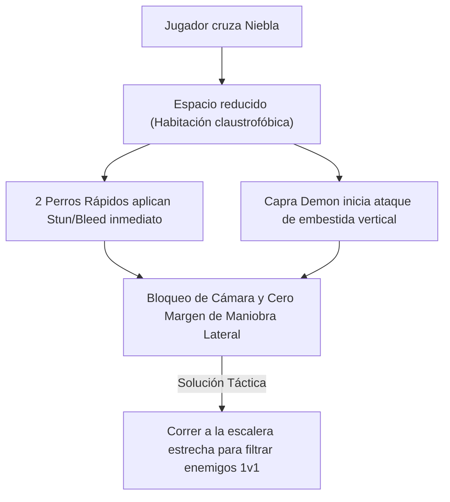
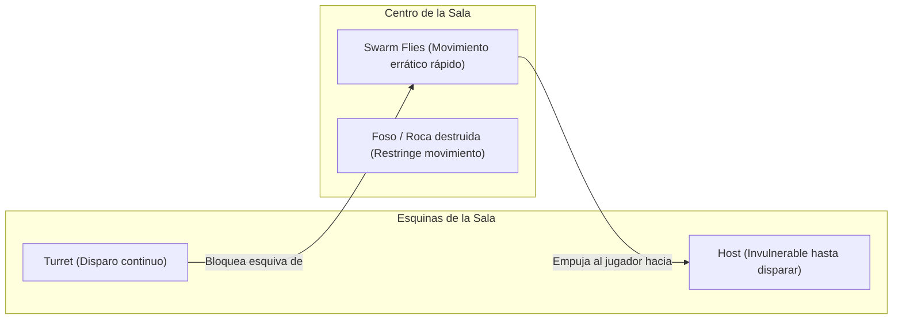

# Deep Research Report: Diseño de Niveles y Colocación de Enemigos (Dark Souls vs. The Binding of Isaac)

> **Fecha**: 8 de Agosto, 2026  
> **Estado**: Completado  
> **Objetivo Principal**: Análisis de la geometría de salas, colocación con propósito de enemigos y dinámicas donde el entorno trabaja a favor o en contra del jugador en *Dark Souls* y *The Binding of Isaac*.

---

## Executive Summary

- **Geometría como Adversario Principal**: Ni en *Dark Souls* ni en *The Binding of Isaac* los enemigos actúan de forma aislada. La dificultad surge del **maridaje entre la inteligencia/patrón del enemigo y la restricción espacial de la sala**.
- **Dark Souls (Diseño Artesanal y Orientado al Aprendizaje)**: Utiliza trampas de ángulo ciego, pasillos estrechos con balanceo (*narrow ledge pressure*) y emboscadas para castigar la prisa y premiar la observación táctica.
- **The Binding of Isaac (Diseño Modular de Arena Procedural)**: Utiliza obstáculos (rocas, fosos, caca roja) y enemigos con distintos vectores de movimiento (torretas estáticas + perseguidores voladores) para obligar al jugador a resolver un puzle de priorización de objetivos y control de masas en espacio reducido.
- **Salas A Favor vs. En Contra**: Las salas mejor diseñadas ofrecen un "bucle de reversión" donde una sala extremadamente hostil se vuelve favorable cuando el jugador aprende a utilizar las trampas del mapa o los cuellos de botella contra los propios enemigos.

---

## 1. Matriz Comparativa: Dark Souls vs. The Binding of Isaac

| Dimensión de Diseño | Dark Souls (Handcrafted Topology) | The Binding of Isaac (Procedural Arenas) |
| :--- | :--- | :--- |
| **Arquitectura de Sala** | Asimétrica, tridimensional, llena de ángulos ciegos y desniveles. | Simétrica o basada en grilla (13x7 baldosas), bidimensional y cerrada. |
| **Propósito de Colocación** | Castigar la imprudencia, enseñar patrones y forzar duelos tácticos. | Forzar priorización de objetivos, kiting y esquiva tipo *bullet hell*. |
| **Rol del Entorno** | Extensión del peligro (caídas al vacío, trampas activables, pasillos angostos). | Matriz de restricción de movimiento (fosos, rocas destructibles, pinchos). |
| **Uso de la Geometría a Favor** | Cuellos de botella (puertas/escaleras) y uso de esquinas para aislar 1v1. | Uso de rocas como escudo contra proyectiles y explosiones de barriles contra hordas. |

---

## 2. Tipologías de Salas que Trabajan En Contra del Jugador (Salas Hostiles)

### 2.1. El Foso Claustrofóbico de Embestida (*Ejemplo: Capra Demon Arena en Dark Souls*)

- **Mecánica de Sala**: Reducir el espacio de maniobra al mínimo para anular la habilidad de esquiva lateral (*strafe/dodge roll*).
- **Propósito**: Desorientar al jugador en los primeros 2 segundos. Obliga a identificar inmediatamente el único elemento geométrico favorable (la escalera o la esquina) para sobrevivir.

---

### 2.2. El Fuego Cruzado en Pasillo Estrecho (*Ejemplo: Anor Londo Archers en Dark Souls*)

- **Geometría**: Una cornisa oblicua ultra estrecha sin barreras laterales, con caída hacia la muerte instantánea.
- **Enemigos**: Dos Caballeros Plateados con arcos grandes en esquinas opuestas disparando flechas con impacto repulsivo (*knockback*).
- **Por qué funciona**: Las flechas no matan por daño, sino por desequilibrio. La geometría transforma una mecánica básica (cubrirse o rodar) en un ejercicio de precisión milimétrica donde el terreno es el verdadero ejecutor.

---

### 2.3. La Pinza de Torretas Estáticas y Perseguidores (*Ejemplo: Host + Fly Rooms en Isaac*)

- **Mecánica de Sala**: Mezclar enemigos indestructibles de patrón temporal (Hosts) con enemigos móviles rápidos (Flies) y obstáculos físicos (Pits).
- **Propósito**: Generar parálisis por análisis. El jugador no puede quedarse quieto por los perseguidores, ni puede moverse libremente por los disparos en línea recta de las torretas.

---

## 3. Tipologías de Salas que Trabajan A Favor del Jugador (Salas Favorables / Manipulables)

### 3.1. El Embudo del Cuello de Botella (*Chokepoint Design*)

- **En Dark Souls**: Atraer a grupos de enemigos numerosos (ej. Huecos en Undead Burg o Ratas en las Profundidades) hacia una puerta estrecha.
- **Efecto de Geometría**: Anula la ventaja numérica del enemigo. Las armas de estocada o barrido vertical del jugador golpean a los enemigos de uno en uno sin riesgo de ser flanqueado.

---

### 3.2. La Trampa Reversible (*Ejemplo: Sen's Fortress en Dark Souls*)

- **Enviromental Hijack**: Las guillotinas de péndulo y las placas de presión que disparan dardos están diseñadas para matar al jugador.
- **Uso a Favor**: Un jugador experimentado puede situarse tras una placa de presión y dejar que los Serpientes acudan hacia él, activando la trampa y eliminando a los enemigos sin gastar durabilidad ni estamina.

---

### 3.3. Cobertura Estática y Destrucción Táctica (*Ejemplo: TNT y Rocas en Isaac*)

- **Rocas de Cobertura**: Bloquean tiros lineales de enemigos tipo *Gush* o *Clotty*, permitiendo disparar lágrimas en parábola o asomarse intermitentemente.
- **Barriles de TNT**: Un barril TNT colocado cerca de una jaula de enemigos permite detonarlo con una lágrima inicial, limpiando la sala en 1 segundo si se calcula el tiempo de aproximación de la horda.

---

## 4. Reglas de Oro para la Colocación de Enemigos en Dungeons

> [!IMPORTANT]
> **1. Regla del Doble Vector**: Nunca coloques únicamente enemigos que se mueven a la misma velocidad y en el mismo plano. Mezcla siempre **Presión Cercana** (enemigo melee) con **Presión Lejana/Línea de Visión** (franco/torreta).

> [!TIP]
> **2. Regla de la Línea de Visión (Line of Sight - LoS)**: Da al jugador al menos 1.5 segundos para procesar visualmente la amenaza al cruzar la puerta antes de que el ataque sea lanzado, A MENOS QUE la sala sea explícitamente una emboscada telegrafiada (ej. manchas de sangre en el suelo o ruidos tras la puerta).

> [!WARNING]
> **3. Regla de la Salida de Emergencia**: Toda sala hostil con trampas letales debe contener una "salida geométrica" (un pilar para cubrirse, una escalera, una cornisa alta o una roca rompible) que el jugador astuto pueda explotar para dar la vuelta al combate.

---

## 5. Referencias y Fuentes Consultadas

- [1] **Level Design Book**: *Enemy Placement, Sightlines, and Chokepoint Patterns in Action RPGs*.
- [2] **Boris the Brave**: *The Procedural Room Templates and Enemy Pools of The Binding of Isaac*.
- [3] **Game Developer (Gamasutra)**: *Level Design Breakdown: Capra Demon & Sen's Fortress in Dark Souls*.
- [4] **Reddit r/leveldesign & r/dark-souls**: *Spatial Constraints, Camera Clipping, and Environmental Hazards Analysis*.
