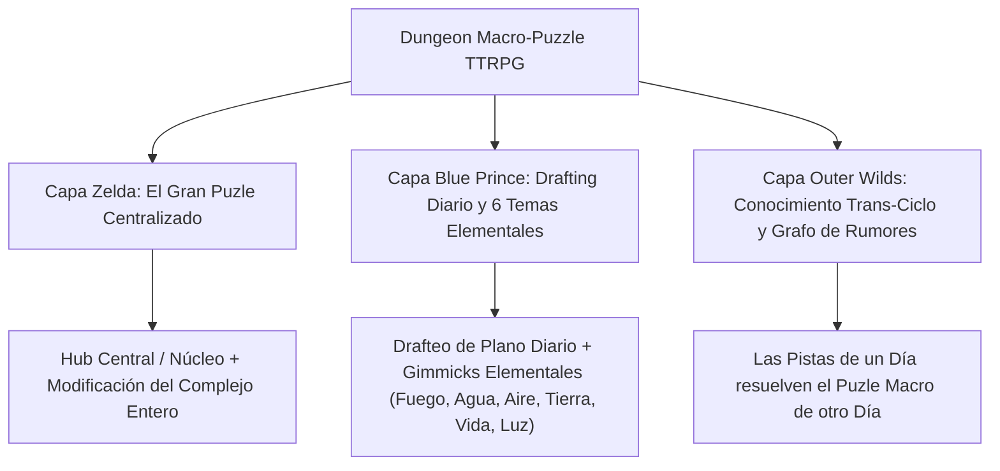
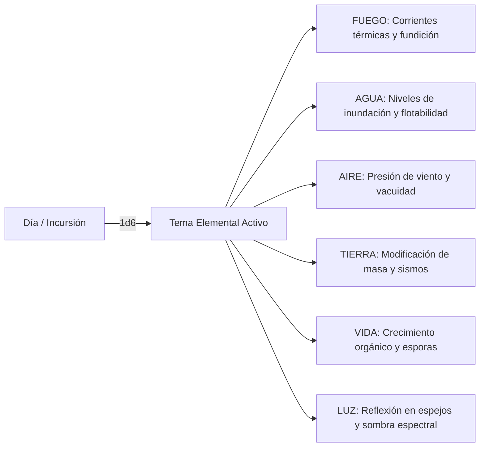

# Guía de Diseño: Dungeon Macro-Puzzle TTRPG (Zelda + Outer Wilds + Blue Prince)

> **Propósito**: Sistema para el DM para dirigir una mazmorra concebida como **un único gran puzle centralizado** (Zelda). Cada día/incursión, la arquitectura adopta uno de los **6 Temas Elementales** con su propia mecánica global (*Gimmick*), mientras los jugadores draftean el plano (*Blue Prince*) y acumulan conocimiento trans-ciclo (*Outer Wilds*).

---

## 1. El Tríptico de Diseño Centralizado



---

## 2. Capa 1: Zelda - El Gran Puzle Centralizado (Macro-Structure)

### A. La Sala del Núcleo (The Master Hub)
Toda la mazmorra orbita alrededor de la **Sala del Núcleo Central**. Esta sala contiene el **Reloj Elemental / Reactor del Templo**.
- Las 6 alas o pisos de la mazmorra se conectan a este Núcleo.
- **La meta final**: Activar la alineación de los 6 elementos en el Núcleo Central. Para ello, los jugadores deben resolver la condición de victoria de cada tema elemental en incursiones distintas o alinearlas en el clímax.

---

## 3. Capa 2: Blue Prince - Drafting Diario y los 6 Temas Elementales

Cada día (o cada vez que la mazmorra se reinicia en el ciclo), el DM establece o tira (1d6) el **Tema Elemental del Día**. Todas las salas que los jugadores drafteen en esa incursión adquieren la mecánica global (*Gimmick*) de ese elemento.



---

### B. Matriz de los 6 Temas Elementales y sus Gimmicks

| Dado (1d6) | Tema Elemental | Mecánica Global del Día (*Daily Gimmick*) | Efecto en las Salas Drafteadas |
| :--- | :--- | :--- | :--- |
| **1** | **FUEGO** | **Presión Térmica y Fundición** | Las puertas de metal están selladas por dilatación. El calor crea corrientes ascendentes de aire en pozos profundos. Los charcos de lava se solidifican si se enfrían. |
| **2** | **AGUA** | **Control Hidráulico y Flotabilidad** | El nivel del agua sube/baja 1 nivel en todo el mapa al activar bombas en cualquier sala. Flotar en balsas da acceso a los techos; sumergirse expone pasajes bajos. |
| **3** | **AIRE** | **Corrientes de Viento y Presión Atascada** | Conductos de ventilación generan turbulencias que impulsan a los jugadores a través de simas. Abrir 2 puertas alineadas crea un efecto venturi que aspira objetos pesados. |
| **4** | **TIERRA** | **Densidad Gravitacional y Sismos** | Placas de peso alteran la inclinación de salas completas. Las paredes de roca agrietada se desmoronan si los jugadores generan vibraciones pesadas. |
| **5** | **VIDA** | **Crecimiento Orgánico y Esporas** | Enredaderas bioluminiscentes crecen al contacto con agua/luz, creando puentes o bloqueando puertas. Las esporas flotantes reaccionan al aliento/fuego de los jugadores. |
| **6** | **LUZ** | **Haz Reflectante y Planos de Sombra** | Haces de luz solar/mágica atraviesan las salas en línea recta. Colocar espejos en salas drafteadas redirige la luz para activar receptores o revelar estructuras invisibles. |

---

### C. El Drafting del Plano Diario (Drafting Room Deck)
Al abrir cualquier puerta, los jugadores draftean 1 de 3 salas. Todas las salas adoptan la física del **Tema Elemental del Día**.
- *Ejemplo*: Si el tema es **AGUA**, la *Sala de la Estatua* contiene un estanque con un nivel de agua ajustable. Si el tema es **LUZ**, la misma *Sala de la Estatua* sostiene un espejo orientable en las manos de la estatua.

---

## 4. Capa 3: Outer Wilds - Progresión por Conocimiento Trans-Ciclo

### A. La Regla de la Interconexión Elemental
El puzle macro de la mazmorra **no se puede resolver en 1 solo día sin el conocimiento de los otros días**.

- **Día de FUEGO**: Los jugadores descubren en una inscripción que "El Ojo de Cristal de la Sala de Luz solo resiste el rayo si primero fue templado en la Caldera de Fuego".
- **Día de LUZ**: Los jugadores aplican lo aprendido: sabiendo qué espejo manipular, dirigen el haz hacia el Ojo de Cristal (que ya aprendieron a templar previamente).

```
Día 1 (FUEGO) ──> Aprender Regla de Temperado ──┐
                                                ├──> CERRAR EL GRAN PUZLE CENTRAL
Día 2 (LUZ)   ──> Redirigir el Rayo Templado ───┘
```

### B. El Registro de Rumores del DM (Grafo de 6 Modos)
El DM mantiene una ficha donde cada elemento aporta **1 Engranaje del Puzle Central**:
1. **Fuego**: Enciende la caldera del Núcleo.
2. **Agua**: Enfría el Núcleo para estabilizarlo.
3. **Aire**: Expulsa los gases de escape del Núcleo.
4. **Tierra**: Sella las grietas tectónicas del Núcleo.
5. **Vida**: Reanima los circuitos de enredaderas del Núcleo.
6. **Luz**: Calibra la lente de enfoque del Núcleo.

---

## 5. Bucle de Juego para la Sesión TTRPG

1. **Amanecer del Ciclo**: Tirar o elegir el **Tema Elemental del Día** (ej. *Día de Luz*).
2. **Drafting del Plano (Blue Prince)**: Los jugadores exploran drafteando salas que traen consigo espejos, sombras y prismas.
3. **Manipulación del Macro-Puzle (Zelda)**: Los jugadores interactúan con la mecánica del tema para alterar la estructura de la Sala del Núcleo Central.
4. **Extracción de Pistas (Outer Wilds)**: Encuentran escritos que revelan cómo el tema de hoy interactúa con el tema de mañana.
5. **Reinicio / Siguiente Día**: La mazmorra se reconfigura. Los jugadores conservan el plano anotado y el conocimiento acumulado para abordar el siguiente Tema Elemental.
