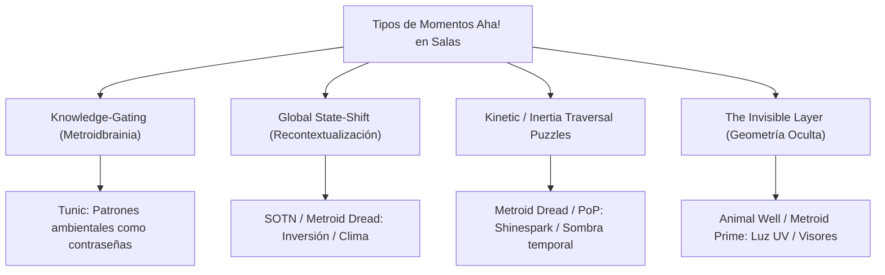
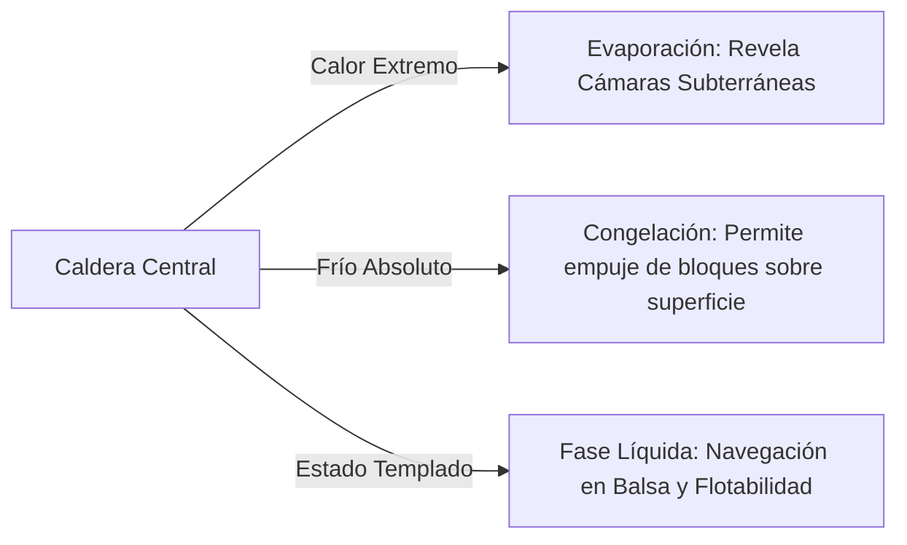

# Deep Research Report: Momentos "Aha!" y Arquitectura de Salas de Metroidvanias Aplicados al Diseño de Dungeons

> **Fecha**: 8 de Agosto, 2026  
> **Estado**: Completado  
> **Objetivo Principal**: Investigación profunda de mecánicas de sala, trucos de diseño espacial, puzles epifánicos (*Metroidbrainia*) y cambios de estado en Metroidvanias para su aplicación directa en el diseño de mazmorras (estilo Zelda o juegos de aventuras).

---

## Executive Summary

- **Metroidbrainia (Gating por Conocimiento)**: Juegos como *Tunic*, *Animal Well* y *La-Mulana* demuestran que el momento "Aha!" más potente ocurre cuando la barrera no es un objeto del inventario, sino la **comprensión del jugador** sobre una regla o patrón visual que siempre estuvo presente en la sala.
- **Recontextualización Espacial (State-Shifting)**: Alterar el estado de un complejo entero (Inversión 180° en *Symphony of the Night*, congelación/descongelación en *Metroid Dread*, cambio térmico) obliga al jugador a recalcular el mapa mental de salas conocidas.
- **Loops Topológicos y Atajos**: Reducir el backtracking mediante la física de la sala (destrucción de paredes de soporte, colapso de tubos de vidrio como en *Metroid Prime*) genera una profunda sensación de maestría espacial.
- **Mecánicas de Eco y Manipulación Temporal**: El uso de clones espectrales (*Prince of Persia: The Lost Crown*) o herramientas polivalentes emergentes (*Animal Well*) permite puzles tridimensionales simultáneos en salas individuales.

---

## 1. Clasificación de Patrones "Aha!" en Metroidvanias

---

## 2. Matriz de Mecánicas de Metroidvania y su Aplicación a Dungeons

| Juego | Mecánica / Momento "Aha!" | Principio de Diseño | Aplicación Directa a una Mazmorra Zelda-like |
| :--- | :--- | :--- | :--- |
| **Tunic** | *The Golden Path / Holy Cross* | **Knowledge Gating**: El mapa/escenario contiene la clave visual que siempre pudiste introducir. | **La Sala de los Azulejos Mudos**: Las grietas o patrones del suelo del vestíbulo son el camino exacto para cruzar una sala a ciegas más adelante. |
| **Animal Well** | *El Slinky / Muelle en Escaleras* | **Emergent Item Physics**: Objetos cotidianos interactúan con la topografía de la sala. | **La Sala de la Esfera Elástica**: Una bola pesada rebota perpetuamente entre pared y pared abriendo puertas rítmicas mientras avanzas. |
| **Prince of Persia: Lost Crown** | *Simurgh Shadow (Copia Temporal)* | **Spatial Teleportation Eco**: Grabar una posición para volver tras activar un mecanismo. | **El Puzle de la Guillotina Doble**: Dejar un "Eco Espectral" bajo una prensa pesada, tirar del interruptor lejano y teletransportarse dentro. |
| **Metroid Dread** | *Thermal Shift (Artaria/Hanubia)* | **Thermal / Physical State Shift**: Alterar la temperatura cambia las densidades y accesos. | **La Caldera del Templo**: Congelar la sala lava transforma los chorros ardientes en columnas de hielo escalables. |
| **Castlevania: SOTN** | *Inverted Castle* | **Spatial Flip / Gravity Inversion**: Invertir 180° la arquitectura del mapa. | **La Torre del Reloj Invertido**: Girar la sala principal convierte las lámparas de techo en plataformas y el pozo en una torre ascendente. |
| **Metroid Prime** | *Glass Tube Power Bomb* | **Structural Shortcut Destruction**: Destruir un túnel transitable para unir dos zonas distantes. | **El Puente de Cristal Roto**: Romper un tubo central de vidrio para despejar un atajo directo desde el Boss Key al vestíbulo. |
| **Metroid Prime / Animal Well**| *UV Light / X-Ray Layer* | **Spectral Plane Layering**: Geometría invisible interactiva mediante luz especial. | **La Galería de los Espejos Espectrales**: Una antorcha espectral revela puentes de luz que solo existen cuando la antorcha está encendida. |

---

## 3. Desglose de 5 Diseños de Salas "Aha!" para Mazmorras

### 3.1. La Sala del "Eco Temporal" (*Inspirado en Prince of Persia: The Lost Crown*)

- **Concepto**: El jugador obtiene el *Brazalete de Sombras* (permite fijar una marca espectral durante 6 segundos y volver a ella instantáneamente).
- **El Puzle "Aha!"**:
  - La sala tiene 3 interruptores de presión pesados situados en esquinas opuestas de un foso.
  - Al pisar el Interruptor A, la puerta abre solo 2 segundos. Es imposible correr hasta la puerta a tiempo.
  - **Resolución "Aha!"**: Poner la marca en la puerta -> Correr a pisar el Interruptor A -> Teletransportarse a la marca instantáneamente cruzando antes de que baje la verja.

---

### 3.2. La Sala de la Geometría Impresa (*Inspirado en Tunic*)

- **Concepto**: Un vestíbulo central con estatuas de piedra alineadas en una pared con grietas decorativas en forma de laberinto.
- **El Puzle "Aha!"**:
  - 5 salas más adelante, el jugador llega a una cámara a oscuras con placas de presión en forma de cuadrícula (5x5). No hay pistas en la sala.
  - **Momento Epifánico**: El jugador recuerda las grietas del vestíbulo inicial. La línea contigua dibuja exactamente el camino seguro en la cuadrícula 5x5 sin activar las trampas de dardos.

---

### 3.3. La Sala de la Transmutación Térmica / Fases del Agua (*Inspirado en Metroid Dread*)

- **Concepto**: Una sala central con una caldera elemental que conmuta entre tres estados: **Fuego / Agua / Hielo**.
- **Impacto Topológico**:
  - *Estado Agua*: Las balsas flotan, permitiendo cruzar el lago central, pero los pasillos inferiores quedan sumergidos.
  - *Estado Hielo*: El lago se congela creando un suelo sólido para empujar bloques pesados, pero destruye las balsas.
  - *Estado Fuego*: Evapora el agua, revelando salas subterráneas secas y cofres en el fondo del pozo.

---

### 3.4. La Sala de la Inercia y Retorno Magnético (*Inspirado en Metroid Dread Shinespark*)

- **Concepto**: Una sala vertical con pendientes y rieles magnéticos.
- **El Puzle "Aha!"**:
  - El jugador obtiene el *Gancho Inercial*.
  - En lugar de usar el gancho para subir despacio, debe engancharse a un punto central en pleno salto pendular para salir disparado a alta velocidad contra una pared de madera frágil en el extremo opuesto del techo.
  - **Sensación**: Combina la precisión física de la plataforma con la resolución de un problema de velocidad vectorial.

---

### 3.5. La Sala de la Linterna Espectral / Capa UV (*Inspirado en Animal Well / Metroid Prime*)

- **Concepto**: Una sala vacía con puertas cerradas y sin interruptores visibles.
- **El Puzle "Aha!"**:
  - Al encender la *Farola de Luz Espectral*, la sala revela inscripciones fluorescentes en las paredes que muestran la posición de palancas invisibles en el plano físico.
  - El jugador debe tocar las paredes basándose en la sombra/proyección reflectante de la linterna para activar los mecanismos fantasma.

---

## 4. Principios Directores para Diseñar Salas Metroidbrainia en Mazmorras

> [!TIP]
> **1. La Información es la Llave**: Diseña puzles cuya solución se pueda ejecutar desde el primer minuto si el jugador tuviera el conocimiento, pero oculta la pista en la arquitectura visual del entorno.

> [!WARNING]
> **2. Evitar el Backtracking Muerto**: Si una sala requiere volver más tarde, añade una puerta de sentido único (*One-Way Shortcut*) que conecte la sala revisitada directamente con el Hub central al resolver el puzle.

---

## 5. Referencias y Fuentes Consultadas

- [1] **Game Maker's Toolkit (Mark Brown)**: *How Games Like Tunic & Animal Well Gate Progress with Knowledge*.
- [2] **Thinky Games Analysis**: *The Mechanics of Metroidbrainias and Spatial Aha! Moments*.
- [3] **Metroid Dread Speedrun & Design Studies**: *Sequence Breaking & Shinespark Room Puzzle Layouts*.
- [4] **Castlevania: Symphony of the Night Retrospectives**: *Inverted Castle Architecture and Recontextualization*.
