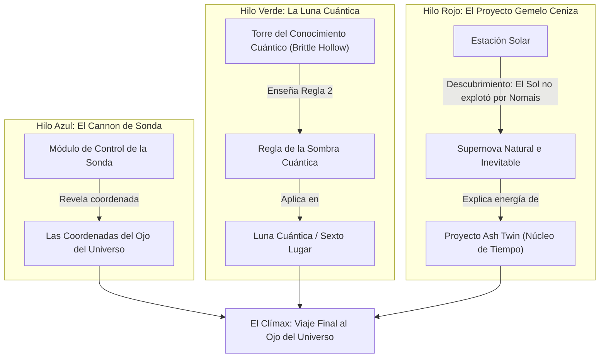

# Deep Research Report: Narrativa No Lineal, Red de Rumores y Progresión por Conocimiento (Outer Wilds y la Metroidbrainia)

> **Fecha**: 8 de Agosto, 2026  
> **Estado**: Completado  
> **Objetivo Principal**: Análisis exhaustivo del diseño de narrativa fragmentada/desordenada pero cohesiva, donde la información funciona simultáneamente como *lore*, pista ambiental y llave mecánica (*Outer Wilds*, *Return of the Obra Dinn*, *Tunic*, *Her Story*).

---

## Executive Summary

- **Progresión por Conocimiento (Knowledge Gating)**: En *Outer Wilds*, el mundo está 100% abierto desde el segundo 1. Las barreras no son puertas con cerraduras de objetos, sino **bloqueos cognitivos**. La "llave" es entender la física o la regla de una sala/planeta.
- **Tríada de Información (El Fragmento Multicapa)**: Cada pista o texto (ej. escrituras Nomai) cumple simultáneamente tres funciones: **Lore emocional/histórico**, **Dirección espacial** (hacia otra sala/sitio) e **Instrucción mecánica** para superar un puzle.
- **La Red de Rumores (Grafo de Conexiones)**: Para evitar el caos informativo, la historia no se cuenta de forma lineal, sino como un **Grafo Acíclico Dirigido (DAG)** de nodos misteriosos (*Rumor Mode*). El jugador reconstruye la línea temporal en su mente mientras el juego organiza las pistas semánticamente.
- **Narrativa Arqueológica**: La historia principal ya ocurrió. El jugador actúa como un historiador cuántico que deduce el pasado inspeccionando ruinas, cadáveres y registros abandonados.

---

## 1. Matriz de Juegos de Progresión por Conocimiento (*Metroidbrainia*)

| Juego | Tipo de Información / Pista | Vehículo de la Pista | Mecánica de Bloqueo | Momento "Aha!" Clave |
| :--- | :--- | :--- | :--- | :--- |
| **Outer Wilds** | Reglas físico-cuánticas & Diarios Nomai | *Traductor Nomai* & Bitácora de Rumores (*Rumor Mode*) | Falta de comprensión sobre cómo viajar o entrar a zonas (ej. Luna Cuántica, Proyecto Gemelo Ceniza). | Entender que la Luna Cuántica requiere observarla (regla fotográfica) para fijarla en el espacio. |
| **Return of the Obra Dinn** | Identidad, acentos, uniformes y causas de muerte | *Cuaderno del Investigador* & *Reloj Memento Mortem* | Deducción de nombres y destinos de 60 marineros sin marcadores. | Deducir la identidad de un marinero por su número de hamaca o tatuaje visible en un congelado temporal. |
| **Tunic** | Idioma glífico & Páginas del manual de instrucciones | *Manual de Juego Retro* dentro del juego | Puertas doradas y caminos ocultos por perspectiva isométrica. | Descubrir que el "Holy Cross" no es un objeto, sino la cruceta/D-pad pulsada siguiendo las líneas del escenario. |
| **Her Story** | Entrevistas policiales en vídeo fragmentadas | *Buscador por Palabras Clave* en PC antiguo | Desconocimiento de términos o nombres clave en el testimonio. | Probar una palabra reveladora (ej. "gemela" o "azúcar") que abre clips de vídeo que cambian toda la trama. |
| **Elden Ring / Dark Souls** | Lore implícito en descripciones de objetos y arquitectura | *Descripciones de ítems* y disposición de estatuas/restos | Comprensión del mundo y secretos de jefes opcionales. | Deducir la relación de un jefe o zona por la estatua que custodia y los ítems colocados en sus pies. |

---

## 2. La Estructura del Grafo de Rumores (*Rumor Topology*)

En *Outer Wilds*, la historia se desglosa en 4 grandes hilos temáticos (representados por colores en el *Rumor Mode* del ship log). Cada nodo es una pista que apunta a otra:



---

## 3. Las 3 Capas de un Fragmento de Información Perfecto

Para que una historia fragmentada sea cohesiva y no frustrante, cada "pista" encontrada en una sala o ruina debe estructurarse en **3 capas concéntricas**:

```
 ┌────────────────────────────────────────────────────────┐
 │ 1. Capa Narrativa / Lore (Emoción, Conflicto, Historia)│
 ├────────────────────────────────────────────────────────┤
 │ 2. Capa Espacial / Vector (¿A dónde ir ahora?)        │
 ├────────────────────────────────────────────────────────┤
 │ 3. Capa Mecánica / Regla (¿Cómo resolver un puzle?)   │
 └────────────────────────────────────────────────────────┘
```

### Ejemplo Práctico (*Outer Wilds - Medusas en Giant's Deep*):
1. **Capa Narrativa**: Feldspar escribió en su diario que estaba atrapado en el interior de una medusa helada para sobrevivir.
2. **Capa Espacial**: Indica que dentro del núcleo de agua de Giant's Deep hay medusas flotando hacia abajo.
3. **Capa Mecánica**: Enseña que las medusas son aislantes eléctricos naturales. Entrar por debajo del tentáculo de una medusa permite cruzar la barrera eléctrica del núcleo sin morir.

---

## 4. Aplicación Práctica a un Dungeon o Juego

Si estás diseñando un dungeon o juego con historia no lineal desordenada pero cohesiva:

1. **Eliminar Llaves Físicas Arbitrarias**: En lugar de "Encuentra la Llave Roja para la Puerta Roja", usa "Encuentra el Mural que te enseña la secuencia de 3 notas musicales para que el guardián de piedra abra la puerta".
2. **Arqueología Ambiental (Cuerpos y Herramientas)**:
   - Muestra el fracaso de aventureros anteriores. Un esqueleto abrasado junto a una pared con marcas de carbón le dice al jugador "esta pared lanza fuego cuando te acercas sin antorcha".
3. **El Cuaderno de Rumores Automático o Guiado**:
   - Proporciona al jugador una herramienta dentro del juego que guarde las notas relevantes asociándolas visualmente por nodos o mapas de hilos (tipo corcho de detective).
4. **Resonancia Lore-Puzle**:
   - El puzle no debe sentirse como una prueba matemática descolgada, sino como la activación de una máquina antigua cuya función narrativa explica la cultura que construyó el dungeon.

---

## 5. Referencias y Fuentes Consultadas

- [1] **Mobius Digital (Developers of Outer Wilds)**: *GDC Talk: Designing Knowledge-Based Progression and Curiosity-Driven Exploration*.
- [2] **Thinky Games**: *The Rise of Metroidbrainias: Outer Wilds, Tunic, and Obra Dinn*.
- [3] **Lucas Pope (Creator of Obra Dinn)**: *Information Design and Deductive Storytelling in Games*.
- [4] **Game Maker's Toolkit (Mark Brown)**: *How Outer Wilds Tells a Story Through Exploration*.
