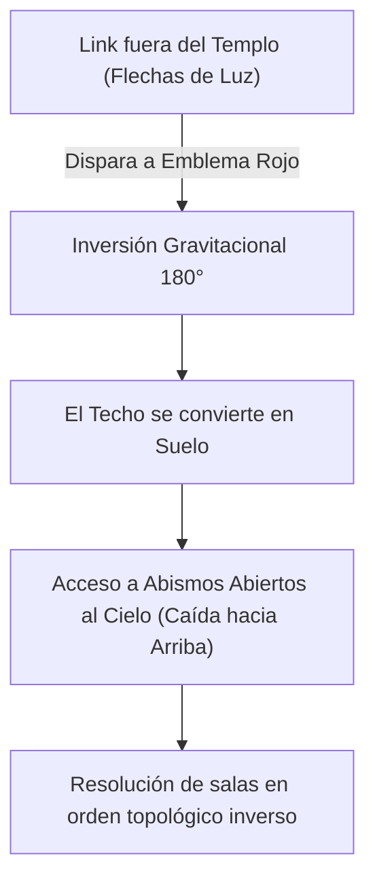
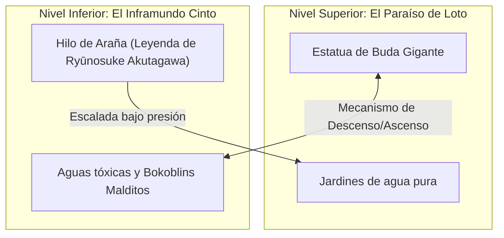

# Deep Research Report: Las Mejores Salas y Secuencias de Dungeons en The Legend of Zelda

> **Fecha**: 8 de Agosto, 2026  
> **Estado**: Completado  
> **Objetivo Principal**: Análisis exhaustivo de las mejores salas, puzles espaciales, secuencias cinemáticas/mecánicas y momentos icónicos en las mazmorras de *The Legend of Zelda* (2D y 3D).

---

## Executive Summary

- **Macro-Puzles Topológicos**: Las salas más aclamadas de la saga (*Stone Tower Temple*, *Eagle's Tower*, *Sandship*) no funcionan aisladamente, sino como nodos de un puzle espacial global donde la sala cambia el estado de toda la mazmorra.
- **Narrativa Ambiental e Ilusión Visual**: Espacios como la **Sala de la Ilusiones** (*Water Temple*) y el **Inframundo del Cisterna Antigua** (*Ancient Cistern*) utilizan la geometría del espacio para transmitir simbolismo poético y confrontación psicológica sin diálogos.
- **Cinética y Travesía Dinámica**: Espacios como la **Cámara del Spinner** (*Arbiter's Grounds*) y el **Descenso del Templo del Viento** (*Tears of the Kingdom*) convierten el desplazamiento dentro de la sala en una atracción de montaña rusa interactiva.
- **Evolución del Diseño**: Desde las estructuras de llaves cruzadas en 2D hasta la manipulación física y temporal en 3D, el diseño de salas alcanza su cenit cuando obliga al jugador a recontextualizar la geometría tridimensional.

---

## 1. Contexto y Arquitectura de Diseño de Mazmorras

El análisis de mazmorras en *The Legend of Zelda* (respaldado por estudios de diseño como *Boss Keys* de Mark Brown y debates de la comunidad) clasifica las salas en cuatro tipologías fundamentales:

1. **Lock-and-Key Isolated Chambers**: Salas lineales con puzle autocontenido.
2. **Topology-Shifting Rooms (Cámaras de Estado Central)**: Salas que alteran la gravedad, nivel de agua o flujo temporal de todo el complejo.
3. **Atmospheric / Narrative Climax Arenas**: Salas diseñadas para impacto emocional, ilusión óptica o peso temático.
4. **Kinetic Traversal Hubs**: Salas enfocadas en la fluidez de movimiento mediante gadgets de movilidad avanzada (Clawshots, Spinner, Paraglider/Zonai).

---

## 2. Matriz Comparativa de las Salas y Secuencias Elite

| Mazmorra / Juego          | Sala / Secuencia                                     | Tipo de Mecánica / Momento                              | Nivel de Complejidad Puzle | Impacto Atmosférico |
| :------------------------ | :--------------------------------------------------- | :------------------------------------------------------ | :------------------------- | :------------------ |
| **Majora's Mask**         | *Stone Tower Temple* - Emblem Flip Room              | Inversión gravitacional de mazmorra completa            | 10 / 10                    | 10 / 10             |
| **Skyward Sword**         | *Ancient Cistern* - Underworld to Heaven Climb       | Tránsito vertical inframundo/paraíso & Hilo de Araña    | 8 / 10                     | 10 / 10             |
| **Ocarina of Time**       | *Water Temple* - Room of Illusion (Dark Link)        | Ilusión espacial sin límites visuales & Espejo combate  | 6 / 10                     | 10 / 10             |
| **Link's Awakening**      | *Eagle's Tower* - 4-Pillar Destruction Room          | Demolición estructural para colapsar piso 4 en 3        | 9 / 10                     | 7 / 10              |
| **Skyward Sword**         | *Sandship* - Timeshift Mast Sequence                 | Esfera de tiempo móvil recontextualizando cubierta      | 9 / 10                     | 9 / 10              |
| **Twilight Princess**     | *Snowpeak Ruins* - Mansion Kitchen (Yeto's Soup)     | Hub de sopa interactivo & Transporte de balas de cañón  | 7 / 10                     | 9 / 10              |
| **Twilight Princess**     | *Arbiter's Grounds* - Spinner Tracks Central Chamber | Rail-riding vertical & Pista para Stallord              | 8 / 10                     | 9 / 10              |
| **Tears of the Kingdom**  | *Wind Temple* - Ark Sky Ascent & Trampoline Sails    | Caída libre, corrientes de viento y salto en velas      | 7 / 10                     | 10 / 10             |
| **Ocarina of Time**       | *Forest Temple* - Twisted Corridor                   | Geometría distorsionada mediante interruptores de pared | 8 / 10                     | 9 / 10              |
| **A Link Between Worlds** | *Dark Palace* - Wall-Merge Light & Shadow Rooms      | Fusión en pared 2D para ver objetos en oscuridad 3D     | 8 / 10                     | 8 / 10              |

---

## 3. Análisis Técnico y Narrativo Detallado

### 3.1. Stone Tower Temple: La Inversión del Mundo (*Majora's Mask*)

- **Mecánica**: Disparar una Flecha de Luz al emblema rojo exterior invierte la gravedad de toda la estructura.
- **Por qué es magistral**: Obliga a reorientar mentalmente el mapa tridimensional. Las salas leídas previamente con suelo firme pasan a ser abismos letales, y los techos inaccesibles revelan cofres y puertas antes invisibles.

---

### 3.2. Ancient Cistern: La Escalada desde el Inframundo (*Skyward Sword*)

- **Inspiración Litera**: Basado en el cuento corto *El Hilo de la Araña* (*Kumo no Ito*) de Ryūnosuke Akutagawa.
- **Momento Clave**: Link desciende desde un templo budista sereno e iluminado a un inframundo grotesco. Para salir, debe subir por un único hilo mientras enemigos zombi ascienden tras él. Al coronar, se enfrenta a **Koloktos**, uno de los combates más aclamados de la franquicia.

---

### 3.3. Water Temple: Sala de la Ilusión / Combat de Dark Link (*Ocarina of Time*)

- **Estructura Estética**: Una sala sin límites visibles, cubierta por agua delgada como un espejo, con un árbol seco en el centro y una niebla infinita.
- **Puzle Psicológico / Combate**:
  - Dark Link imita cada ataque de espada exactamente, reaccionando a las entradas del mando.
  - La sala no tiene salidas obvias hasta derrotar a la sombra, momento en el cual la ilusión se disipa y la puerta estándar reaparece.
  - Rompe la convención geométrica de la mazmorra para crear claustrofobia en espacio abierto.

---

### 3.4. Eagle's Tower: Colapso de Estructura 2D (*Link's Awakening*)

- **Puzle Global**: Transportar una bola de hierro pesada por las salas del 3er piso para destruir 4 pilares de soporte masivos.
- **Efecto de Sala**: Al destruir el cuarto pilar, la torre colapsa dinámicamente: el 4º piso cae y se fusiona con el 3º, cambiando permanentemente el diseño del mapa y permitiendo el acceso a la cima.

---

### 3.5. Sandship: Secuencia de Piedra del Tiempo (*Skyward Sword*)

- **Mecánica de Micro-Universo Temporal**: Golpear la Piedra del Tiempo situada en el mástil principal crea una esfera de realidad pasada alrededor del barco.
- **Dinamismo**: Un lado de la sala/cubierta puede estar en el presente (barco desértico, abandonado, madera podrida) mientras el otro está en el pasado (barco tecnológicamente avanzado con robots activos y velas desplegadas). Modifica puertas, rejillas y cañones en tiempo real.

---

### 3.6. Snowpeak Ruins: Cocina del Yeti (*Twilight Princess*)

- **Reinventando el Hub Central**: En lugar de un vestíbulo tradicional, el centro de la mazmorra es la cocina donde Yeto cocina una sopa.
- **Puzle e Integración**: Las salas secundarias consisten en recuperar ingredientes (calabaza de Ordon, queso de cabra) transportando balas de cañón a través de pasillos congelados con puzles de hielo y empuje de bloques. Cada ingrediente mejora las propiedades curativas de la sopa.

---

### 3.7. Arbiter's Grounds: La Pista Central del Spinner (*Twilight Princess*)

- **Secuencia Dinámica**: Al conseguir el *Spinner*, la sala central revela rieles magnéticos incrustados en las paredes.
- **Sensación de Juego**: Transforma la mazmorra en un juego de plataformas sobre rieles a alta velocidad, culminando en la arena de boss de **Stallord**, donde la sala entera es un coliseo circular de arena móvil con un pilar gigante con rieles.

---

### 3.8. Wind Temple: El Descenso del Arca del Viento (*Tears of the Kingdom*)

- **Verticalidad y Física Libre**: La sala central es el cielo dentro de la tormenta y la cubierta del navío volador gigante.
- **Mecánica**: El jugador debe saltar entre lonas de velas que actúan como trampolines gigantes, combinar corrientes ascendentes de aire con la paravela y atravesar escotillas congeladas con buceo libre para activar los 5 turbocompresores.

---

## 4. Trade-Offs, Riesgos y Lecciones de Diseño

> [!IMPORTANT]
> **El riesgo de la desorientación excesiva**: Dungeons como el *Water Temple* (OoT) sufrieron críticas históricas no por la falta de genialidad de su sala central, sino por la fricción del menú para equipar las Botas de Hierro (corregido en 3DS) y el rastreo de llaves perdidas en niveles de agua alterados.

- **Diseño de Puzles Espaciales vs. Frustración**:
  - *Éxito*: *Stone Tower Temple* e *Ice Ruins* (*ALBW*) ofrecen pistas visuales claras (texturas de suelo/techo, colores de luz).
  - *Riesgo*: Sin una señalización ambiental precisa, el cambio de estado global de una sala puede provocar *backtracking* tedioso.

---

## 5. Recomendaciones para Diseñadores / Entusiastas

1. **Priorizar Puzles Macro sobre Puzles Micro**: Las mejores salas son aquellas donde manipular un mecanismo afecta a múltiples salas del mapa.
2. **Integración Narrativa**: La sala debe contar una historia por sí misma (*Ancient Cistern*, *Snowpeak Ruins*).
3. **Ritmo y Variedad de Movimiento**: Combinar puzles de pensamiento pausado con secuencias cinéticas de movilidad alta.

---

## 6. Referencias y Fuentes Consultadas

- [1] **Mark Brown - Game Maker's Toolkit (Boss Keys)**: *The Legend of Zelda Dungeon Design Analysis Series*.
- [2] **Zelda Wiki / Data**: *Stone Tower Temple & Ancient Cistern Structural Mechanics*.
- [3] **Reddit r/zelda & r/truezelda Discussions**: *Community Consensus on Best Individual Zelda Rooms & Puzzles*.
- [4] **Nintendo Official Guides & Retrospectives**: *Developer Insights on Ocarina of Time Water Temple & Skyward Sword Sandship*.
