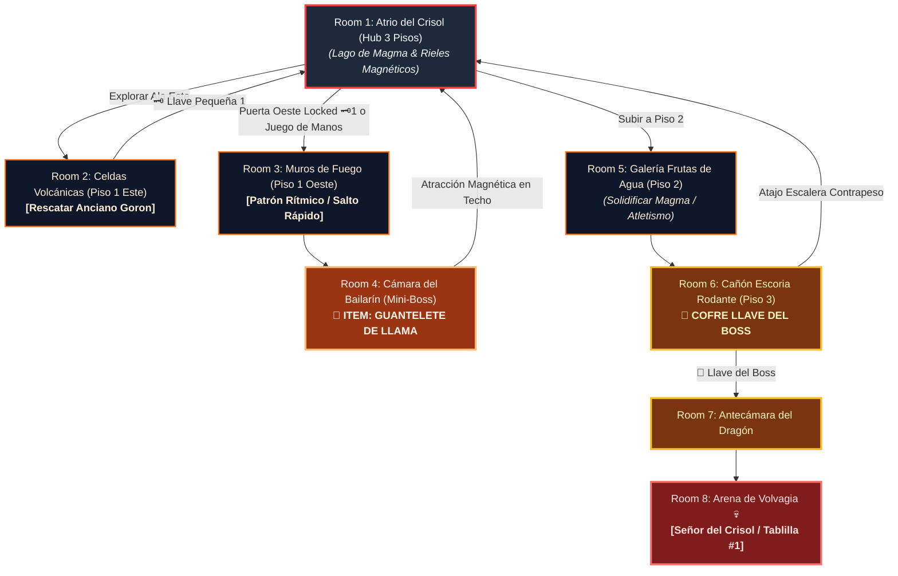

# 🌋 Subdungeon 1: La Caldera Volcánica (Layout Complejo y No-Lineal estilo Goron Mines & Fire Temple)

> **Ubicación**: `7 - DM/OneShots/ARepeat/Subdungeons/01_Subdungeon_Fuego_Caldera.md`  
> **Inspiración Verbatim**: **Goron Mines** (*Twilight Princess*) + **Fire Temple** (*Ocarina of Time*)  
> **Regla de Diseño DM (Sistema de Doble Opción)**: **CERO BLOQUEOS OBLIGATORIOS (No Skill-Check Gates)**. Todos los puzles, obstáculos y cerraduras admiten **DOS MÉTODOS DE RESOLUCIÓN**:  
> 1. 🟢 **Opción Interactiva (Sin Tirada / 100% Seguro)**: Mediante exploración espacial, puzles físicos, uso de ítems o paciencia.  
> 2. ⚡ **Opción Rápida con Tirada (Skill Check Skip)**: Permite saltarse la prueba o resolverla al instante mediante una tirada de habilidad (Fuerza, Atletismo, Acrobacias, Juego de Manos, Arcanos, etc.).  
> **Estructura de Layout**: **Hub Central (3 Pisos)** + **Ala Este (Celdas Goron)** + **Ala Oeste (Fundición de Rieles)** + **Backtracking con Dungeon Item**  
> **Dungeon Item**: *Guantelete de Llama* (Plasma Térmico & Atracción Magnética)  
> **Guardián de Área**: *El Señor del Crisol* (Inspirado en *Volvagia / Fyrus*)  
> **Recompensa**: 🔓 Desbloqueo Permanente de la Caldera + Fragmento de Tablilla #1

---

## 🗺️ Mapa de Flujo No-Lineal de la Mazmorra (Non-Linear Zelda Hub Layout)

---

### 📊 Tabla Resumen de Progreso (Sistema Doble Opción)

| Paso | Ubicación | Tipo | 🟢 Opción Sin Tirada (100% Seguro) | ⚡ Opción Rápida con Tirada (Skill Skip) |
| :---: | :--- | :---: | :--- | :--- |
| **1** | **Room 2 (Celdas Volcánicas)** | 🟢 Exploración | Mover estatua (1 min) y disparar a cristal rúnico | **Fuerza DC 13** (empujar en 1 seg) / **Juego de Manos DC 13** (ganzuar celda) |
| **2** | **Room 3 (Muros de Fuego)** | 🟢 Transición | Observar patrón de 6s y cruzar seguro entre ráfagas | **Acrobacias DC 13** (esprintar a través del fuego en 1 acción) |
| **3** | **Room 4 (Mini-Boss)** | ⚔️ Combate | Enfriar al Bailarín con plasma y atacar su núcleo | **Atletismo DC 13** para sujetar el núcleo directamente |
| **4** | **Room 5 (Galería 2F)** | 🧩 Puzle | Disparar a Frutas de Agua para solidificar magma | **Atletismo DC 13** (saltar entre salientes de basalto sin frutas) |
| **5** | **Room 6 (Cañón 3F)** | 👑 Clave & Atajo | Resguardarse en nichos esperando paso de rocas | **Acrobacias DC 13** (esprintar ladera arriba esquivando escoria) |
| **6** | **Room 8 (Arena Final)** | 💀 Boss | Usar Guantelete de Llama y atacar a Volvagia | **Percepción DC 13** para predecir el hoyo de salida |

---

## 🏛️ Recorrido Verbatim Sala por Sala (DM Walkthrough & Backtracking)

### Room 1: Atrio del Crisol Central (Hub Central - 3 Pisos)
> *"Un monumental atrio circular de tres niveles tallado en piedra volcánica. Un lago de magma hirviente ocupa el suelo inferior. Tres grandes accesos flanquean la sala: al Este las Celdas Volcánicas, al Oeste un pasaje cerrado con cerrojo de latón 🗝️1, y en el techo del Piso 2 discurren rieles de basalto magnético azuledo. Al norte, en el Piso 3, se yergue el Portón del Dragón 🔒."*
* **Mecánica Doble**:
  * 🟢 *Sin Tirada*: Usar la **Llave Pequeña 🗝️1** obtenida en Room 2 para abrir la puerta Oeste.
  * ⚡ *Con Tirada*: **Juego de Manos DC 13** (ganzuar el cerrojo de latón en 1 acción).

---

### Room 2: 🧩 Ala Este: Celdas Volcánicas & Rescate del Anciano Goron (OoT / TP)
> *"Una galería subterránea barrida por un muro de llamas vivas de 10 pies de altura. Detrás de los barrotes de la celda Este, un Anciano Goron grita señalando un cristal rúnico ocantado tras una estatua de basalto."*
* **Mecánica Doble**:
  * 🟢 *Sin Tirada*: Desplazar manualmente la estatua (tarda 1 minuto) para revelar el cristal, disparar a distancia para apagar las llamas y presionar el pisador de la celda.
  * ⚡ *Con Tirada*: **Fuerza DC 13** (desplazar la estatua de un solo empuje en 1 acción) o **Juego de Manos DC 13** (forzar los barrotes de la celda sin tocar el cristal).
* **Botín**: El Anciano Goron entrega la **Llave Pequeña 🗝️1**.

---

### Room 3: 🧩 Ala Oeste: El Laberinto de Muros de Fuego (OoT)
> *"Un corredor sinuoso donde ráfagas de llama oscilan en patrones rítmicos cruzados."*
* **Mecánica Doble**:
  * 🟢 *Sin Tirada*: Observar el patrón rítmico (las llamas se alternan cada 6 segundos) y cruzar caminando sin peligro.
  * ⚡ *Con Tirada*: **Acrobacias DC 13** (esprintar a través de las llamas en 1 sola ronda sin esperar el patrón).

---

### Room 4: ⚔️ Cámara del Mini-Boss: Bailarín de Llama / Flare Dancer (OoT)
> *"Una estancia circular sobre magma donde el Bailarín de Llama realiza su danza de fuego."*
* **Combate / Puzle**: Desalojar el núcleo negro con agua/plasma/impacto (*o **Atletismo DC 13** para atraparlo al vuelo*) y atacarlo antes de que regenere su manto.
* **🎁 COFRE MAESTRO**: Otorga el **Guantelete de Llama** (Dispara plasma térmico y activa la **Atracción Magnética de Basalto** para caminar por el techo).
* **🔄 BACKTRACKING**: Regresar al **Hub Central (Room 1)** y ascender al Piso 2 caminando boca abajo por los rieles del techo.

---

### Room 5: 🧩 Piso 2: Galería de las Frutas de Agua (Fire Sanctuary SS)
> *"Un balcón suspendido en el Piso 2 del Hub sobre un ancho canal de magma. En los muros cuelgan frutas de agua cristalina."*
* **Mecánica Doble**:
  * 🟢 *Sin Tirada*: Disparar a las frutas de agua para hacerlas caer sobre el magma, solidificando plataformas flotantes temporales.
  * ⚡ *Con Tirada*: **Atletismo DC 13** (efectuar saltos acrobáticos entre los salientes de la pared sin usar las frutas de agua).

---

### Room 6: Piso 3: Cañón de Escoria Rodante & Atajo del Hub (Llave del Boss 👑)
> *"Una cañuela alta en el Piso 3 por donde esferas de escoria caen rodando. En un nicho elevado flota un cofre dorado."*
* **Mecánica Doble**:
  * 🟢 *Sin Tirada*: Avanzar resguardándose en los nichos laterales aprovechando el intervalo entre rocas rodantes.
  * ⚡ *Con Tirada*: **Acrobacias DC 13** (correr ladera arriba en sentido contrario esquivando todas las rocas de un solo impulso).
* **Atajo**: Golpear la estaca de basalto con el *Guantelete de Llama* hace caer una escalera de contrapeso directa a 1F.
* **Botín**: Abrir el cofre dorado para reclamar la **Llave del Boss 👑 (Llave de Volvagia)**.

---

### Room 7: 🔒 Antecámara del Dragón
> *"De regreso al Piso 3 del Hub Central (usando la nueva escalera atajo), el grupo se alza ante el Portón monumental del Dragón."*
* **Mecánica Doble**:
  * 🟢 *Sin Tirada*: Insertar la **Llave del Boss 👑**.
  * ⚡ *Con Tirada*: **Arcanos DC 14** (sobrecargar los glifos rúnicos del portón con el plasma del Guantelete de Llama para forzar la apertura).

---

### Room 8: 💀 Arena del Boss Final: Volvagia / El Señor del Crisol (OoT / TP)
> *"Una pista circular con 9 hoyos sobre magma de los que emerge Volvagia."*
* **Mecánica Boss**: Whack-a-mole con el *Guantelete de Llama*. (*Tirada de **Percepción DC 13** opcional permite detectar qué hoyo temblará antes de que Volvagia asome*).
* **Recompensa**: 🔓 Desbloqueo permanente de la Caldera + **Fragmento de Tablilla #1**.

