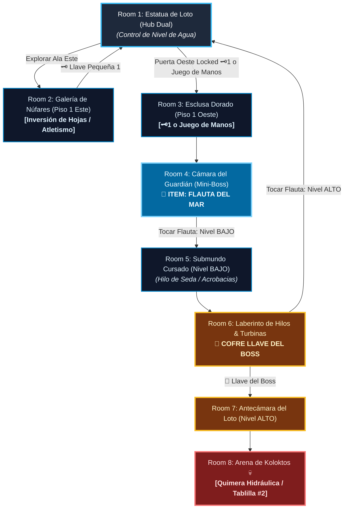

# 🌊 Subdungeon 2: La Cisterna Sumergida (Layout Complejo y No-Lineal estilo Ancient Cistern)

> **Ubicación**: `7 - DM/OneShots/ARepeat/Subdungeons/02_Subdungeon_Agua_Cisterna.md`  
> **Inspiración Verbatim**: **Ancient Cistern** (*Skyward Sword*)  
> **Regla de Diseño DM (Sistema de Doble Opción)**: **CERO BLOQUEOS OBLIGATORIOS (No Skill-Check Gates)**. Todos los puzles, obstáculos y esclusas admiten **DOS MÉTODOS DE RESOLUCIÓN**:  
> 1. 🟢 **Opción Interactiva (Sin Tirada / 100% Seguro)**: Mediante exploración espacial, buceo cuidadoso, puzles de válvulas o uso de la Flauta del Mar.  
> 2. ⚡ **Opción Rápida con Tirada (Skill Check Skip)**: Permite atajar al instante mediante una tirada de habilidad (Atletismo, Juego de Manos, Acrobacias, Arcanos, etc.).  
> **Estructura de Layout**: **Gran Palacio del Loto (Hub Central Dual)** + **Ala Este (Conductos Subacuáticos)** + **El Submundo Inferior (Nivel Cursado)** + **Control de Nivel de Agua (ALTO / MEDIO / BAJO)**  
> **Dungeon Item**: *Flauta del Mar* (Controlador del Nivel de Agua & Invocador de Corrientes)  
> **Guardián de Área**: *La Quimera Hidráulica* (Inspirado en *Koloktos*)  
> **Recompensa**: 🔓 Desbloqueo Permanente de la Cisterna + Fragmento de Tablilla #2

---

## 🗺️ Mapa de Flujo No-Lineal de la Mazmorra (Ancient Cistern Non-Linear Layout)

---

### 📊 Tabla Resumen de Progreso (Sistema Doble Opción)

| Paso | Ubicación | Tipo | 🟢 Opción Sin Tirada (100% Seguro) | ⚡ Opción Rápida con Tirada (Skill Skip) |
| :---: | :--- | :---: | :--- | :--- |
| **1** | **Room 2 (Núfares)** | 🟢 Exploración | Bucear por debajo de la hoja de loto y empujarla hacia arriba | **Atletismo DC 13** (voltear la hoja de loto de un solo empuje rápido) |
| **2** | **Room 3 (Esclusa)** | 🟢 Transición | Usar la Llave Pequeña 🗝️1 obtenida en Room 2 | **Juego de Manos DC 13** (ganzuar la válvula de latón directamente) |
| **3** | **Room 4 (Mini-Boss)** | ⚔️ Combate | Parar las cimitarras del autómata y romper articulaciones | **Atletismo DC 13** para arrebatar una cimitarra de latón |
| **4** | **Room 5 (Submundo B1)** | 🧩 Puzle | Drenar foso a Nivel BAJO con Flauta y escalar Hilo de Seda | **Acrobacias DC 13** (trepar por las guadañas esquivándolas en 1 ronda) |
| **5** | **Room 6 (Turbinas 3F)** | 👑 Clave & Atajo | Invertir turbinas con la Flauta para nadar a favor | **Atletismo DC 13** (nadar a contracorriente sin usar la Flauta) |
| **6** | **Room 8 (Arena Final)** | 💀 Boss | Llenar palacio a Nivel ALTO e ingresar a boca de estatua | **Arcanos DC 14** (desencadenar la Flauta para aturdir a Koloktos) |

---

## 🏛️ Recorrido Verbatim Sala por Sala (DM Walkthrough & Water Level Manipulations)

### Room 1: La Gran Estatua de Loto (Hub Central Dual)
> *"Un palacio subacuático dominado por una estatua dorada de loto de 40 pies. La estatua conecta verticalmente el Palacio Superior con el Submundo Inferior. Al inicio, el nivel de agua está en ALTO. La boca de la estatua sostiene un portón con candado de loto 🔒."*
* **Mecánica Doble**:
  * 🟢 *Sin Tirada*: Usar la **Llave Pequeña 🗝️1** en la Esclusa Oeste (Room 3).
  * ⚡ *Con Tirada*: **Juego de Manos DC 13** (ganzuar la válvula de la esclusa sin buscar la llave).

---

### Room 2: 🧩 Ala Este: Galería de las Núfares Flotantes (SS)
> *"Una cámara sumergida con grandes hojas de loto flotando en la superficie."*
* **Mecánica Doble**:
  * 🟢 *Sin Tirada*: Bucear por debajo de la hoja principal y presionar hacia arriba durante 10 segundos para voltearla.
  * ⚡ *Con Tirada*: **Atletismo DC 13** (voltear la hoja de loto de un solo empuje en 1 acción).
* **Botín**: Abrir el cofre sumergido para obtener la **Llave Pequeña 🗝️1**.

---

### Room 3: Ala Oeste: Esclusa del Canal Dorado
> *"Un pasillo con válvulas mecánicas de loto. Al usar la Llave 🗝️1 (o ganzuarla), la compuerta se despeja."*

---

### Room 4: ⚔️ Cámara del Mini-Boss: Guardián de Latón de Cuatro Brazos (SS)
> *"Un autómata de latón de cuatro brazos armado con cimitarras ceremoniales."*
* **Combate**: Parar sus cimitarras y romper sus articulaciones. (*Tirada opcional de **Atletismo DC 13** permite arrebatarle una cimitarra de un tirón*).
* **🎁 COFRE MAESTRO**: Entrega la **Flauta del Mar** (Cambia el nivel de agua del templo entre ALTO, MEDIO y BAJO).

---

### Room 5: 🧩 Foso Inferior: Caída al Submundo Cursado & Hilo de Seda (SS)
> *"Al vaciarse el agua con la Flauta, los jugadores caen al fango del Submundo entre hordas de Cursed Bokoblins. Un único Hilo de Seda Mística cuelga desde el techo elevado."*
* **Mecánica Doble**:
  * 🟢 *Sin Tirada*: Derrotar a los engendros y escalar el Hilo de Seda respetando el ritmo de las guadañas giratorias.
  * ⚡ *Con Tirada*: **Acrobacias DC 13** (trepar a toda velocidad esquivando guadañas en 1 sola ronda sin recibir raspones).

---

### Room 6: El Laberinto de Hilos y Turbinas (Llave del Boss 👑)
> *"Una pasarela superior en el Submundo barrida por turbinas acuáticas."*
* **Mecánica Doble**:
  * 🟢 *Sin Tirada*: Tocar la *Flauta del Mar* para invertir las turbinas y nadar a favor de la corriente.
  * ⚡ *Con Tirada*: **Atletismo DC 13** (nadar con fuerza bruta a contracorriente sin tocar la Flauta).
* **Botín**: Reclamar la **Llave del Boss 👑 (Llave de la Flor de Loto)**.

---

### Room 7: 🔒 Antecámara del Corazón del Loto
> *"Nadar hacia la boca de la estatua e insertar la Llave del Boss 👑 (o **Arcanos DC 14** para forzar la cerradura de loto con vibración de la Flauta)."*

---

### Room 8: 💀 Boss Final: Koloktos / La Quimera Hidráulica (SS)
> *"Una cámara circular dominada por Koloktos: autómata gigante de seis brazos."*
* **Mecánica Boss**: Desmembrar sus brazos con sus propias cimitarras y romper la reja de su pecho.
* **Recompensa**: 🔓 Desbloqueo permanente de la Cisterna + **Fragmento de Tablilla #2**.

