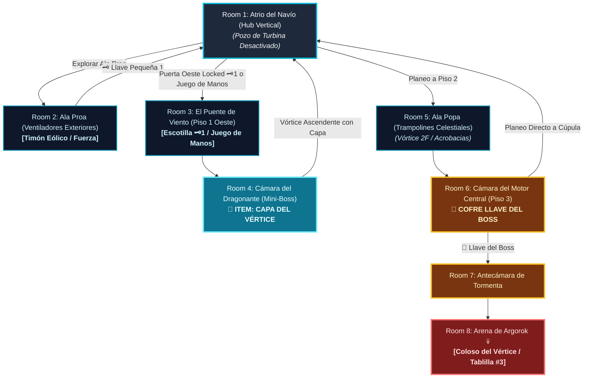

# 🌬️ Subdungeon 3: La Torre de los Vientos (Layout Complejo y No-Lineal estilo City in the Sky)

> **Ubicación**: `7 - DM/OneShots/ARepeat/Subdungeons/03_Subdungeon_Aire_Torre.md`  
> **Inspiración Verbatim**: **City in the Sky** (*Twilight Princess*) + **Stormwind Ark** (*Tears of the Kingdom*)  
> **Regla de Diseño DM (Sistema de Doble Opción)**: **CERO BLOQUEOS OBLIGATORIOS (No Skill-Check Gates)**. Todos los puzles, corrientes y escotillas admiten **DOS MÉTODOS DE RESOLUCIÓN**:  
> 1. 🟢 **Opción Interactiva (Sin Tirada / 100% Seguro)**: Mediante navegación vertical, uso de la Capa del Vértice, timones de bronce o paciencia con las ráfagas.  
> 2. ⚡ **Opción Rápida con Tirada (Skill Check Skip)**: Permite atajar volando o forzando mecanismos mediante tiradas (Fuerza, Atletismo, Acrobacias, Arcanos, etc.).  
> **Estructura de Layout**: **Núcleo de la Ciudadela Flotante (Hub Vertical)** + **Ala Proa (Turbinas Exteriores)** + **Ala Popa (Trampolines Celestes)** + **Activación de Vórtices Eólicos**  
> **Dungeon Item**: *Capa del Vértice* (Planeo Eólico, Impulso de Ráfaga y Sustentación Aérea)  
> **Guardián de Área**: *El Coloso del Vértice* (Inspirado en *Argorok / Colgera*)  
> **Recompensa**: 🔓 Desbloqueo Permanente de la Torre + Fragmento de Tablilla #3

---

## 🗺️ Mapa de Flujo No-Lineal de la Mazmorra (City in the Sky Non-Linear Layout)

---

### 📊 Tabla Resumen de Progreso (Sistema Doble Opción)

| Paso | Ubicación | Tipo | 🟢 Opción Sin Tirada (100% Seguro) | ⚡ Opción Rápida con Tirada (Skill Skip) |
| :---: | :--- | :---: | :--- | :--- |
| **1** | **Room 2 (Ala Proa)** | 🟢 Exploración | Girar timón eólico en equipo (2 personas / 1 min) | **Fuerza DC 13** (girar el timón solo de un solo empuje) |
| **2** | **Room 3 (Puente Viento)** | 🟢 Transición | Abrir escotilla con 🗝️1 y cruzar observando ráfagas | **Juego de Manos DC 13** (ganzuar escotilla) / **Acrobacias DC 13** (cruzar en 1 acción) |
| **3** | **Room 4 (Mini-Boss)** | ⚔️ Combate | Esquivar tornados del Dragonante y atacar su torso | **Atletismo DC 13** (taclear al Dragonante derribándolo al instante) |
| **4** | **Room 5 (Ala Popa 2F)** | 🧩 Puzle | Desplegar Capa en el punto cumbre del rebote | **Acrobacias DC 13** (ganar 15ft extra de impulso y subir a 3F directo) |
| **5** | **Room 6 (Motor 3F)** | 👑 Clave & Atajo | Acelerar las 4 turbinas secundarias lanzando ráfagas | **Arcanos DC 14** (sobrecargar el panel eólico principal de un solo toque) |
| **6** | **Room 8 (Arena Final)** | 💀 Boss | Engancharse a torres con Capa y caer sobre su gema | **Atletismo DC 13** (saltar directo de torre a gema sin planeo) |

---

## 🏛️ Recorrido Verbatim Sala por Sala (DM Walkthrough & Vertical Navigation)

### Room 1: Atrio del Navío Celestial (Hub Vertical)
> *"Una plaza colosal de piedra eólica blanca que flota sobre un abismo de nubes. En el centro, un gran pozo de turbina desactivado se halla apagado. Tres accesos destacan: la Proa (Este), la Escotilla del Puente (Oeste - Locked 🗝️1) y la Popa elevada en el Piso 2. Al norte, en la cima, la Cúpula de la Tormenta 🔒."*
* **Mecánica Doble**:
  * 🟢 *Sin Tirada*: Usar la **Llave Pequeña 🗝️1** en la escotilla Oeste.
  * ⚡ *Con Tirada*: **Juego de Manos DC 13** (ganzuar la escotilla sellada).

---

### Room 2: 🧩 Ala Proa: Torre de Ventiladores Exteriores (TotK)
> *"Un pasaje al aire libre donde hélices de bronce giran impulsadas por corrientes heladas."*
* **Mecánica Doble**:
  * 🟢 *Sin Tirada*: Derrotar a 3x Harpías y girar el timón eólico entre 2 personas durante 1 minuto.
  * ⚡ *Con Tirada*: **Fuerza DC 13** (arrancar la palanca y girar el timón solo en 1 acción rápida).
* **Botín**: La turbina activa un chorro eólico que eleva el cofre con la **Llave Pequeña 🗝️1**.

---

### Room 3: Ala Oeste: El Puente del Viento Cruzado
> *"Una pasarela al vacío barrida por dos ventiladores laterales."*
* **Mecánica Doble**:
  * 🟢 *Sin Tirada*: Cruzar caminando con paso firme entre los descansos de las ráfagas.
  * ⚡ *Con Tirada*: **Acrobacias DC 13** (esprintar a toda velocidad atravesando las ráfagas sin detenerse).

---

### Room 4: ⚔️ Cámara del Mini-Boss: Dragonante de Latón (TP)
> *"Un autómata de latón que proyecta tornados."*
* **Combate**: Esquivar tornados o **Atletismo DC 13** para interceptarlo al vuelo.
* **🎁 COFRE MAESTRO**: Otorga la **Capa del Vértice** (Permite planeo eólico y atrapar corrientes de aire).

---

### Room 5: 🧩 Ala Popa: Trampolines en Velas Celestiales (TotK)
> *"Un pozo vertical de 60 pies con tres velas elásticas horizontalmente."*
* **Mecánica Doble**:
  * 🟢 *Sin Tirada*: Rebotar en las 3 velas y desplazar la *Capa del Vértice* en el punto alto de cada salto.
  * ⚡ *Con Tirada*: **Acrobacias DC 13** (efectuar un salto perfecto que gana 15 ft adicionales de impulso ascendiendo a 3F de un tirón).

---

### Room 6: Piso 3: Cámara del Motor Central (Llave del Boss 👑)
> *"La sala de máquinas principal donde cuatro turbinas eólicas secundarias deben ser aceleradas mediante ráfagas."*
* **Mecánica Doble**:
  * 🟢 *Sin Tirada*: Disparar ráfagas con la capa sobre las 4 turbinas individualmente.
  * ⚡ *Con Tirada*: **Arcanos DC 14** (sintonizar el glifo maestro y encender las 4 turbinas en 1 sola ronda).
* **Botín**: Reclamar la **Llave del Boss 👑 (Llave de Argorok)**.

---

### Room 7: 🔒 Antecámara de la Tormenta
> *"Insertar la Llave del Boss 👑 (o **Juego de Manos / Arcanos DC 14** para forzar las alas de bronce de la cúpula)."*

---

### Room 8: 💀 Boss Final: Argorok / El Coloso del Vértice (TP)
> *"Cúspide de la ciudadela entre tormentas de rayos con 4 torres de pararrayos."*
* **Mecánica Boss**: Engancharse a las torres con la capa, ascender sobre Argorok y picar en caída libre sobre la gema de su espalda.
* **Recompensa**: 🔓 Desbloqueo permanente de la Torre + **Fragmento de Tablilla #3**.

