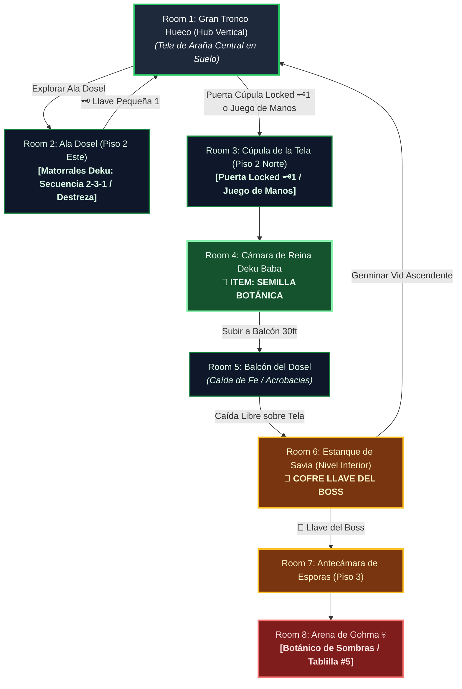

# 🌿 Subdungeon 5: El Invernadero Ancestral (Layout Complejo y No-Lineal estilo Great Deku Tree)

> **Ubicación**: `7 - DM/OneShots/ARepeat/Subdungeons/05_Subdungeon_Vida_Invernadero.md`  
> **Inspiración Verbatim**: **Inside the Great Deku Tree** (*Ocarina of Time*)  
> **Regla de Diseño DM (Sistema de Doble Opción)**: **CERO BLOQUEOS OBLIGATORIOS (No Skill-Check Gates)**. Todos los puzles, vegetación y trampas de esporas admiten **DOS MÉTODOS DE RESOLUCIÓN**:  
> 1. 🟢 **Opción Interactiva (Sin Tirada / 100% Seguro)**: Mediante exploración espacial, desviación física de nueces Deku, germinación de Semillas Botánicas o caídas de fe sobre telas.  
> 2. ⚡ **Opción Rápida con Tirada (Skill Check Skip)**: Permite saltarse la prueba o resolverla al instante mediante una tirada de habilidad (Destreza, Atletismo, Acrobacias, Arcanos, etc.).  
> **Estructura de Layout**: **El Gran Tronco Hueco (Hub Vertical de 3 Pisos)** + **Ala Dosel (Matorrales Deku)** + **Ala Raíces Sumergidas (Foso de Savia)** + **Caída Libre con Destrucción de Tela de Araña**  
> **Dungeon Item**: *Semilla Botánica* (Semilla Deku Titánica que germina vides instantáneas y trampolines)  
> **Guardián de Área**: *El Botánico de Sombras* (Inspirado en *Gohma*)  
> **Recompensa**: 🔓 Desbloqueo Permanente del Invernadero + Fragmento de Tablilla #5

---

## 🗺️ Mapa de Flujo No-Lineal de la Mazmorra (Great Deku Tree Non-Linear Layout)

---

### 📊 Tabla Resumen de Progreso (Sistema Doble Opción)

| Paso | Ubicación | Tipo | 🟢 Opción Sin Tirada (100% Seguro) | ⚡ Opción Rápida con Tirada (Skill Skip) |
| :---: | :--- | :---: | :--- | :--- |
| **1** | **Room 2 (Ala Dosel)** | 🟢 Exploración | Desviar proyectiles reflejados en la secuencia 2-3-1 | **Destreza DC 13** (desviar la nuez a la primera sin esperar la clave) |
| **2** | **Room 3 (Cúpula Norte)** | 🟢 Transición | Usar la Llave Pequeña 🗝️1 obtenida de los matorrales | **Juego de Manos DC 13** (ganzuar el portón de madera entrelazada) |
| **3** | **Room 4 (Mini-Boss)** | ⚔️ Combate | Cortar los tallos secundaria de Reina Deku Baba | **Atletismo DC 13** (decapitar el bulbo principal en 1 sola ronda) |
| **4** | **Room 5 (Balcón Dosel)** | 🧩 Puzle | Encender antorcha y saltar 30ft rompiendo la tela central | **Acrobacias DC 13** (caer de pie en el centro exacto sin mojarse) |
| **5** | **Room 6 (Estanque B1)** | 👑 Clave & Atajo | Plantar Semilla Botánica en los tentáculos del bulbo | **Naturaleza / Atletismo DC 13** (forzar los tentáculos a mano) |
| **6** | **Room 8 (Arena Final)** | 💀 Boss | Esperar a que el ojo de Gohma parpadee en rojo para aturdirla | **Percepción DC 13** (predecir el parpadeo del ojo 1 turno antes) |

---

## 🏛️ Recorrido Verbatim Sala por Sala (DM Walkthrough & Tree Drops)

### Room 1: El Gran Tronco Hueco (Hub 3 Pisos - Planta Baja)
> *"Un árbol titánico de 500 pies en cuyo interior hueco raíces gigantescas forman rampas en espiral. En el centro del suelo del Piso 1 hay una gran tela de araña elástica tensada sobre un abismo. Tres accesos destacan: el Ala Dosel (Piso 2 - Este), la Cúpula Norte (Piso 2 - Locked 🗝️1) y la Antecámara de Esporas en el Piso 3 (Locked 🔒)."*
* **Mecánica Doble**:
  * 🟢 *Sin Tirada*: Usar la **Llave Pequeña 🗝️1** en la Cúpula Norte (Room 3).
  * ⚡ *Con Tirada*: **Juego de Manos DC 13** (ganzuar los cerrojos de vides entrelazadas).

---

### Room 2: 🧩 Ala Dosel: Galería de los Matorrales Deku (OoT)
> *"Un nicho en la corteza con tres Matorrales Deku que escupen nueces."*
* **Mecánica Doble**:
  * 🟢 *Sin Tirada*: Reflejar los proyectiles con el escudo y golpear a los matorrales en la secuencia **2-3-1 (Centro, Derecha, Izquierda)**.
  * ⚡ *Con Tirada*: **Destreza DC 13** (desviar los tres proyectiles simultáneamente de un solo movimiento de escudo).
* **Botín**: El matorral confiesa la clave y entrega la **Llave Pequeña 🗝️1**.

---

### Room 3: Ala Norte: Cúpula de la Tela de Araña Central
> *"Un pasillo que bordea la tela de araña central y da paso a la estancia del Mini-Boss."*

---

### Room 4: ⚔️ Cámara del Mini-Boss: Reina Deku Baba (OoT)
> *"Una planta carnívora titánica que surge del barro."*
* **Combate**: Cortar sus tallos o **Atletismo DC 13** para forzar sus fauces abiertas y destrozar la raíz.
* **🎁 COFRE MAESTRO**: Entrega la **Semilla Botánica** (Germina vides elásticas instantáneas y trampolines).

---

### Room 5: 🧩 Balcón del Dosel: Caída de Fe sobre la Tela (OoT)
> *"Pararse en el borde del balcón a 30 pies de altura sobre la tela de araña central."*
* **Mecánica Doble**:
  * 🟢 *Sin Tirada*: Encender la antorcha del muro y saltar en caída libre directamente sobre el centro de la tela a 30 ft para romperla.
  * ⚡ *Con Tirada*: **Acrobacias DC 13** (efectuar una caída mortal amortiguada aterrizando de pie en el centro exacto sin mojarse el equipo).

---

### Room 6: Nivel Inferior: Estanque de Savia & Bulbo Kalle Demos (Llave del Boss 👑)
> *"Un estanque de savia bioluminiscente sumergido entre las raíces del árbol donde Kalle Demos custodia el cofre."*
* **Mecánica Doble**:
  * 🟢 *Sin Tirada*: Plantar la *Semilla Botánica* en los tentáculos para entramar sus mandíbulas.
  * ⚡ *Con Tirada*: **Naturaleza DC 13** o **Fuerza DC 13** (separar los tentáculos manualmente de un estirón).
* **Botín**: Reclamar la **Llave del Boss 👑 (Llave de la Semilla Deku)**.
* **Atajo**: Plantar una *Semilla Botánica* germina una vid gigante ascendente directa a 1F.

---

### Room 7: 🔒 Antecámara de las Esporas (Piso 3)
> *"Escalar al Piso 3 e insertar la Llave del Boss 👑 (o **Arcanos DC 14** para disipar la barrera de esporas)."*

---

### Room 8: 💀 Boss Final: Gohma / El Botánico de Sombras (OoT)
> *"La cúpula de las raíces a oscuras dominada por el ojo rojo de Gohma en el techo."*
* **Mecánica Boss**: Disparar a su ojo cuando parpadee en **rojo** para aturdirla en el suelo. (*Tirada de **Percepción DC 13** opcional permite detectar el parpadeo 1 turno antes*).
* **Recompensa**: 🔓 Desbloqueo permanente del Invernadero + **Fragmento de Tablilla #5**.

