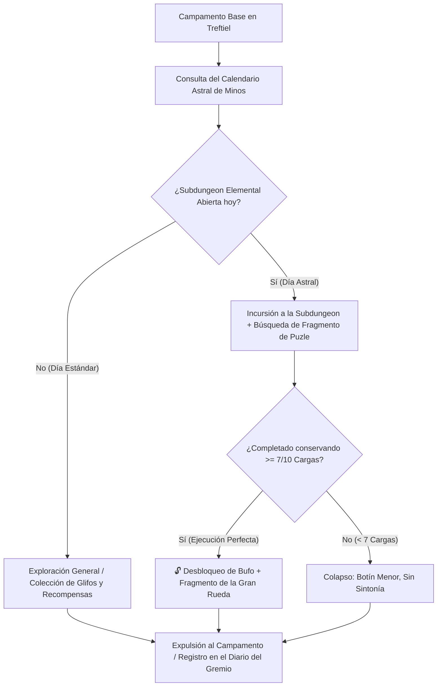

# El Laberinto de Minos: Sistemas Core, Lore y Sintonía

> **Ubicación**: `7 - DM/OneShots/ARepeat/00-Indice_y_Sistemas_Core.md`  
> **Ubicación en Shivath**: **Treftiel**, en el borde del **Angramanio** (La Herida del Mundo).  
> **Formato**: Misión Secundaria Repetible / Downtime / West Marches  
> **Inspiración**: *Outer Wilds* + *Blue Prince* + *Xenoblade*  
> **Palabras de Poder de Shivath**: **Fire**, **Water**, **Air**, **Earth**, **Life**, **Light**.

---

## 1. Lore y Propósito: La Bóveda de Estabilización de Treftiel

El Laberinto de Minos se ubica en las regiones de **Treftiel**, erigido en las fronteras de la bruma caótica del **Angramanio**. 

* **El Ancla de Orden**: Minos creó este laberinto voluntariamente como una **Bóveda de Estabilización**. Su arquitectura viva canaliza y purifica la niebla alucinógena y las fluctuaciones del Angramanio, impidiendo que el caos devore las tierras de Treftiel.
* **El Test de Preparación**: A su vez, el laberinto actúa como una prueba acumulativa para filtrar y preparar a los exploradores capaces de resistir las anomalías de Shivath.

---

## 2. El Bucle de Juego y la Carga Arcana



---

## 3. Recompensas de Incursión (Downtime Loot)

Al finalizar cada expedición (sea por colapso o extracción voluntaria), los jugadores traen al campamento:

1. **Ligero Dinero / Reliquias Arcaicas**: Monedas y gemas de las ruinas de Treftiel para comerciar con facciones o eruditos.
2. **Consumibles de Minos**: Elixires de sintonía, elixires de resistencia y bombas rúnicas elementales.
3. **Objetos Mágicos Menores/Medianos**: Ocasionalmente hallados en cofres de salas secretas (5x5) o tras vencer a Guardianes de Área.

---

## 4. El Gran Meta-Puzle de Minos (Acceso al Boss Final)

Para abrir la **Gran Puerta Hexagonal del Sanctum (Sala 12)** y desafiar a *El Juicio de Minos*, los jugadores deben resolver un **Meta-Puzle de Múltiples Piezas**:

```
======================================================================
           🧭 LA GRAN RUEDA DE CRIPTOGRAFÍA DE MINOS 🧭
======================================================================
1. CADA SUBDUNGEON CONTIENE 1 FRAGMENTO DE TABLILLA (6 Piezas en Total).
2. Al conquistar una Subdungeon con >= 7/10 Cargas Arcanas, los jugadores
   obtienen la Pieza Rúnica de ese elemento.
3. ENSAMBLAJE EN EL DIARIO: En el Campamento, los jugadores superponen
   los 6 Fragmentos en la Rueda de Criptografía de Minos para descifrar 
   la SECUENCIA MAESTRA DE 12 SÍMBOLOS que desbloquea la Sala 12.
======================================================================
```

---

## 5. Tabla de Sintonías Elementales Desbloqueables

| Palabra de Poder | Pasiva de Combate | Facultad de Puzles | Rol en Boss Final |
| :--- | :--- | :--- | :--- |
| **FIRE (Fuego)** | Inmunidad a fuego/frío. +1d6 daño fuego. | **Ignite/Melt**: Enciende forjas y derrite hielo. | Rompe el *FIRE Orb* del Boss con WATER. |
| **WATER (Agua)** | Inmunidad a ahogamiento. Caminar sobre agua. | **Drain/Conduct**: Drena depósitos y canaliza agua. | Rompe el *WATER Orb* del Boss con FIRE. |
| **AIR (Aire)** | Caída pluma. +10 ft movimiento. | **Vent/Float**: Dispersa gases y vuela en corrientes. | Rompe el *AIR Orb* del Boss con EARTH. |
| **EARTH (Tierra)** | +2 AC y resistencia a daño físico. | **Shatter/Anchor**: Repara muros y ancla salas. | Rompe el *EARTH Orb* del Boss con AIR. |
| **LIFE (Vida)** | Regeneración 1d4 HP/turno (<50% HP). | **Overgrowth/Purify**: Brota vides y purifica toxinas. | Rompe el *LIFE Orb* del Boss con LIGHT. |
| **LIGHT (Luz)** | Emite luz 30 ft. Visión en oscuridad. | **Refract/Reveal**: Proyecta espejos y revela glifos. | Rompe el *LIGHT Orb* del Boss con LIFE. |
