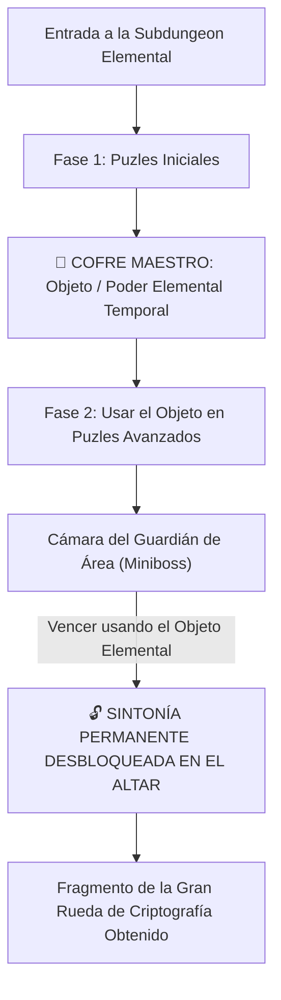

# El Laberinto de Minos: Sistemas Core, Lore y Subdungeons (Zelda Style)

> **Ubicación**: `7 - DM/OneShots/ARepeat/00-Indice_y_Sistemas_Core.md`  
> **Ubicación en Shivath**: **Treftiel**, en el borde del **Angramanio** (La Herida del Mundo).  
> **Formato**: Misión Secundaria Repetible / Downtime / West Marches  
> **Inspiración**: *Zelda 2D Mini-Dungeons* + *Outer Wilds* + *Blue Prince* + *Xenoblade*  
> **Palabras de Poder de Shivath**: **Fire**, **Water**, **Air**, **Earth**, **Life**, **Light**.

---

## 1. Lore y Propósito: La Bóveda de Estabilización de Treftiel

El Laberinto de Minos se ubica en las regiones de **Treftiel**, erigido en las fronteras de la bruma caótica del **Angramanio**. 

* **El Ancla de Orden**: Minos creó este laberinto voluntariamente como una **Bóveda de Estabilización**. Su arquitectura viva canaliza y purifica la niebla alucinógena y las fluctuaciones del Angramanio, impidiendo que el caos devore las tierras de Treftiel.
* **El Test de Preparación**: A su vez, el laberinto actúa como una prueba acumulativa para filtrar y preparar a los exploradores capaces de resistir las anomalías de Shivath.

---

## 2. Bucle de Juego y Estructura Zelda para Subdungeons

Cada **Subdungeon Elemental** opera como una **Mini-Dungeon de Zelda**:



### Objetos Elementales Temporales de Subdungeon (Dungeon Items)
1. **FIRE**: *Guantelete de Llama de Minos* (Dispara plasma para encender antorchas distantes y derretir hielo).
2. **WATER**: *Flauta del Mar de Minos* (Modifica el nivel del agua en cualquier cisterna).
3. **AIR**: *Capa del Vértice de Minos* (Otorga saltos de viento de 30 ft y vuelo en corrientes).
4. **EARTH**: *Martillo de Basalto de Minos* (Rompe muros de piedra agrietados y golpea estacas telúricas).
5. **LIFE**: *Semilla Botánica de Minos* (Germina vides gigantes instantáneas como puentes o cuerdas).
6. **LIGHT**: *Escudo Prismático de Minos* (Refleja rayos de luz hacia ojos y receptores solares).

---

## 3. Persistencia Total de Subdungeons y Regla 7/10 de Excelencia

```
======================================================================
         👑 PERSISTENCIA TOTAL Y BONUS DE EXCELENCIA 7/10 👑
======================================================================
1. PERSISTENCIA DE SUBDUNGEONS: Todo el avance dentro de una Subdungeon
   (palancas activadas, agua desviada, puertas abiertas o daño al Guardián)
   SE GUARDA PERMANENTEMENTE entre incursiones.

2. BONUS DE EXCELENCIA 7/10:
   - Si el grupo completa la Subdungeon conservando SIETE O MÁS (>= 7/10)
     Puntos de Carga Arcana al finalizar (máximo 3 cargas gastadas),
     obtiene el BONUS DE EXCELENCIA: Desbloqueo instantáneo del bufo
     de sintonía permanente + Reliquia Estelar de Minos.
   - Si gastan más cargas (< 7 Cargas al final), IGUAL AVANZAN y guardan 
     su progreso para desbloquear la sintonía en la siguiente run.
======================================================================
```

---

## 4. Recompensas de Incursión (Downtime Loot)

1. **Ligero Dinero / Reliquias Arcaicas**: Monedas y gemas de las ruinas de Treftiel para comerciar.
2. **Consumibles de Minos**: Elixires de sintonía, elixires de resistencia y bombas rúnicas elementales.
3. **Objetos Mágicos Menores/Medianos**: Ocasionalmente hallados en cofres de salas secretas (5x5) o tras vencer a Guardianes de Área.

---

## 5. El Gran Meta-Puzle de Minos (Acceso al Boss Final)

Para abrir la **Gran Puerta Hexagonal del Sanctum (Sala 12)** y desafiar a *El Juicio de Minos*, los jugadores deben resolver un **Meta-Puzle de Múltiples Piezas**:

* Cada Subdungeon contiene **1 Fragmento de Tablilla (6 Piezas en Total)**.
* Los jugadores reúnen las 6 piezas y las ensamblan en la **Rueda de Criptografía de Minos** en el Diario del Gremio para descifrar la secuencia maestra que abre la Sala 12.
