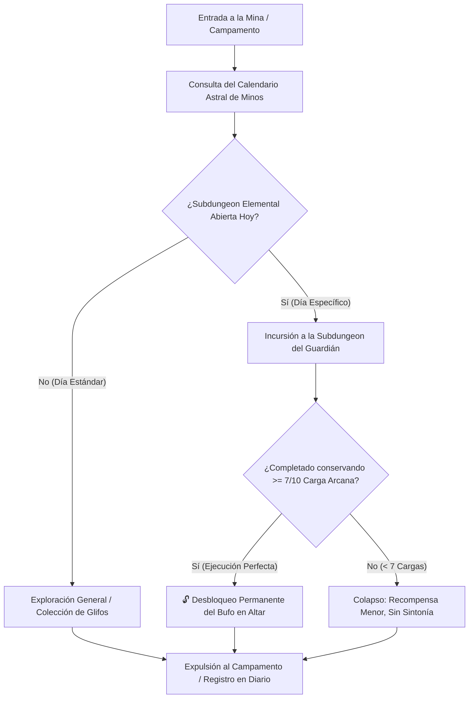

# El Laberinto de Minos: Sistemas Core, Días Elementales y Sintonía

> **Ubicación**: `7 - DM/OneShots/ARepeat/00-Indice_y_Sistemas_Core.md`  
> **Formato**: Misión Secundaria Repetible / Downtime / West Marches  
> **Inspiración**: *Outer Wilds* + *Blue Prince* + *Xenoblade*  
> **Palabras de Poder de Shivath**: **Fire**, **Water**, **Air**, **Earth**, **Life**, **Light**.

---

## 1. El Propósito de Minos y la Estructura de la Dungeon

El Laberinto de Minos es un motor arcano-astronómico vivo creado voluntariamente por el gran arquitecto Minos. Su función es actuar como una prueba continua donde la fuerza bruta fracasa y solo la **acumulación de conocimiento**, la **manipulación de sistemas interconectados** y la **sintonía elemental progresiva** permiten avanzar hacia el núcleo.

### Resumen del Bucle (The Expedition Loop)



---

## 2. Días Elementales y Subdungeons (Rotación Astral)

El laberinto no muestra todas sus salas al mismo tiempo. Existen **6 Subdungeons Elementales** dedicadas a las Palabras de Poder de Shivath. Cada Subdungeon solo abre su compuerta principal en **Días Particulares** del ciclo lunar/astral de Shivath:

| Día Astral | Subdungeon Abierta | Guardián de Área | Requisito de Acceso |
| :---: | :--- | :--- | :--- |
| **Día de la Llama (FIRE)** | *La Caldera Volcánica* | El Señor del Crisol | Red Térmica encendida en la run anterior. |
| **Día de la Marea (WATER)** | *La Cisterna Sumergida* | La Quimera Hidráulica | Válvula del Depósito desbloqueada. |
| **Día del Viento (AIR)** | *La Torre de los Vientos* | El Coloso del Vértice | Conexión de aire activa en el Engranaje. |
| **Día del Pico (EARTH)** | *El Dominio Telúrico* | El Guardián de Basalto | Ancla Arcana previa en la Sala 10. |
| **Día del Brote (LIFE)** | *El Invernadero Ancestral* | El Botánico de Sombras | Semilla ancestral sembrada en la Sala 03. |
| **Día del Sol (LIGHT)** | *El Santuario Prismático* | El Espejismo de Cristal | Espejo rúnico alineado en la Sala 09. |

---

## 3. Desbloqueo de Sintonía Elemental (Regla del 7/10 de Carga Arcana)

Al inicio de la campaña, **los jugadores no tienen acceso a todos los elementos en el Altar de Sintonía**.

Para **desbloquear permanentemente** una Palabra de Poder y poder elegirla en el Altar al inicio de cualquier incursión futura, el grupo debe cumplir la **Prueba de Ejecución Perfecta**:

```
======================================================================
         👑 REGLA DE EJECUCIÓN PERFECTA (PRUEBA DEL GUARDIÁN) 👑
======================================================================
1. Entrada en Día Específico: Entrar a la Subdungeon en su día astral.
2. Derrotar al Guardián de Área y resolver el Puzle Maestro.
3. EFICIENCIA DE CARGA: El grupo debe completar la Subdungeon conservando
   SETE O MÁS (>= 7/10) PUNTOS DE CARGA ARCANA intactos al final.
   (Máximo 3 Puntos de Carga gastados en toda la incursión).
   
RESULTADO:
- Con 7-10 Cargas restantes: 🔓 SINTONÍA DESBLOQUEADA PARA SIEMPRE.
- Con < 7 Cargas restantes: Se obtiene botín menor, pero el canal arcano
  se desestabiliza y la Sintonía NO se desbloquea.
======================================================================
```

---

## 4. Tabla de Sintonías Elementales Desbloqueables

Una vez desbloqueada una Palabra de Poder mediante la regla del 7/10, cualquier jugador puede sintonizarse con ella al inicio de las siguientes incursiones:

| Palabra de Poder | Pasiva de Combate | Facultad de Puzles | Rol en Boss Final |
| :--- | :--- | :--- | :--- |
| **FIRE (Fuego)** | Inmunidad a fuego/frío. +1d6 daño fuego. | **Ignite/Melt**: Enciende forjas y derrite hielo. | Rompe el *FIRE Orb* del Boss con WATER. |
| **WATER (Agua)** | Inmunidad a ahogamiento. Caminar sobre agua. | **Drain/Conduct**: Drena depósitos y canaliza agua. | Rompe el *WATER Orb* del Boss con FIRE. |
| **AIR (Aire)** | Caída pluma. +10 ft movimiento. | **Vent/Float**: Dispersa gases y vuela en corrientes. | Rompe el *AIR Orb* del Boss con EARTH. |
| **EARTH (Tierra)** | +2 AC y resistencia a daño físico. | **Shatter/Anchor**: Repara muros y ancla salas. | Rompe el *EARTH Orb* del Boss con AIR. |
| **LIFE (Vida)** | Regeneración 1d4 HP/turno (<50% HP). | **Overgrowth/Purify**: Brota vides y purifica toxinas. | Rompe el *LIFE Orb* del Boss con LIGHT. |
| **LIGHT (Luz)** | Emite luz 30 ft. Visión en oscuridad. | **Refract/Reveal**: Proyecta espejos y revela glifos. | Rompe el *LIGHT Orb* del Boss con LIFE. |

---

## 5. El Diario del Gremio y Calendario de la Mina

En el Campamento Base reside el **Calendario Astral y Diario de la Mina**:
* Los jugadores consultan qué **Día Astral** es hoy antes de elegir ruta.
* Registran qué Palabras de Poder ya han sido **Desbloqueadas con 7/10 Cargas** y cuáles siguen selladas.
