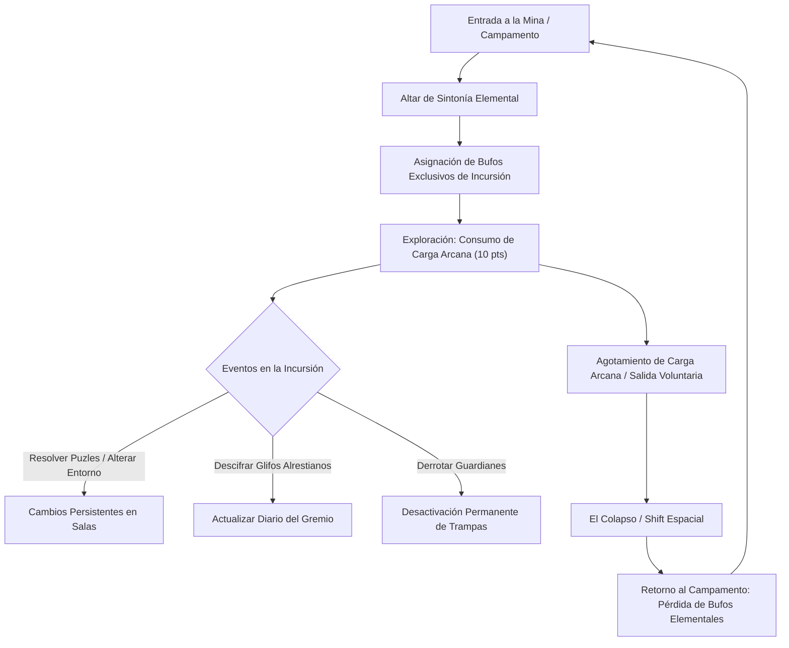
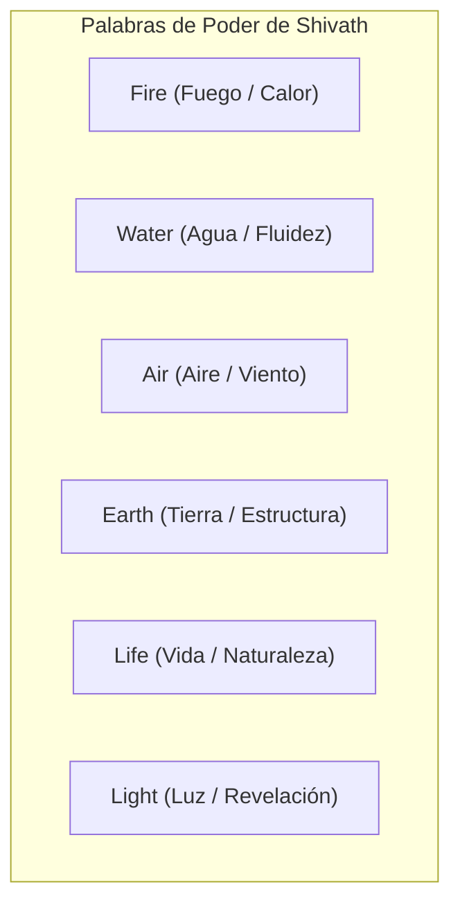

# El Laberinto de Minos: Sistemas Core y Sintonía Elemental

> **Ubicación**: `7 - DM/OneShots/ARepeat/00-Indice_y_Sistemas_Core.md`  
> **Formato**: Misión Secundaria Repetible / Downtime / West Marches  
> **Inspiración**: *Outer Wilds* + *Blue Prince* + *Xenoblade (Escritura Alrestiana)*  
> **Palabras de Poder de Shivath**: **Fire**, **Water**, **Air**, **Earth**, **Life**, **Light**.

---

## 1. El Propósito de Minos y la Estructura de la Dungeon

El Laberinto de Minos es un motor arcano-astronómico vivo creado voluntariamente por el gran arquitecto Minos. Su función es actuar como una prueba continua donde la fuerza bruta fracasa y solo la **acumulación de conocimiento**, la **manipulación de sistemas interconectados** y la **sintonía elemental coordinada con las Palabras de Poder de Shivath** permiten avanzar hacia el núcleo.

### Resumen del Bucle (The Expedition Loop)

---

## 2. Sistema de Carga Arcana (Contador de Sesión)

Para garantizar que las expediciones sean ideales como **actividades secundarias o de relleno (1.5 a 3 horas)**:

* **Reserva Inicial**: El grupo comienza con **10 Puntos de Carga Arcana**.
* **Consumo por Sala**:
  * Entrar o explorar una sala nueva: **-1 Carga Arcana**.
  * Re-cruzar una sala ya visitada en la misma incursión: **0 Carga Arcana** (si la sala está limpia).
  * Error grave en un panel de Minos o fallo catastrófico en puzle: **-1 Carga Arcana adicional**.
* **El Colapso (The Shift)**:
  * Al llegar a **0 Carga Arcana**, la masa del laberinto vibra y expulsa a los exploradores hacia la superficie mediante un pliegue dimensional seguro.
  * El orden y conexiones de las salas se reconfiguran para la siguiente expedición, pero las **alteraciones del terreno y el conocimiento registrado permanecen**.

---

## 3. Sistema de Sintonía Elemental (Las 6 Palabras de Poder de Shivath)

Al cruzar el **Altar de Sintonía** en la entrada del laberinto, cada jugador debe elegir o sintonizarse con una de las **6 Palabras de Poder de Shivath**:

> [!IMPORTANT]
> **Regla de Duración**: Estos bufos y facultades solo existen **dentro** del laberinto. Al ser expulsados o salir a la superficie, la sintonía se disipa por completo.

### Tabla de Sintonías Elementales de Shivath

| Palabra de Poder | Pasiva de Combate / Supervivencia | Facultad de Interacción en Puzles | Rol en Boss Final |
| :--- | :--- | :--- | :--- |
| **Fire (Fuego)** | Inmunidad a daño de fuego y frío extremo. +1d6 daño de fuego a tus ataques. | **Ignite/Melt**: Enciende forjas antiguas, derrite barreras de hielo y activa generadores térmicos. | Rompe el *Escudo Frío de Minos* e incinera las esporas del núcleo. |
| **Water (Agua)** | Inmunidad a ahogamiento. Caminar sobre agua y resistir alta presión hidráulica. | **Drain/Conduct**: Sintoniza con conductos de agua, purifica líquidos y canaliza corrientes. | Rompe el *Escudo Flamígero de Minos* y enfría la coraza volcánica. |
| **Air (Aire)** | Caída pluma constante. +10 ft velocidad y ventaja en salvaciones para esquivar trampas. | **Vent/Float**: Desplaza gases venenosos, impulsa plataformas de viento y activa pozos de presión. | Rompe el *Escudo Gravitacional de Minos* y estabiliza el suelo. |
| **Earth (Tierra)** | +2 a AC y resistencia a daño físico no mágico. | **Shatter/Anchor**: Repara o rompe muros de piedra frágiles; activa anclas telúricas. | Rompe el *Escudo Cinético de Minos* y fija sus pies a la matriz. |
| **Life (Vida)** | Regeneración de 1d4 HP por turno al estar herido (<50% HP). Inmunidad a veneno. | **Overgrowth/Purify**: Hace brotar raíces para escalar abismos y purifica toxinas o esporas arcanas. | Rompe el *Escudo de Necrosis de Minos* y restaura los conductos vitales. |
| **Light (Luz)** | Emite luz mágica de 30 ft. Inmunidad a ceguera y visión a través de ilusiones/oscuridad. | **Refract/Reveal**: Refleja rayos solares en espejos rúnicos y revela glifos e itinerarios invisibles. | Rompe el *Escudo Astral/Espejismo de Minos* y expone el Núcleo de Cristal. |

---

## 4. El Diario del Gremio (Persistencia Asíncrona)

En el Campamento Base reside el **Diario de la Expedición de Minos**.
* Cada grupo que sale anota:
  * Glifos traducidos y combinaciones descubiertas.
  * Estado de las válvulas, generadores y tanques de fluidos.
  * Guardianes eliminados.
* Cuando un nuevo grupo (o jugadores distintos) juega en la siguiente sesión, **hereda todo el diario**, permitiéndoles usar el conocimiento previo inmediatamente sin repetir el trabajo de descubrimiento.
