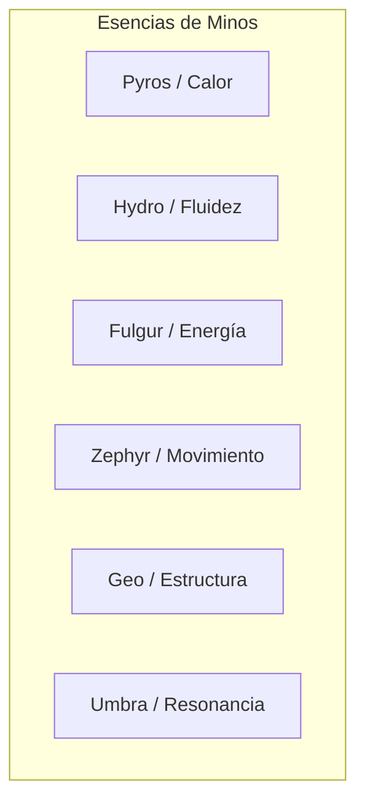

# El Laberinto de Minos: Sistemas Core y Sintonía Elemental

> **Ubicación**: `7 - DM/OneShots/ARepeat/00-Indice_y_Sistemas_Core.md`  
> **Formato**: Misión Secundaria Repetible / Downtime / West Marches  
> **Inspiración**: *Outer Wilds* + *Blue Prince* + *Xenoblade (Escritura Alrestiana)*

---

## 1. El Propósito de Minos y la Estructura de la Dungeon

El Laberinto de Minos es un motor arcano-astronómico vivo creado voluntariamente por el gran arquitecto Minos. Su función es actuar como una prueba continua donde la fuerza bruta fracasa y solo la **acumulación de conocimiento**, la **manipulación de sistemas interconectados** y la **sintonía elemental coordinada** permiten avanzar hacia el núcleo.

### Resumen del Bucle (The Expedition Loop)

```mermaid
flowchart TD
    A[Entrada a la Mina / Campamento] --> B[Altar de Sintonía Elemental]
    B --> C[Asignación de Bufos Exclusivos de Incursión]
    C --> D[Exploración: Consumo de Carga Arcana (10 pts)]
    D --> E{Eventos en la Incursión}
    E -->|Resolver Puzles / Alterar Entorno| F[Cambios Persistentes en Salas]
    E -->|Descifrar Glifos Alrestianos| G[Actualizar Diario del Gremio]
    E -->|Derrotar Guardianes| H[Desactivación Permanente de Trampas]
    D --> I[Agotamiento de Carga Arcana / Salida Voluntaria]
    I --> J[El Colapso / Shift Espacial]
    J --> K[Retorno al Campamento: Pérdida de Bufos Elementales]
    K --> A
```

---

## 2. Sistema de Carga Arcana (Contador de Sesión)

Para garantizar que las expediciones sean ideales como **actividades secundarias o de relleno (1.5 a 3 horas)**:

* **Reserva Inicial**: El grupo comienza con **10 Puntos de Carga Arcana**.
* **Consumo por Sala**:
  * Entrar o explorar una sala nueva: **-1 Carga Arcana**.
  * Re-cruzar una sala ya visitada en la misma incursión: **0 Carga Arcana** (si la sala está limpia).
  * Error grave en un panel de Minos o fallo catastrófico en puzle: **-1 Carga Arcana adicional**.
* **El Colapso (The Shift)**:
  * Al llegar a **0 Carga Arcana**, la masa del laberinto vibra y expulsa a los jugadores hacia la superficie mediante un pliegue dimensional seguro.
  * El orden y conexiones de las salas se reconfiguran para la siguiente expedición, pero las **alteraciones del terreno y el conocimiento registrado permanecen**.

---

## 3. Sistema de Sintonía Elemental (Bufos Exclusivos de la Dungeon)

Al cruzar el **Altar de Sintonía** en la entrada del laberinto, cada jugador debe elegir o sintonizarse con un **Elemento de Minos**. 

> [!IMPORTANT]
> **Regla de Duración**: Estos bufos y facultades solo existen **dentro** del laberinto. Al ser expulsados o salir a la superficie, la sintonía se disipa por completo.

Cada elemento otorga **Beneficios Pasivos**, **Facultades de Interacción con Puzles** y un **Rol Vital para el Boss Final**:



### Tabla de Sintonías Elementales

| Elemento | Pasiva de Combate / Supervivencia | Facultad de Interacción en Puzles | Rol en Boss Final |
| :--- | :--- | :--- | :--- |
| **Pyros (Fuego / Calor)** | Inmunidad a daño de fuego y frío extremo. Tus ataques infligen +1d6 daño de fuego. | Melt/Ignite: Enciende forjas antiguas, derrite barreras de hielo y purga esporas arcanas. | Rompe el *Escudo Frío de Minos* y sobrecarga la Forja Central. |
| **Hydro (Agua / Fluidez)** | Inmunidad a ahogamiento. Puedes caminar sobre superficies líquidas y resistir presiones. | Conduct/Drain: Sintoniza con conductos de agua, purifica líquidos tóxicos y canaliza corrientes. | Rompe el *Escudo Flamígero de Minos* y enfría el núcleo del Guardián. |
| **Fulgur (Rayo / Energía)** | +3 a Iniciativa y +10 ft de movimiento. Inmunidad a parálisis y electrificación. | Circuit/Power: Actúa como puente conductor entre nodos arcanos descompuestos. | Rompe el *Escudo Terrestre de Minos* y activa la bobina de aturdimiento. |
| **Zephyr (Viento / Movimiento)** | Caída pluma constante. Puedes realizar saltos dobles y esquivar trampas con ventaja en AGI. | Vent/Float: Activa pozos de presión de aire, dispersa gases venenosos e impulsa mecanismos de viento. | Rompe el *Escudo Gravitacional de Minos* y estabiliza las plataformas. |
| **Geo (Tierra / Estructura)** | +2 a AC y resistencia a daño físico no mágico. | Shatter/Anchor: Repara o destruye estructuras de piedra frágiles; activa anclas telúricas. | Rompe el *Escudo Cinético de Minos* y fija sus pies a la matriz. |
| **Umbra (Vacío / Resonancia)** | Visión en la oscuridad absoluta (incluso mágica). Inmunidad a ceguera y miedo. | Translate/Phase: Permite resonar con glifos ocultos y atravesar barreras espectrales finas. | Rompe el *Escudo Astral de Minos* y revela los puntos débiles del Núcleo. |

---

## 4. El Diario del Gremio (Persistencia Asíncrona)

En el Campamento Base reside el **Diario de la Expedición de Minos**.
* Cada grupo que sale anota:
  * Glifos traducidos y palabras aprendidas.
  * Estado de las válvulas, generadores y tanques de fluidos.
  * Guardianes eliminados.
* Cuando un nuevo grupo (o jugadores distintos) juega en la siguiente sesión, **hereda todo el diario**, permitiéndoles usar el conocimiento previo inmediatamente sin repetir el trabajo de descubrimiento.
