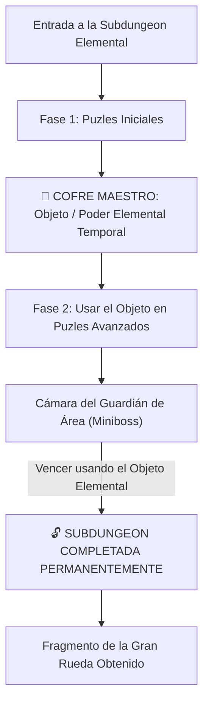

# El Laberinto de Minos: Sistemas Core y Subdungeons (Mecánico Agnóstico)

> **Ubicación**: `7 - DM/OneShots/ARepeat/00-Indice_y_Sistemas_Core.md`  
> **Formato**: Misión Secundaria Repetible / Downtime / West Marches  
> **Inspiración**: *Zelda 2D/3D Mini-Dungeons* + *Outer Wilds* + *Blue Prince* + *Binding of Isaac*  
> **Palabras de Poder de Shivath**: **Fire**, **Water**, **Air**, **Earth**, **Life**, **Light**.

Ver de simplificar y hacer una dungeon con ascensor o escaleras
Vale maybe la cosa empieza como dungeon meshi y después cambia a otra cosa
Maybe basarme en pokemon mundo misterioso

---

## 1. Bucle de Juego y Estructura de Subdungeons

Cada **Subdungeon Elemental** opera como una **Mini-Dungeon de Zelda**:



### Objetos Elementales Temporales de Subdungeon (Dungeon Items)
1. **FIRE**: *Guantelete de Llama* (Dispara plasma para encender antorchas distantes y derretir hielo).
2. **WATER**: *Flauta del Mar* (Modifica el nivel del agua en cualquier cisterna).
3. **AIR**: *Capa del Vértice* (Otorga saltos de viento de 30 ft y vuelo en corrientes).
4. **EARTH**: *Martillo de Basalto* (Rompe muros de piedra agrietados y golpea estacas telúricas).
5. **LIFE**: *Semilla Botánica* (Germina vides gigantes instantáneas como puentes o cuerdas).
6. **LIGHT**: *Escudo Prismático* (Refleja rayos de luz hacia ojos y receptores solares).

---

## 🏰 Guías Verbatim de Mazmorras Zelda (`Subdungeons/`)

Cada Sanctum / Subdungeon cuenta con una guía **verbatim completa sala por sala estilo Zelda** (con mapa de flujo Mermaid, Llaves Pequeñas 🗝️, Mini-Boss ⚔️, Dungeon Item 🎁, Llave del Boss 👑 y Boss Final 💀):

1. **[[01_Subdungeon_Fuego_Caldera|🌋 Subdungeon 1: La Caldera Volcánica (Goron Mines - Twilight Princess)]]** (`01_Subdungeon_Fuego_Caldera.md`)
2. **[[02_Subdungeon_Agua_Cisterna|🌊 Subdungeon 2: La Cisterna Sumergida (Ancient Cistern - Skyward Sword)]]** (`02_Subdungeon_Agua_Cisterna.md`)
3. **[[03_Subdungeon_Aire_Torre|🌬️ Subdungeon 3: La Torre de los Vientos (City in the Sky - TP & Stormwind Ark - TotK)]]** (`03_Subdungeon_Aire_Torre.md`)
4. **[[04_Subdungeon_Tierra_Dominio|🪨 Subdungeon 4: El Dominio Telúrico (Snowhead Temple - MM Edición Basalto sin Hielo)]]** (`04_Subdungeon_Tierra_Dominio.md`)
5. **[[05_Subdungeon_Vida_Invernadero|🌿 Subdungeon 5: El Invernadero Ancestral (Inside the Great Deku Tree - OoT & Forbidden Woods - WW)]]** (`05_Subdungeon_Vida_Invernadero.md`)
6. **[[06_Subdungeon_Luz_Santuario|☀️ Subdungeon 6: El Santuario Prismático (Spirit Temple - OoT Verbatim)]]** (`06_Subdungeon_Luz_Santuario.md`)
7. **[[07_Sanctum_12_Reactor_Central|👑 Sanctum 12: El Reactor Central (Ganon's Castle - OoT & TotK)]]** (`07_Sanctum_12_Reactor_Central.md`)

---

## 2. Persistencia Total de Subdungeons y Regla 7/10 de Excelencia

```
======================================================================
         👑 PERSISTENCIA TOTAL Y BONUS DE EXCELENCIA 7/10 👑
======================================================================
1. PERSISTENCIA DE SUBDUNGEONS: Todo el avance dentro de una Subdungeon
   (palancas activadas, agua desviada, puertas abiertas o daño al Guardián)
   SE GUARDA PERMANENTEMENTE entre incursiones.

2. BONUS DE EXCELENCIA 7/10:
   - Si el grupo completa la Subdungeon conservando SIETE O MÁS (>= 7/10)
     Puntos de Carga Arcana al finalizar (máximo 3 cargas gastadas),
     obtiene el BONUS DE EXCELENCIA (Reliquia de Minos + Recompensa Extra).
   - Si gastan más cargas (< 7 Cargas al final), IGUAL AVANZAN y guardan 
     su progreso para la siguiente run.
======================================================================
```

---

## 3. Recompensas de Incursión (Downtime Loot)

1. **Monedas / Reliquias Arcaicas**: Monedas y gemas de las ruinas para comerciar.
2. **Consumibles de Minos**: Elixires de resistencia y bombas rúnicas elementales.
3. **Objetos Mágicos Menores/Medianos**: Hallados en cofres de salas secretas (7x7) o tras vencer a Guardianes de Área.

---

## 4. El Gran Meta-Puzle y Bloqueos Cognitivos (Outer Wilds + Zelda)

Para abrir la **Gran Puerta Hexagonal del Sanctum (Sala 12)** y desafiar a *El Juicio de Minos*, los jugadores deben resolver el **Macro-Puzle del Reactor Central**:

```
======================================================================
         🧠 BLOQUEOS COGNITIVOS VS. ATAJOS FÍSICOS (KNOWLEDGE GATING) 🧠
======================================================================
1. BLOQUEOS COGNITIVOS (KNOWLEDGE LOCKS):
   - La entrada al Sanctum está 100% visible desde la primera incursión.
   - El obstáculo NO es una llave física arbitraria, sino COMPRENDER la 
     secuencia física/elemental del Reactor Central.
   - Cada Subdungeon enseña una regla física fundamental (ej. cómo enfriar 
     el reactor con WATER, cómo evacuar gases con AIR, cómo calibrar la lente 
     con LIGHT).

2. LAS 6 PIEZAS DEL TABLERO DE MINOS:
   * Cada Subdungeon otorga 1 Fragmento de Tablilla (6 en total).
   * Reunir los 6 fragmentos traduce la secuencia rúnica necesaria para 
     ejecutar el Alineamiento Maestro del Reactor en la Sala 12.
======================================================================
```

---

## 5. Regla de Filtrado Elemental de la Incursión Daily

> [!IMPORTANT]
> **EXCLUSIVIDAD ELEMENTAL DEL DÍA**:
> - En cada incursión diaria, el laberinto se sintoniza con **UNA ÚNICA Subdungeon Elemental** (Fuego, Agua, Aire, Tierra, Vida o Luz).
> - El pool de salas elementales de esa run **SOLO contiene salas del Set Elemental correspondiente a la Subdungeon activa**.
> - Por ejemplo: Si la Subdungeon del día es **FIRE (Fuego)**, el laberinto generará salas del *Set 0 (Genéricas/Neutrales)* y **únicamente del Set 1 (Fuego)**. Las salas del Set de Agua, Aire, Tierra, Vida o Luz se excluyen automáticamente para preservar la identidad temática del día.

