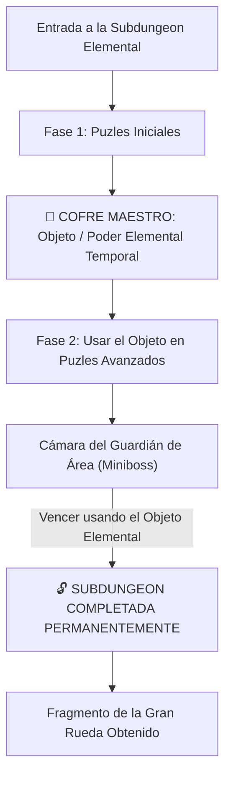

# El Laberinto de Minos: Sistemas Core y Subdungeons (Mecánico Agnóstico)

> **Ubicación**: `7 - DM/OneShots/ARepeat/00-Indice_y_Sistemas_Core.md`  
> **Formato**: Misión Secundaria Repetible / Downtime / West Marches  
> **Inspiración**: *Zelda 2D/3D Mini-Dungeons* + *Outer Wilds* + *Blue Prince* + *Binding of Isaac*  
> **Palabras de Poder de Shivath**: **Fire**, **Water**, **Air**, **Earth**, **Life**, **Light**.

---

## 1. Bucle de Juego y Estructura de Subdungeons

Cada **Subdungeon Elemental** opera como una **Mini-Dungeon de Zelda**:



### Objetos Elementales Temporales de Subdungeon (Dungeon Items)
1. **FIRE**: *Guantelete de Llama* (Dispara plasma para encender antorchas distantes y derretir hielo).
2. **WATER**: *Flauta del Mar* (Modifica el nivel del agua en cualquier cisterna).
3. **AIR**: *Capa del Vértice* (Otorga saltos de viento de 30 ft y vuelo en corrientes).
4. **EARTH**: *Martillo de Basalto* (Rompe muros de piedra agrietados y golpea estacas telúricas).
5. **LIFE**: *Semilla Botánica* (Germina vides gigantes instantáneas como puentes o cuerdas).
6. **LIGHT**: *Escudo Prismático* (Refleja rayos de luz hacia ojos y receptores solares).

---

## 2. Persistencia Total de Subdungeons y Regla 7/10 de Excelencia

```
======================================================================
         👑 PERSISTENCIA TOTAL Y BONUS DE EXCELENCIA 7/10 👑
======================================================================
1. PERSISTENCIA DE SUBDUNGEONS: Todo el avance dentro de una Subdungeon
   (palancas activadas, agua desviada, puertas abiertas o daño al Guardián)
   SE GUARDA PERMANENTEMENTE entre incursiones.

2. BONUS DE EXCELENCIA 7/10:
   - Si el grupo completa la Subdungeon conservando SIETE O MÁS (>= 7/10)
     Puntos de Carga Arcana al finalizar (máximo 3 cargas gastadas),
     obtiene el BONUS DE EXCELENCIA (Reliquia de Minos + Recompensa Extra).
   - Si gastan más cargas (< 7 Cargas al final), IGUAL AVANZAN y guardan 
     su progreso para la siguiente run.
======================================================================
```

---

## 3. Recompensas de Incursión (Downtime Loot)

1. **Monedas / Reliquias Arcaicas**: Monedas y gemas de las ruinas para comerciar.
2. **Consumibles de Minos**: Elixires de resistencia y bombas rúnicas elementales.
3. **Objetos Mágicos Menores/Medianos**: Hallados en cofres de salas secretas (7x7) o tras vencer a Guardianes de Área.

---

## 4. El Gran Meta-Puzle (Acceso al Boss Final)

Para abrir la **Gran Puerta Hexagonal del Sanctum (Sala 12)** y desafiar a *El Juicio de Minos*, los jugadores deben resolver un **Meta-Puzle de Múltiples Piezas**:

* Cada Subdungeon contiene **1 Fragmento de Tablilla (6 Piezas en Total)**.
* Los jugadores reúnen las 6 piezas para descifrar la secuencia maestra que abre la Sala 12.
