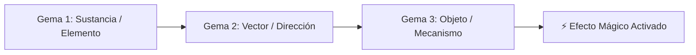

# Sistema de Escritura Rúnico-Simbólico de Minos (Estilo Alrestiano)

> **Ubicación**: `7 - DM/OneShots/ARepeat/01-Sistema_de_Escritura_Alrestiano.md`  
> **Filosofía**: Ideogramas simbólicos puros inspirados en el lenguaje Alrestiano (*Xenoblade*). No requiere sintaxis compleja; combina **Sustancia** + **Vector/Acción** + **Objeto/Receptor**.

---

## 1. Regla de Puzle Puro y Mecánica de Skip (2 Cargas)

```
======================================================================
           🧩 REGLA DE PUZLE PURO Y FORCED OVERRIDE (SKIP) 🧩
======================================================================
1. PUZLE PURO DE INGENIO:
   - Los puzles de consolas arcanas de 3 gemas son puramente de razonamiento
     e inspección del entorno. NO se regala la combinación con tiradas de dado.

2. FORCED OVERRIDE / SALTO DE PUZLE (COSTO DE 2 CARGAS):
   - Si el grupo se atasca y decide no gastar tiempo descifrando la triada,
     pueden realizar un FORCED OVERRIDE forzando la consola.
   - COSTO: Consume DOS (2) Cargas Arcanas del contador.
   - PENALIZACIÓN: La puerta se abre para esta incursión, pero NO SE GUARDA
     NI DESBLOQUEA para futuras expediciones (deberán resolverla correctamente
     o volver a saltarla en la siguiente run).
======================================================================
```

---

## 2. Los 3 Pilares de los Ideogramas de Shivath

Cada inscripción o consola de 3 gemas está formada por una combinación de 3 símbolos:



### Tabla de Ideogramas Core

#### Gema 1: Sustancias Elementales y Mecánicas
* `[🟁 FIRE]` - Fuego / Llama / Magma
* `[🟂 WATER]` - Agua / Marea / Humedad
* `[🟄 AIR]` - Aire / Viento / Presión
* `[🟅 EARTH]` - Tierra / Basalto / Roca
* `[🌱 LIFE]` - Vida / Flora / Raíz
* `[☀️ LIGHT]` - Luz / Prisma / Sol
* `[🗝️ KEY]` - Llave Genérica / Pasador Físico (No Elemental)
* `[⚖️ WEIGHT]` - Masa / Peso / Báscula (No Elemental)

#### Gema 2: Vectores y Acciones
* `[▲ KAEL-UP]` - Elevación / Ascender / Levitar
* `[▼ KAEL-DOWN]` - Descenso / Drenar / Caer
* `[▶ PHAS-FWD]` - Flujo / Impulsar / Proyectar
* `[🔄 ROT-CYCLE]` - Inversión / Rotación / Girar
* `[⊗ PURGE]` - Purificación / Disipar / Cortar

#### Gema 3: Objetos y Receptores
* `[⚙ GEAR]` - Engranaje / Rueda de Piedra
* `[🚪 DOOR]` - Portón / Sello de Piedra
* `[💎 CRYSTAL]` - Cristal Receptor de Luz
* `[🌊 BASIN]` - Cisterna / Depósito de Fluido
* `[🔥 BRAZIER]` - Brasero / Caldera
* `[🏋️ LATCH]` - Rastrillo de Tensión / Pasador

---

## 3. Ejemplo de Triadas de Consola para el DM

1. **Purificar Brasero de Fuego**: `[🟁 FIRE] + [⊗ PURGE] + [🔥 BRAZIER]` -> Desactiva trampas de magma.
2. **Drenar Cisterna de Agua**: `[🟂 WATER] + [▼ KAEL-DOWN] + [🌊 BASIN]` -> Drena el nivel del agua en la sala.
3. **Ascender Viento en la Torre**: `[🟄 AIR] + [▲ KAEL-UP] + [⚙ GEAR]` -> Activa el pozo de corrientes ascendentes.
4. **Abrir Rejilla de Muro Agrietado**: `[🟅 EARTH] + [▶ PHAS-FWD] + [🚪 DOOR]` -> Rompe la pared con pulso telúrico.
5. **Liberar Cerrojo de Latón**: `[🗝️ KEY] + [▶ PHAS-FWD] + [🚪 DOOR]` -> Retrae el cerrojo mecánico de la sala.
6. **Equilibrar Báscula de Basalto**: `[⚖️ WEIGHT] + [▼ KAEL-DOWN] + [⚙ GEAR]` -> Bloquea la balanza de contrapesos en posición abierta.

