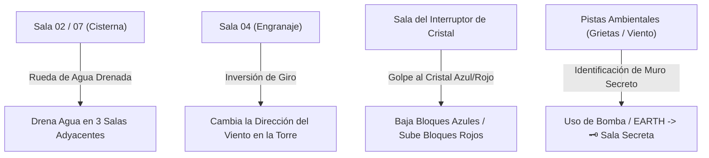

# Relaciones Inter-Salas, Redes Causales y Persistencia de Puertas

> **Ubicación**: `7 - DM/OneShots/ARepeat/02-Relaciones_Inter_Salas_y_Matriz.md`  
> **Sistema**: Redes Causales de Área + Persistencia Mixta de Puertas.  
> **Palabras de Poder de Shivath**: **Fire**, **Water**, **Air**, **Earth**, **Life**, **Light**.

---

## 1. Regla de Persistencia Mixta de Puertas y Pasadizos

```
======================================================================
                 🚪 REGLA DE PERSISTENCIA MIXTA 🚪
======================================================================
1. ATAJOS FÍSICOS PERMANENTES (SE GUARDAN):
   - Atajos de Rejilla de Hierro caídos (Forma Gaseosa).
   - Muros de piedra agrietados derribados con Bombas / EARTH Shatter.
   - Puentes desplegados con palancas de cadenas.
   * Al desbloquearse, el DM los marca como "Abiertos Permanentemente"
     en la Web App generador_minos_7x7.html.

2. CERROJOS ELEMENTALES TEMPORALES (SE RESETEAN DÍA A DÍA):
   - Compuertas con sellos de Glifos (Triadas de 3 gemas).
   - Puertas selladas por Hielo Mágico [FIRE], Agua Hirviendo [WATER],
     Vientos Ascendentes [AIR] o Vides Arcanas [LIFE].
   * Se resetean al cambiar de día astral, exigiendo que los jugadores
     usen sus sintonías o Cargas Arcanas para superarlas nuevamente.
======================================================================
```

---

## 2. Redes Causales Inter-Salas (Efectos de Área)

Determinadas salas contienen mecanismos arcanos que alteran el estado de las salas adyacentes en la matriz 7x7:



### Redes Inter-Salas Detalladas
1. **Red Hidráulica (WATER)**: Accionar la manivela de la Cisterna (Sala 02) drena la piscina central de las 3 salas vecinas en la rejilla, permitiendo acceder a los pedestales inferiores del suelo.
2. **Red de Cristales Peg (LIGHT/AIR)**: Golpear el Cristal Rúnico conmuta el estado global de los bloques de cuarzo Azul y Rojo en las salas del cuadrante.
3. **Pistas de la Sala Secreta de Isaac (🗝️)**: Las salas adyacentes a la Sala Secreta presentan **Pistas Ambientales** (grietas finas en el basalto, brisas frías o ideogramas atenuados). Al detectar la pista, asestar un impacto de Bomba o **EARTH** abre el pasadizo a la Sala Secreta.
