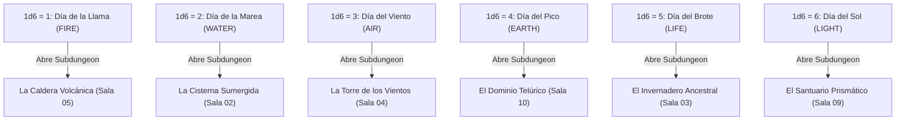

# Relaciones Inter-Salas y Matriz Causal (Blue Prince / Outer Wilds Logic)

> **Ubicación**: `7 - DM/OneShots/ARepeat/02-Relaciones_Inter_Salas_y_Matriz.md`  
> **Concepto**: Ninguna sala funciona aislada. Accionar un mecanismo en la Sala X modifica el estado físico, la temperatura o la accesibilidad de la Sala Y.  
> **Estructura de Rejilla**: **Matriz 5x5 con Huecos Libres** (Estilo *Zelda 2D* / *The Binding of Isaac*).  
> **Palabras de Poder de Shivath**: **Fire**, **Water**, **Air**, **Earth**, **Life**, **Light**.

---

## 1. El Calendario Astral de Minos (Días Elementales)

Las **Subdungeons Elementales** no están abiertas siempre. Al inicio de cada sesión de downtime, el DM determina el **Día Astral** de Shivath (tirando 1d6 o avanzando el calendario de la campaña):



---

## 2. Redes de Causalidad Inter-Salas

El Laberinto de Minos opera mediante **4 Redes de Transferencia Fieles**:


---

## 3. Matriz de Reconfiguración Procedural 5x5 (Zelda 2D / Isaac Style)

Al inicio de cada incursión, el laberinto se expande en una **rejilla 5x5 con huecos libres (vacíos)**. De las 25 casillas posibles, entre 12 y 15 casillas son salas navegables y el resto son abismos o muros inamovibles.

```
    Col 1        Col 2        Col 3        Col 4        Col 5
A [  A1  ] --- [  A2  ] --- [  A3  ] --- [  A4  ] --- [  A5  ]
     |            |            |            |            |
B [  B1  ] --- [  B2  ] --- [  B3  ] --- [  B4  ] --- [  B5  ]
     |            |            |            |            |
C [  C1  ] --- [  C2  ] --- [  C3  ] --- [  C4  ] --- [  C5  ]
   (ATRIO)
     |            |            |            |            |
D [  D1  ] --- [  D2  ] --- [  D3  ] --- [  D4  ] --- [  D5  ]
                                       (SUBDUNGEON)
     |            |            |            |            |
E [  E1  ] --- [  E2  ] --- [  E3  ] --- [  E4  ] --- [  E5  ]
```

### Tabla de Alineamientos de Minos (Efecto Ambiental 1d6)

| 1d6 | Alineamiento | Efecto Ambiental Global |
| :---: | :--- | :--- |
| **1** | **Alineamiento Solar (FIRE)** | Forjas al 100% de calor. Subdungeon de Fire accesible. |
| **2** | **Alineamiento Lunar (LIGHT)** | Iluminación nula. Subdungeon de Light accesible. |
| **3** | **Alineamiento de Vida (LIFE)** | Plantas crecen rápido. Subdungeon de Life accesible. |
| **4** | **Alineamiento Gravitacional (AIR)** | Gravedad reducida. Subdungeon de Air accesible. |
| **5** | **Alineamiento Inundado (WATER)** | Salas inferiores inundadas. Subdungeon de Water accesible. |
| **6** | **Alineamiento Armónico (EARTH)** | **Los jugadores eligen la posición inicial de 2 salas** mediante sus Anclas acumuladas. |
