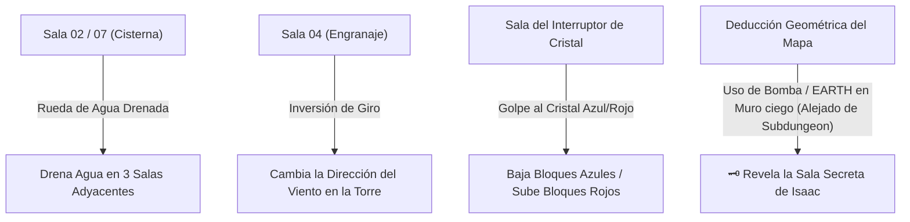

# Relaciones Inter-Salas, Redes Causales y Persistencia de Puertas

> **Ubicación**: `7 - DM/OneShots/ARepeat/02-Relaciones_Inter_Salas_y_Matriz.md`  
> **Sistema**: Redes Causales de Área + Persistencia Mixta + Sala Secreta Isaac Pura (Sin Adyacencia a Subdungeon).  
> **Palabras de Poder de Shivath**: **Fire**, **Water**, **Air**, **Earth**, **Life**, **Light**.

---

## 1. Regla de Persistencia Mixta de Puertas y Pasadizos

```
======================================================================
                 🚪 REGLA DE PERSISTENCIA MIXTA 🚪
======================================================================
1. ATAJOS FÍSICOS PERMANENTES (SE GUARDAN):
   - Atajos de Rejilla de Hierro caídos (Forma Gaseosa).
   - Muros de piedra agrietados derribados con Bombas / EARTH Shatter.
   - Puentes desplegados con palancas de cadenas.
   * Al desbloquearse, el DM los marca como "Abiertos Permanentemente"
     en la Web App generador_minos_7x7.html.

2. CERROJOS ELEMENTALES TEMPORALES (SE RESETEAN DÍA A DÍA):
   - Compuertas con sellos de Glifos (Triadas de 3 gemas).
   - Puertas selladas por Hielo Mágico [FIRE], Agua Hirviendo [WATER],
     Vientos Ascendentes [AIR] o Vides Arcanas [LIFE].
   * Se resetean al cambiar de día astral, exigiendo que los jugadores
     usen sus sintonías o Cargas Arcanas para superarlas nuevamente.
======================================================================
```

---

## 2. Regla de Generación de la Sala Secreta de Isaac (🗝️)

```
======================================================================
     🗝️ SALA SECRETA DE ISAAC (REGLA DE NO ADYACENCIA A SUBDUNGEON) 🗝️
======================================================================
1. UBICACIÓN MULTI-SALA:
   - Se genera SIEMPRE 1 Sala Secreta por incursión.
   - Se ubica en un hueco de la rejilla 7x7 que conecta con DOS O MÁS (2, 3 o 4)
     SALAS ACTIVAS vecinas.

2. PROHIBIDA LA ADYACENCIA A LA SUBDUNGEON:
   - NUNCA se genera en celdas colindantes a la Subdungeon Boss (Regla Isaac).
     La Sala Secreta debe estar en una rama distinta del laberinto.

3. SIN PISTAS EXTERNAS (DEDUCCIÓN POR MAPA):
   - NO hay grietas, marcas ni pistas visuales en las paredes exteriores.
   - Los jugadores deben DEDUCIR su ubicación observando la geometría del
     mapa en su cuaderno físico (buscando huecos vacíos rodeados por salas).
   - Para abrirla, deben probar usando una Bomba o el poder EARTH en un muro.
======================================================================
```

---

## 3. Redes Causales Inter-Salas (Efectos de Área)

Determinadas salas contienen mecanismos arcanos que alteran el estado de las salas adyacentes en la matriz 7x7:



### Redes Inter-Salas Detalladas
1. **Red Hidráulica (WATER)**: Accionar la manivela de la Cisterna (Sala 02) drena la piscina central de las 3 salas vecinas en la rejilla.
2. **Red de Cristales Peg (LIGHT/AIR)**: Golpear el Cristal Rúnico conmuta el estado global de los bloques de cuarzo Azul y Rojo en las salas del cuadrante.
3. **Sala Secreta de Isaac (🗝️)**: Deducción geométrica pura en mapa. Un impacto de Bomba o **EARTH Shatter** en la pared ciega de una sala colindante (no Subdungeon) derrumba el muro de piedra agrietada.

---

## 4. Catálogo de Puertas Mecánicas No Elementales (Llaves Genéricas y Puzles Deterministas)

Para evitar la dependencia exclusiva de elementos arcanos, el laberinto incorpora cerrojos puramente mecánicos e ítems genéricos de dungeon. **Una vez que los jugadores entienden la mecánica en su primera run, su resolución en expediciones subsecuentes es rápida y directa** gracias al registro en el cuaderno físico:

```
======================================================================
     ⚙️ PUERTAS MECÁNICAS Y LLAVES DE INCURSIÓN (NO ELEMENTALES) ⚙️
======================================================================
1. PUERTA DE LLAVE DE LATÓN (🗝️ Small Key Door):
   - Requiere 1 Llave de Latón genérica hallada en cofres comunes, escombros 
     o enemiguitos constructos de la rejilla.
   - Puzle Repetible: Tras descubrir qué sala contiene la llave, en runs 
     posteriores el grupo anota su ubicación y la recoge en 1 turno.

2. PUERTA DE CONTRAPESOS DE BÁSCULA (⚖️ Weight Balance Door):
   - Exige equilibrar 2 platos de basalto (ej. colocar 2 rocas pesadas o el 
     peso de 2 personajes en un plato para igualar el contrapeso).
   - Puzle Repetible: La combinación de peso queda anotada ("Plato Izq = 2 PJs / 
     Plato Der = 1 bloque de piedra"), resolviéndose al instante en futuras runs.

3. PUERTA DE CLAVE DE ENGRANAJES MURALES (⚙️ Rotary Pin Lock):
   - Ruedas dentadas de bronce con muescas numeradas del 1 al 6.
   - Puzle Repetible: La secuencia (ej. 4-2-6) se deduce la primera vez por marcas 
     en la pared o inspección manual, y se ejecuta en 5 segundos en siguientes runs.

4. PUERTA DE PASADORES SINCRONIZADOS (⏱️ Simultaneous Levers):
   - Dos palancas en extremos opuestos de la sala (o salas colindantes) deben 
     ser accionadas en el mismo turno/segundo.
   - Puzle Repetible: Exige coordinar 2 aventureros o trabar 1 palanca con un 
     bloque/cuerda y correr a la otra. Mecánica pura sin consumo arcano.

5. PUERTA DE MOLDE Y FUNDICIÓN FRÍA (🕯️ Key Mold Door):
   - Muro con hendidura cilíndrica profunda. Requiere encontrar un Molde de Cera
     y derretir una aleación blanda en la sala de la forja para crear la llave.
   - Puzle Repetible: Aprendida la ruta entre la forja y el pasaje, se completa 
     en 1 turno de desplazamiento.

6. PUERTA DE PASADOR DE ALTA TENSIÓN (🏋️ Heavy Latch Bar):
   - Rastrillo de hierro pesado bloqueado por un pasador de trinquete de alta tensión.
   - Puzle Repetible: Requiere un personaje con Fuerza >= 12 tirando del mecanismo 
     o atándolo con cuerdas/estacas para mantenerlo abierto mientras cruzan.
======================================================================
```

---

## 5. Catálogo de Cerrojos con Pruebas de Habilidad Inusuales (Unusual Skill Checks)

Para dinamizar la exploración sin limitarse a tiradas repetitivas de Percepción/Investigación/Atletismo, estas puertas requieren **usos creativos de habilidades inusuales** (Arcanismo, Engaño, Intimidación, Juego de Manos, Naturaleza, Perspicacia, Interpretación, Medicina, etc.). Una vez descubierta la técnica o respuesta la primera vez, se anota en el cuaderno físico y su paso en runs futuras es inmediato:

```
======================================================================
     🧠 CERROJOS CON PRUEBAS DE HABILIDAD INUSUALES (UNUSUAL CHECKS) 🧠
======================================================================
1. PUERTA BIOMECÁNICA SANGRANTE (🏥 Check: Medicina DC 13):
   - Músculo petrificado y savia arcana. Palpar el "pulso" y hacer una punción 
     quirúrgica en la arteria rúnica correcta drena la presión muscular.

2. PUERTA DE FRISO DINÁSTICO (📜 Check: Fuerza [Historia] DC 13):
   - Losas de 200 lbs grabadas con reyes antiguos. Exige conocer el orden dinástico 
     mientras se ejerce fuerza física palanca para rotar las piedras pesadas.

3. PUERTA DE SALMODIA LITÚRGICA (📜 Check: Religión / Teología DC 13):
   - Efigies de Alrest que requieren recitar los versos arcanos de consagración 
     en la cadencia y tono ritual correctos.

4. PUERTA DE RESONANCIA CUÁNTICA (🎵 Check: Interpretación / Instrumento DC 13):
   - Cierre de cuarzo bloqueado por frecuencia armónica. Cantar o tocar la nota 
     exacta (ej. Sol#) que descompone la cristalización del cerrojo.

5. PUERTA DE NIDO DE VERMES CONSTRUCTO (🪲 Check: Trato con Animales DC 13):
   - Cerradura tupida por larvas de basalto. Guiar o alimentar a los insectos 
     con virutas de mineral para que royan el pestillo.

6. PUERTA DE FISURAS MICRO-GASEOSAS (💨 Check: Supervivencia Subterránea DC 13):
   - Muro con 6 orificios; 5 liberan gas tóxico y 1 activa el pasador. Leer la 
     dirección de micro-corrientes térmicas en las fisuras para dar con el correcto.

7. SELLO ARCANO DE DECODIFICACIÓN (🔮 Check: Arcanismo DC 13):
   - Glifo de retención en el umbral. Reconocer la firma rúnica para invertir 
     su polaridad y disipar la barrera de contención.

8. GUARDIÁN DEL ECO ESPESTRAL (🎭 Check: Engaño / Deception DC 13):
   - Relieve parlamentario de piedra. Mentir con convicción proclamando ser 
     el heraldo del Rey Minos para engañar a la cerradura espectral.

9. CRISTAL SUMISO DE ESPINAS (👥 Check: Intimidación DC 13):
   - Umbral bloqueado por espinas de cuarzo pulsante. Proyectar fuerza de voluntad 
     imponente para amedrentar la frecuencia del cristal y hacer que se retraiga.

10. CERRADURA ROTATORIA DE ALTA VELOCIDAD (🖐️ Check: Juego de Manos DC 13):
    - Engranaje con muescas girando a alta velocidad. Insertar un vástago de titanio 
      en la muesca exacta sin romper la aguja en el intento.

11. VIDES DE RAÍZ SENSIBLE (🌿 Check: Naturaleza DC 13):
    - Puerta tupida por vides carnívoras. Frotar el polen de feromonas adecuado 
      en el bulbo central para que relaje sus tallos.

12. EFIGIE DE ROSTRO CAMBIANTE (👁️ Check: Perspicacia / Insight DC 13):
    - Relieve facial ancestral. Leer la sutil micro-expresión en la mirada del 
      rostro para deducir qué ojo de cuarzo presionar.
======================================================================
```

---

## 6. Sets de Salas Interconectadas en Cadena (Linked Room Clusters)

> [!IMPORTANT]
> **REGLA DE CLUSTERS (ASINCRONÍA Y ORDEN FLEXIBLE)**:
> 1. **Salas Independientes y Distantes**: Un Cluster NUNCA es una sala grande dividida en trozos contiguos. Son **salas separadas en la rejilla 7x7**, pudiendo estar en ramas distintas del laberinto.
> 2. **Orden Flexible de Resolución**: Los aventureros pueden descubrir y visitar las salas de un cluster en **cualquier orden**. Si encuentran primero la `Sala B` (bloqueada/inundada), pueden registrar la pista en su cuaderno físico, encontrar la `Sala A` más tarde para cambiar el estado global, y retornar a `Sala B` o `Sala C`.
> 3. **Sin Sincronización en Tiempo Real**: Todo se resuelve mediante interacciones de estado global (conmutadores, grúas, lentes de luz, purificación) que persistirán mientras dure la incursión.

> [!TIP]
> **SISTEMA DE COLORES EN LA WEB APP (`generador_minos_7x7.html`)**:
> - **Colores Temáticos de Sets**: `[FIRE]` (Carmesí Volcánico), `[WATER]` (Azul Oceánico), `[AIR]` (Cian Eléctrico), `[EARTH]` (Ámbar Telúrico), `[LIFE]` (Verde Esmeralda), `[LIGHT]` (Dorado Prismático).
> - **Insignias Neón por Cluster**: Cada Cluster (A a H) tiene su propio color neón dedicado (`Cluster A` = Cian, `Cluster B` = Púrpura, `Cluster C` = Naranja, `Cluster D` = Esmeralda, `Cluster E` = Amarillo, `Cluster F` = Rojo, `Cluster G` = Violeta, `Cluster H` = Rosa) con borde neón doble para rápida identificación en el mapa.

```
======================================================================
         🔗 SETS DE SALAS ENCADENADAS Y LINKED CLUSTERS 🔗
======================================================================
1. CLUSTER A: LA CADENA HIDRÁULICA (3 SALAS):
   - Sala A (Cisterna Maestro): Drena el agua de la Sala B de forma permanente.
   - Sala B (Cámara de Filtros): Con la cisterna seca, permite accionar la palanca.
   - Sala C (Esclusa de Salida): La palanca retraerá el cerrojo de salida.

2. CLUSTER B: EL CIRCUITO DE CRISTALES PEG (3 SALAS):
   - Sala A (Interruptor Rúnico): Golpear el cristal alterna el estado global Azul/Rojo.
   - Sala B (Puerta de Bloques Azules): Transitable cuando los bloques Azules caen.
   - Sala C (Cámara de Bloques Rojos): Revela el cofre al bajar los bloques Rojos.

3. CLUSTER C: LA CADENA DE FUNDICIÓN DE LLAVE (3 SALAS):
   - Sala A (Mina de Aleación): Recoger el metal maleable.
   - Sala B (Horno de Fundición): Derretir el metal en el Molde de Cera.
   - Sala C (Sello del Molde): Insertar la llave forjada a medida para abrir.

4. CLUSTER D: LA CADENA DEL CONTRAPESO DE BASALTO (3 SALAS):
   - Sala A (Consola de Grúa): Girar el cabrestante eleva el bloque suspendido en la Sala B.
   - Sala B (Cámara del Bloque Volado): Despejado el pasaje inferior, revela el pozo hacia la Sala C.
   - Sala C (Sello de Presión de Basalto): Caer por el pozo desengancha el portón final.

5. CLUSTER E: EL CIRCUITO DE ESPEJOS SOLAR (3 SALAS):
   - Sala A (Tragaluz Solar): Emite un haz solar directo hacia la entrada.
   - Sala B (Galería de Espejos): Reorientar el espejo central hacia el conducto Este.
   - Sala C (Receptor Solar del Sello): El haz incide en la gema solar y abre el portón.

6. CLUSTER F: EL TRÍPTICO DE CONVECCIÓN TÉRMICA (3 SALAS):
   - Sala A (Horno Magmático / Fuego): Eleva la temperatura de la caldera.
   - Sala B (Pozo de Viento / Aire): Recibe el aire caliente creando un vortex ascendente.
   - Sala C (Cámara del Balcón): Permite volar con la Capa del Vértice hasta el balcón.

7. CLUSTER G: LA CADENA DE PURIFICACIÓN DE ESPORAS (3 SALAS):
   - Sala A (Invernadero de Esporas): Libera esporas tóxicas que infectan la Sala B.
   - Sala B (Conducto Infectado): Dañina hasta purificarla.
   - Sala C (Manantial de Agua Pura): Accionar el chorro limpia las esporas de la Sala B.

8. CLUSTER H: EL PÉNDULO DE GRAVEDAD INVERTIDA (2 SALAS):
   - Sala A (Consola de Inversión): Invierte la gravedad del cuadrante.
   - Sala B (Torre de Bloques): Los bloques caen hacia el techo, liberando el pasaje inferior.
======================================================================
```
