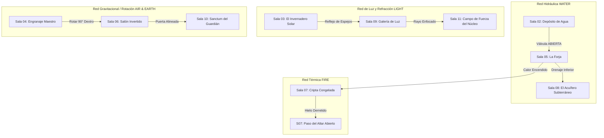

# Relaciones Inter-Salas y Matriz Causal (Blue Prince / Outer Wilds Logic)

> **Ubicación**: `7 - DM/OneShots/ARepeat/02-Relaciones_Inter_Salas_y_Matriz.md`  
> **Concepto**: Ninguna sala funciona aislada. Accionar un mecanismo en la Sala X modifica el estado físico, la temperatura o la accesibilidad de la Sala Y.  
> **Palabras de Poder de Shivath**: **Fire**, **Water**, **Air**, **Earth**, **Life**, **Light**.

---

## 1. Redes de Causalidad Inter-Salas

El Laberinto de Minos opera mediante **4 Redes de Transferencia Fieles**:



---

## 2. Detalle de los 4 Sistemas de Influencia Cruzada

### A. Red Hidráulica (WATER)
* **Depósito Principal (Sala 02)**: Contiene miles de litros de agua alcalina.
* **Efecto Cruzado**:
  * Si la Válvula `▼ Kael-Down` en Sala 02 se abre, la **Sala 05 (La Forja)** se inunda, apagando el fuego y creando un puente flotante de madera para cruzar el abismo.
  * Si el agua se drena hacia la **Sala 08 (Acuífero)**, se revela un pasadizo secreto sumergido que conduce directamente al atajo de la **Sala 10**.

### B. Red Térmica (FIRE)
* **La Forja Central (Sala 05)**: Emite un calor volcánico extremo cuando sus incineradores están encendidos.
* **Efecto Cruzado**:
  * Cuando la Forja está encendida, los túneles térmicos calientan la **Sala 07 (Cripta Congelada)**.
  * El hielo milenario de la Sala 07 se derrite tras **1 turno de Carga Arcana**, liberando cofres sumergidos y abriendo la puerta norte.

### C. Red de Refracción (LIGHT & LIFE)
* **Invernadero Solar (Sala 03)**: Canaliza haces de luz solar directa a través de prismas de cristal y vides botánicas.
* **Efecto Cruzado**:
  * Al alinear los espejos de la **Sala 09 (Galería de Luz)**, el haz se proyecta hacia la **Sala 11**, desactivando la barrera reflectante del núcleo.
  * El jugador con sintonía **Light** puede actuar como prisma vivo para corregir una desviación de espejo rota.

### D. Red de Rotación y Gravitación (EARTH & AIR)
* **El Engranaje Maestro (Sala 04)**: Consola de rotación espacial.
* **Efecto Cruzado**:
  * Girar la rueda en la Sala 04 hace rotar físicamente la **Sala 06 (Salón Invertido)**.
  * Al girar 90°, lo que era una pared inalcanzable se convierte en el nuevo suelo, permitiendo a los jugadores caminar hasta la puerta que antes estaba en el techo.

---

## 3. Matriz de Reconfiguración Procedural (Tirada de Alineamiento 1d6)

Al inicio de cada incursión, el DM tira **1d6** para determinar cómo encajan las salas en la cuadrícula 3x3 del laberinto:

```
    [Posición A] --- [Posición B] --- [Posición C]
         |                |                |
    [Posición D] --- [Posición E] --- [Posición F]
         |                |                |
    [Posición G] --- [Posición H] --- [Posición I]
```

### Tabla de Alineamientos de Minos

| 1d6 | Alineamiento | Disposición de Nodos | Regla Ambiental Global |
| :---: | :--- | :--- | :--- |
| **1** | **Alineamiento Solar (FIRE)** | En línea recta (A -> E -> I). | Forjas al 100% de calor. Las salas de hielo son agua hirviendo. |
| **2** | **Alineamiento Lunar (LIGHT)** | Anillo periférico (A -> B -> C -> F -> I -> H -> G -> D). | Iluminación nula. Revela inscripciones brillantes en las paredes. |
| **3** | **Alineamiento de Vida (LIFE)** | Concentrado en cruz alrededor del Hub (B, D, E, F, H). | Plantas y vides arcanas crecen rápido; plataformas de flora activas. |
| **4** | **Alineamiento Gravitacional (AIR)** | Matriz en espiral (A -> B -> C -> F -> E -> D -> G). | Gravedad reducida a la mitad. Saltos dobles automáticos. |
| **5** | **Alineamiento Inundado (WATER)** | Conexiones verticales empujadas hacia abajo. | Salas inferiores llenas de agua hasta el pecho. |
| **6** | **Alineamiento Armónico (EARTH)** | **Los jugadores eligen la posición inicial de 2 salas** mediante sus Anclas de Glifo acumuladas. |
