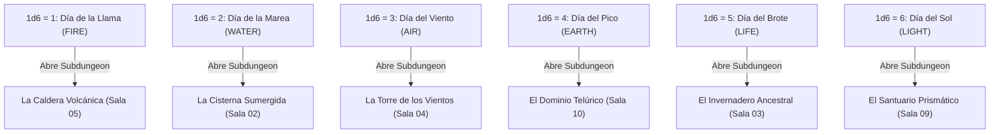

# Relaciones Inter-Salas y Matriz Causal (Blue Prince / Outer Wilds Logic)

> **Ubicación**: `7 - DM/OneShots/ARepeat/02-Relaciones_Inter_Salas_y_Matriz.md`  
> **Concepto**: Ninguna sala funciona aislada. Accionar un mecanismo en la Sala X modifica el estado físico, la temperatura o la accesibilidad de la Sala Y.  
> **Palabras de Poder de Shivath**: **Fire**, **Water**, **Air**, **Earth**, **Life**, **Light**.

---

## 1. El Calendario Astral de Minos (Días Elementales)

Las **Subdungeons Elementales** no están abiertas siempre. Al inicio de cada sesión de downtime, el DM determina el **Día Astral** de Shivath (tirando 1d6 o avanzando el calendario de la campaña):



---

## 2. Redes de Causalidad Inter-Salas

El Laberinto de Minos opera mediante **4 Redes de Transferencia Fieles**:


---

## 3. Matriz de Reconfiguración Procedural (Tirada de Alineamiento 1d6)

Al inicio de cada incursión, el DM tira **1d6** para determinar cómo encajan las salas en la cuadrícula 3x3 del laberinto:

```
    [Posición A] --- [Posición B] --- [Posición C]
         |                |                |
    [Posición D] --- [Posición E] --- [Posición F]
         |                |                |
    [Posición G] --- [Posición H] --- [Posición I]
```

### Tabla de Alineamientos de Minos

| 1d6 | Alineamiento | Disposición de Nodos | Regla Ambiental Global |
| :---: | :--- | :--- | :--- |
| **1** | **Alineamiento Solar (FIRE)** | En línea recta (A -> E -> I). | Forjas al 100% de calor. Subdungeon de Fire accesible. |
| **2** | **Alineamiento Lunar (LIGHT)** | Anillo periférico (A -> B -> C -> F -> I -> H -> G -> D). | Iluminación nula. Subdungeon de Light accesible. |
| **3** | **Alineamiento de Vida (LIFE)** | Concentrado en cruz alrededor del Hub (B, D, E, F, H). | Plantas crecen rápido. Subdungeon de Life accesible. |
| **4** | **Alineamiento Gravitacional (AIR)** | Matriz en espiral (A -> B -> C -> F -> E -> D -> G). | Gravedad reducida. Subdungeon de Air accesible. |
| **5** | **Alineamiento Inundado (WATER)** | Conexiones verticales empujadas hacia abajo. | Salas inferiores inundadas. Subdungeon de Water accesible. |
| **6** | **Alineamiento Armónico (EARTH)** | **Los jugadores eligen la posición inicial de 2 salas** mediante sus Anclas acumuladas. | Subdungeon de Earth accesible. |
