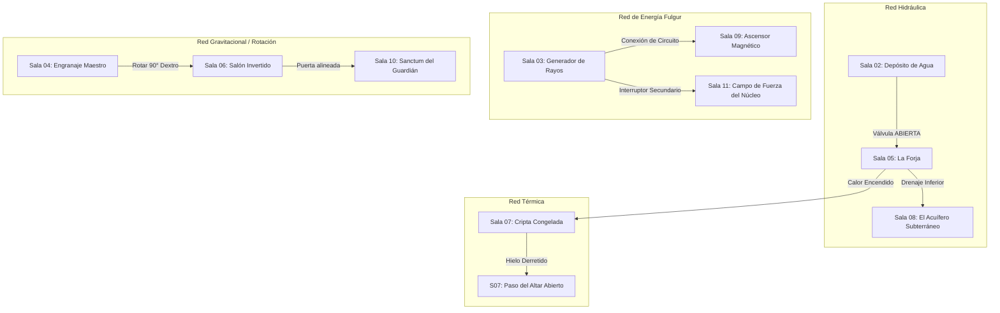

# Relaciones Inter-Salas y Matriz Causal (Blue Prince / Outer Wilds Logic)

> **Ubicación**: `7 - DM/OneShots/ARepeat/02-Relaciones_Inter_Salas_y_Matriz.md`  
> **Concepto**: Ninguna sala funciona aislada. Accionar un mecanismo en la Sala X modifica el estado físico, la temperatura o la accesibilidad de la Sala Y.

---

## 1. Redes de Causalidad Inter-Salas

El Laberinto de Minos opera mediante **4 Redes de Transferencia Fieles**:



---

## 2. Detalle de los 4 Sistemas de Influencia Cruzada

### A. Red Hidráulica (Agua y Fluidez)
* **Depósito Principal (Sala 02)**: Contiene miles de litros de agua alcalina.
* **Efecto Cruzado**:
  * Si la Válvula `▼ Kael-Down` en Sala 02 se abre, la **Sala 05 (La Forja)** se inunda, apagando el fuego de los autómatas y creando un puente flotante de madera para cruzar el abismo.
  * Si el agua se drena hacia la **Sala 08 (Acuífero)**, se revela un pasadizo secreto sumergido que conduce directamente al atajo de la **Sala 10**.

### B. Red Térmica (Fuego e Hielo)
* **La Forja Central (Sala 05)**: Emite un calor volcánico extremo cuando sus incineradores están encendidos.
* **Efecto Cruzado**:
  * Cuando la Forja está encendida, los túneles térmicos calientan la **Sala 07 (Cripta Congelada)**.
  * El hielo milenario de la Sala 07 se derrite tras **1 turno de Carga Arcana**, liberando cofres sumergidos en hielo y abriendo la puerta norte.

### C. Red de Energía (Fulgur / Circuitos)
* **Generador de Rayos (Sala 03)**: Canaliza bobinas de sobretensión.
* **Efecto Cruzado**:
  * Sin energía, el **Ascensor Magnético (Sala 09)** está inactivo y bloquea el acceso a los niveles inferiores.
  * Los jugadores pueden usar al personaje con **Sintonía Fulgur** como "puente humano" para cerrar el circuito entre la Sala 03 y el Ascensor sin necesidad de encontrar el cable conductor.

### D. Red de Rotación y Gravitación (Engranajes)
* **El Engranaje Maestro (Sala 04)**: Consola de rotación espacial.
* **Efecto Cruzado**:
  * Girar la rueda en la Sala 04 hace rotar físicamente la **Sala 06 (Salón Invertido)**.
  * Al girar 90°, lo que era una pared inalcanzable se convierte en el nuevo suelo, permitiendo a los jugadores caminar hasta la puerta que antes estaba en el techo.

---

## 3. Matriz de Reconfiguración Procedural (Tirada de Alineamiento 1d6)

Al inicio de cada incursión, el DM tira **1d6** para determinar cómo encajan las salas en la cuadrícula 3x3 del laberinto:

```
    [Posición A] --- [Posición B] --- [Posición C]
         |                |                |
    [Posición D] --- [Posición E] --- [Posición F]
         |                |                |
    [Posición G] --- [Posición H] --- [Posición I]
```

### Tabla de Alineamientos de Minos

| 1d6 | Alineamiento | Disposición de Nodos | Regla Ambiental Global |
| :---: | :--- | :--- | :--- |
| **1** | **Alineamiento Solar** | En línea recta (A -> E -> I). | Forjas al 100% de calor. Las salas de hielo son agua hirviendo. |
| **2** | **Alineamiento Lunar** | Anillo periférico (A -> B -> C -> F -> I -> H -> G -> D). | Iluminación nula. Enfriamiento global; el agua se congela. |
| **3** | **Alineamiento de Tormenta** | Concentrado en cruz alrededor del Hub (B, D, E, F, H). | Conductos de rayo sobrecargados; trampa eléctrica activa en pasillos. |
| **4** | **Alineamiento Gravitacional** | Matriz en espiral (A -> B -> C -> F -> E -> D -> G). | Gravedad reducida a la mitad. Saltos dobles automáticos. |
| **5** | **Alineamiento Inundado** | Conexiones verticales empujadas hacia abajo. | Salas inferiores llenas de agua hasta el pecho. |
| **6** | **Alineamiento Armónico** | **Los jugadores eligen la posición inicial de 2 salas** mediante sus Anclas de Glifo acumuladas. |
