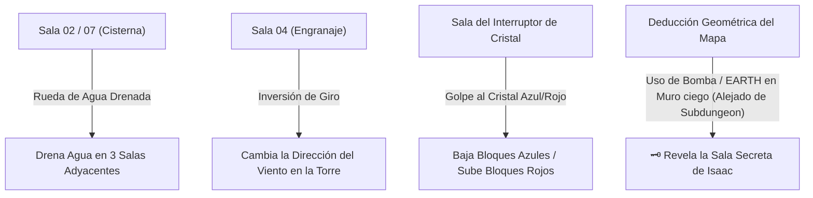

# Relaciones Inter-Salas, Redes Causales y Persistencia de Puertas

> **Ubicación**: `7 - DM/OneShots/ARepeat/02-Relaciones_Inter_Salas_y_Matriz.md`  
> **Sistema**: Redes Causales de Área + Persistencia Mixta + Sala Secreta Isaac Pura (Sin Adyacencia a Subdungeon).  
> **Palabras de Poder de Shivath**: **Fire**, **Water**, **Air**, **Earth**, **Life**, **Light**.

---

## 1. Regla de Persistencia Mixta de Puertas y Pasadizos

```
======================================================================
                 🚪 REGLA DE PERSISTENCIA MIXTA 🚪
======================================================================
1. ATAJOS FÍSICOS PERMANENTES (SE GUARDAN):
   - Atajos de Rejilla de Hierro caídos (Forma Gaseosa).
   - Muros de piedra agrietados derribados con Bombas / EARTH Shatter.
   - Puentes desplegados con palancas de cadenas.
   * Al desbloquearse, el DM los marca como "Abiertos Permanentemente"
     en la Web App generador_minos_7x7.html.

2. CERROJOS ELEMENTALES TEMPORALES (SE RESETEAN DÍA A DÍA):
   - Compuertas con sellos de Glifos (Triadas de 3 gemas).
   - Puertas selladas por Hielo Mágico [FIRE], Agua Hirviendo [WATER],
     Vientos Ascendentes [AIR] o Vides Arcanas [LIFE].
   * Se resetean al cambiar de día astral, exigiendo que los jugadores
     usen sus sintonías o Cargas Arcanas para superarlas nuevamente.
======================================================================
```

---

## 2. Regla de Generación de la Sala Secreta de Isaac (🗝️)

```
======================================================================
     🗝️ SALA SECRETA DE ISAAC (REGLA DE NO ADYACENCIA A SUBDUNGEON) 🗝️
======================================================================
1. UBICACIÓN MULTI-SALA:
   - Se genera SIEMPRE 1 Sala Secreta por incursión.
   - Se ubica en un hueco de la rejilla 7x7 que conecta con DOS O MÁS (2, 3 o 4)
     SALAS ACTIVAS vecinas.

2. PROHIBIDA LA ADYACENCIA A LA SUBDUNGEON:
   - NUNCA se genera en celdas colindantes a la Subdungeon Boss (Regla Isaac).
     La Sala Secreta debe estar en una rama distinta del laberinto.

3. SIN PISTAS EXTERNAS (DEDUCCIÓN POR MAPA):
   - NO hay grietas, marcas ni pistas visuales en las paredes exteriores.
   - Los jugadores deben DEDUCIR su ubicación observando la geometría del
     mapa en su cuaderno físico (buscando huecos vacíos rodeados por salas).
   - Para abrirla, deben probar usando una Bomba o el poder EARTH en un muro.
======================================================================
```

---

## 3. Redes Causales Inter-Salas (Efectos de Área)

Determinadas salas contienen mecanismos arcanos que alteran el estado de las salas adyacentes en la matriz 7x7:



### Redes Inter-Salas Detalladas
1. **Red Hidráulica (WATER)**: Accionar la manivela de la Cisterna (Sala 02) drena la piscina central de las 3 salas vecinas en la rejilla.
2. **Red de Cristales Peg (LIGHT/AIR)**: Golpear el Cristal Rúnico conmuta el estado global de los bloques de cuarzo Azul y Rojo en las salas del cuadrante.
3. **Sala Secreta de Isaac (🗝️)**: Deducción geométrica pura en mapa. Un impacto de Bomba o **EARTH Shatter** en la pared ciega de una sala colindante (no Subdungeon) derrumba el muro de piedra agrietada.
