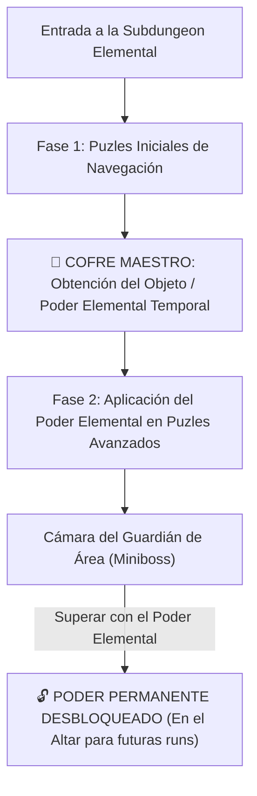

# Catálogo Maestro de Salas, Puzles y Encuentros (Inspiración Isaac & 3D Zelda)

> **Ubicación**: `7 - DM/OneShots/ARepeat/03-Catalogo_de_Salas_y_Puzles.md`  
> **Filosofía de Diseño**: Puzles espaciales, interacción de entorno, salas temáticas estilo *The Binding of Isaac* (Arcadas, Sacrificio, Mercado, Desafío, Salas Secretas) y puzles mecánicos profundos de *3D Zelda* (OoT, MM, WW, TP, SS, BotW/TotK).

---

## 1. Estructura Zelda para Subdungeons Elementales

Cada Subdungeon Elemental opera como una **Mini-Dungeon de Zelda**:

---

## 2. Catálogo de Salas Especiales Estilo The Binding of Isaac

### A. 🗝️ La Sala Secreta de Minos (Isaac Secret Room Pura)
* **Regla de Posicionamiento Isaac**: Generada obligatoriamente en una celda de la rejilla 7x7 que conecta con **2, 3 o 4 salas activas**.
* **Pistas Externas**: **NINGUNA**. No hay grietas ni marcas visuales en los muros exteriores. Los jugadores deducen su existencia en el cuaderno físico buscando huecos vacíos rodeados por salas.
* **Mecanismo de Apertura**: Impacto de Bomba o uso de sintonía **EARTH Shatter** en el muro ciego.
* **Contenido y Botín**: Pedestal de piedra arcana con un **Cofre de Reliquias Raras de Minos**, 2d6 elixires elementales o un **Fragmento de la Rueda de Criptografía**.

### B. 🩸 La Cámara del Altar de Sacrificio (Sacrifice Room)
* **Inspiración**: *Isaac Sacrifice Rooms*.
* **Diseño**: Una losa de basalto erizada de picos arcanos en el centro de un estanque de líquido resplandeciente.
* **Mecánica**: Un aventurero puede voluntariamente derramar su sangre sobre los picos (perdiendo HP o **1 Carga Arcana**).
* **Efecto de la Plegaria a Minos**:
  * *Tirada 1d6*:
    * **1-3**: Otorga un elíxir elemental bendito o bufo temporal (+2 a tiradas de salvación).
    * **4-5**: Revela el mapa de 3 salas no exploradas de la rejilla.
    * **6**: Otorga una reliquia arcana rara o desvela la posición de la Subdungeon.

### C. ⚖️ La Sala de Desafío Rúnico (Challenge Room)
* **Inspiración**: *Isaac Challenge & Boss Challenge Rooms*.
* **Diseño**: Un gran salón de armas arcanas con un interruptor de piedra con el ideograma `[▶ PHAS-FWD] + [⚙ GEAR]`.
* **Mecánica**: Accionar el interruptor **sella instantáneamente las puertas** y activa un sistema de trampas defensivas (estatuas Beamos que rotan o constructos de basalto).
* **Recompensa**: Tras sobrevivir 3 rondas de trampa o desactivar los 3 pedestales de control, las puertas se reabren y descienden **2 Cofres Dorados de Downtime**.

### D. 📜 El Mercado del Mercader Espectral (Arcane Shop / Merchant)
* **Inspiración**: *Isaac Shops / Zelda Merchants*.
* **Diseño**: Una estatua parlante de Minos rodeada de tres pedestales flotantes de cuarzo.
* **Mecánica**: El espectro ofrece elixires de sintonía, pergaminos de atajo o bombas a cambio de gemas de downtime o elixires colectados. Permitir intercambios éticos sin violencia.

---

## 3. Catálogo Extenso de Salas y Puzles Inspirados en 3D Zelda

### A. Ocarina of Time / Majora's Mask

#### Sala 01: El Pozo de las Balanzas de Agua (Water Temple Weight Puzzle)
* **Diseño**: Cámara cilíndrica de 40 pies sumergida. Un botón de presión de basalto gigante yace en el lecho marino.
* **Mecánica**: Los nadadores convencionales flotan por la densidad del agua. Requiere armadura pesada o sintonía **EARTH** (que incrementa la densidad corporal) para hundirse y presionar el interruptor, drenando la cisterna.

#### Sala 02: El Salón de la Lente Prismática (Lens of Truth Room)
* **Diseño**: Un foso de lava hirviendo sin puentes visibles.
* **Mecánica**: Usar el *Escudo Prismático (LIGHT)* refleja la luz del techo sobre la niebla, revelando baldosas flotantes de cristal que no existen en el espectro visible normal.

#### Sala 03: Las Cuatro Antorchas de la Prueba Solar (Torch Speed Run)
* **Diseño**: Cuatro braseros de bronce apagados rodeando la puerta del sanctum.
* **Mecánica**: Encender la primera antorcha inicia una mecha arcana que se apaga en **6 segundos (1 ronda)**. Requiere encender las 4 en un solo turno usando sintonía **FIRE** (área) o el *Guantelete de Llama*.

---

### B. Wind Waker / Twilight Princess

#### Sala 04: La Rueda de Espejos del Templo Solar (Spirit Light Alignment)
* **Diseño**: Galería circular con 3 estatuas equipadas con espejos orientables sobre peanas de bronce.
* **Mecánica**: Reorientar los espejos en secuencia circular para redirigir un haz de luz solar directo desde el tragaluz central hasta el Sello de Sol de la compuerta.

#### Sala 05: El Pozo del Viento Ascendente (Updraft Shaft)
* **Diseño**: Torre vertical de 50 pies con rejillas ruidosas en el piso.
* **Mecánica**: Activar la consola `[🟄 AIR] + [▲ KAEL-UP]` desata una potente corriente de viento. Los exploradores con la *Capa del Vértice* o sintonía **AIR** flotan plácidamente hacia la cornisa superior.

#### Sala 06: Las Estatuas Gemelas Espejadas (Dominion Rod Statue Sync)
* **Diseño**: Sala dividida a la mitad por una muralla de cristal insonorizado. En cada lado hay una estatua pesada y un pedestal de presión.
* **Mecánica**: Al empujar la Estatua A, la Estatua B se mueve de forma **reflejada** en la otra mitad. El grupo debe maniobrar para que ambas estatuas pisen sus interruptores **simultáneamente**.

---

### C. Skyward Sword / Breath of the Wild / Tears of the Kingdom

#### Sala 07: El Engranaje de Tiempo Invertido (Recall Time Gear)
* **Diseño**: Una rueda de molino de basalto gigante girando continuamente en sentido horario, arrojando bloques de piedra al abismo.
* **Mecánica**: Usar sintonía de tiempo o ideogramas `[🔄 ROT-CYCLE]` invierte el giro de la rueda (sentido antihorario). Los jugadores se suben a los álabes del molino para ascender montados hasta la salida del techo.

#### Sala 08: El Balancín y Catapulta de Basalto (Seesaw Launch)
* **Diseño**: Una viga pesada pivotando sobre un bloque central. La salida está en una repisa a 30 pies.
* **Mecánica**: Un aventurero se ubica en el extremo inferior. Otro aventurero se arroja desde una cornisa o deja caer un bloque pesado (**EARTH**) sobre el otro extremo, catapultando al aventurero al balcón.

#### Sala 09: La Red de Conductividad Eléctrica (Electric Circuit Puzzle)
* **Diseño**: Un estanque de agua salada entre un generador rúnico activo y la puerta receptora.
* **Mecánica**: Colocar cadenas de hierro, armas metálicas o usar a un PJ sintonizado con agua/electricidad para crear una red conductora que transmita la corriente y active el cerrojo.

---

## 4. Catálogo de Encuentros No Combativos (Narrativos y Espaciales)

### Encuentro 01: El Oráculo de Basalto Mudo
* **Concepto**: Un gólem ancestral que custodia un atajo permanente. No ataca.
* **Dinámica**: Se comunica únicamente encendiendo secuencias de ideogramas en su pecho. Los jugadores deben responder encendiendo la secuencia opuesta o armónica en la consola del pedestal para ganar su bendición.

### Encuentro 02: El Dilema del Gran Puente de Cristal
* **Concepto**: Un puente de cuarzo que cruza un cañón subterráneo.
* **Dinámica**: El cristal del puente cambia según el **Alineamiento de Minos del Día**. Si el día es **FIRE**, el cristal quema al pisarlo sin protección de agua; si es **AIR**, ráfagas laterales amenazan con derribar a los viajeros. Requiere coordinar sintonías del grupo para cruzar a salvo.

### Encuentro 03: El Archivo de las Memorias de Minos
* **Concepto**: Una biblioteca de losas de basalto flotantes.
* **Dinámica**: Leer las losas revela trozos de historia de Shivath y el Angramanio, otorgando pistas directas para descifrar la **Gran Rueda de Criptografía de Minos** sin gastar Carga Arcana.
