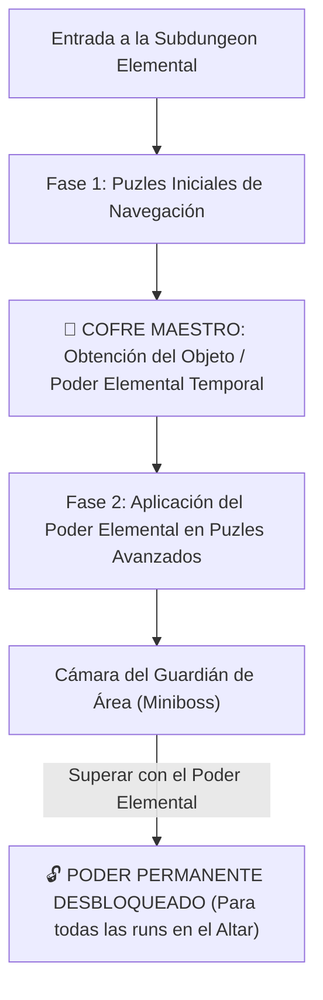

# Catálogo Maestro de Salas, Puzles y Conexiones (Diseño Zelda Style)

> **Ubicación**: `7 - DM/OneShots/ARepeat/03-Catalogo_de_Salas_y_Puzles.md`  
> **Filosofía**: **Diseño de Salas estilo Legend of Zelda (2D, 3D, BotW/TotK y Metroidvania)**. Puzles espaciales, interacción de entorno, atajos con mecánicas únicas y objetos elementales de dungeon.

---

## 1. Estructura Zelda para Subdungeons Elementales

Cada Subdungeon Elemental opera como una **Mini-Dungeon de Zelda**:

### El Objeto Elemental de Dungeon (Dungeon Item)
* **FIRE**: *El Guantelete de Llama de Minos* -> Lanza proyectiles de plasma que encienden antorchas distantes o derriten hielo al instante.
* **WATER**: *La Flauta del Mar de Minos* -> Eleva o drena el nivel del agua en cualquier sala con rejillas.
* **AIR**: *La Capa del Vértice de Minos* -> Otorga impulso aéreo de 30 ft para cruzar abismos y remontar corrientes de viento.
* **EARTH**: *El Martillo de Basalto de Minos* -> Rompe bloques de roca y golpea estacas telúricas para levantar pilares.
* **LIFE**: *La Semilla Botánica de Minos* -> Germina plantas gigantes instantáneas que actúan como puentes o cuerdas.
* **LIGHT**: *El Escudo Prismático de Minos* -> Refleja haces de luz solar hacia gemas receptoras distantes.

---

## 2. Catálogo Extenso de Salas (Inspiración Directa en Zelda)

---

### CLASE 1: PUZLES FÍSICOS Y MECÁNICOS CLÁSICOS

#### Sala 01: La Sala de la Rejilla y el Abismo (Atajo de Forma Gaseosa / Fase)
* **Inspiración**: *Atajos de Mazmorra / Zelda 2D*.
* **Diseño**: Dos plataformas de piedra separadas por un abismo sin fondo. Una **Rejilla de Hierro de Forja** bloquea el paso físico y aéreo (volar no funciona por los barrotes estrechos).
* **Mecánica**:
  * Un jugador que use `Gaseous Form`, cambio de fase o paso etéreo atraviesa los barrotes de la rejilla.
  * **Acción del Otro Lado**: Al cruzar, acciona una palanca de palio que **deja caer un puente de cadenas permanente** y abre una trampilla.
* **Beneficio**: Salta 2 o 3 salas de puzles/monstruos no hechos, ahorrando **2 Cargas Arcanas**. En días específicos, el lado lejano alberga un **Cofre de Reliquias Raras**.

#### Sala 02: El Salón del Interruptor de Cristal Rojo/Azul (Peg Switch Room)
* **Inspiración**: *A Link to the Past / Ocarina of Time (Crystal Switch)*.
* **Diseño**: Bloques de cristal en el suelo que suben y bajan alterando los caminos. En el centro hay un **Cristal Rúnico de Golpe**.
* **Mecánica**: Golpear el cristal con un proyectil, arma de alcance o sintonía **LIGHT/AIR** lo conmuta de Azul a Rojo. Cuando está Azul, bajan las barreras azules y suben las rojas; al cambiar a Rojo, se invierte la disposición de los muros del salón.

#### Sala 03: La Sala de las Cuatro Antorchas de Tiempo (Torch Lighting Race)
* **Inspiración**: *Ocarina of Time / Majora's Mask*.
* **Diseño**: Cuatro pedestales de antorcha apagados rodeando una compuerta de hierro sellada.
* **Mecánica**: Las 4 antorchas deben encenderse en menos de **6 segundos** (1 ronda). Encender la primera inicia una cuenta atrás de chispas. Requiere sintonía **FIRE** (bola de fuego de área) o usar el *Guantelete de Llama* para encenderlas en secuencia circular rápida.

#### Sala 04: El Pozo de las Balanzas Sumergidas (Water Temple Heavy Switch)
* **Inspiración**: *Ocarina of Time (Water Temple Iron Boots)*.
* **Diseño**: Un pozo profundo lleno de agua cristalina con un gran interruptor plano de piedra en el fondo.
* **Mecánica**: El interruptor del fondo requiere un peso extremo para ceder. Los nadadores normales flotan sin poder activarlo; se requiere peso pesado (sintonía **EARTH**, armadura de hierro pesada o estado magmático) para hundirse al fondo y pisar el interruptor que abre la verja del lecho acuático.

#### Sala 05: La Cámara del Ojo Receptor de Flecha (Eye Target Switch)
* **Inspiración**: *Zelda 3D (Eye Target Switches)*.
* **Diseño**: Sobre la arcada norte cuelga un **Ojo de Cristal Dorado** con párpados de piedra que se abren intermitentemente.
* **Mecánica**: Disparar una flecha, proyectil místico o haz de luz sintonizado (**LIGHT**) directamente en la pupila del ojo mientras está abierto hace sonar una campanada rúnica y deja caer un cofre maestro o despliega una escalera de mano.

#### Sala 06: El Balancín y Catapulta de Piedra (Seesaw Launcher)
* **Inspiración**: *Tears of the Kingdom (Shrine Seesaw Puzzles)*.
* **Diseño**: Una viga pesada de basalto pivotando sobre una cuña central. La salida está en un balcón a 30 pies de altura.
* **Mecánica**: Un jugador se coloca en el extremo inferior del balancín. Otro jugador (o un bloque dejado caer con **EARTH**) impacta con fuerza el extremo elevado, catapultando al aventurero del balancín directamente hasta la cornisa superior.

---

### CLASE 2: PUZLES DE LUZ, ESPEJOS Y SOMBRAS

#### Sala 07: La Rueda de Espejos en Cadena (Spirit Temple Light Beam)
* **Inspiración**: *Spirit Temple (Ocarina of Time) / Wind Waker*.
* **Diseño**: Cámara penumbrosa con tres estatuas equipadas con espejos orientables sobre peanas de bronce.
* **Mecánica**: Reorientar los espejos para formar una trayectoria de luz en cadena: Haz Solar -> Espejo 1 -> Espejo 2 -> Espejo 3 -> Sello de Sol de la Puerta. El jugador **LIGHT** puede actuar como espejo suplente si uno está roto.

#### Sala 08: El Espejo de las Sombras Invisibles (Lens of Truth Floor)
* **Inspiración**: *Ocarina of Time (Lens of Truth / Bottom of the Well)*.
* **Diseño**: Un abismo aparentemente insondable sin suelo ni puentes visibles.
* **Mecánica**: Mirar a través del *Escudo Prismático (LIGHT)* o usar visión del vacío (**UMBRA**) revela que existen plataformas invisibles de cristal suspendidas sobre el abismo. Caminar a ciegas provoca una caída; seguir las huellas visibles en la luz permite cruzar con seguridad.

#### Sala 09: La Lente Lupa Solar (Magnifying Sun Lens)
* **Inspiración**: *The Minish Cap / Phantom Hourglass*.
* **Diseño**: Un cristal convexo gigante suspendido en el techo. En el centro de la sala descansa un bloque de hielo milenario indestructible que atrapa la llave del santuario.
* **Mecánica**: Orientar la lente lupa del techo para enfocar la luz solar directa sobre el bloque de hielo, derritiéndolo en 1 ronda y liberando el artefacto interior.

---

### CLASE 3: PUZLES DE AGUA, FLUIDOS Y FLOTABILIDAD

#### Sala 10: La Cisterna de las Tres Marcas (Water Level Valve)
* **Inspiración**: *Twilight Princess (Lakebed Temple) / Majora's Mask (Great Bay)*.
* **Diseño**: Cisterna circular de 3 niveles con tuberías de drenaje y una manivela de timón.
* **Mecánica**:
  * **Nivel Alto**: Inunda la sala; permite nadar a repisas superiores pero oculta los cofres del suelo.
  * **Nivel Medio**: Despeja plataformas flotantes de madera para cruzar caminando.
  * **Nivel Bajo**: Drena la sala por completo, exponiendo la válvula inferior que conecta con la **Sala 05 (La Forja)**.

#### Sala 11: El Tobogán de la Corriente Unidireccional (One-Way Slide)
* **Inspiración**: *Zelda 2D / A Link Between Worlds*.
* **Diseño**: Un canal de agua rápida o pendiente de hielo liso que descesa bruscamente hacia la siguiente sala.
* **Mecánica**: Es un tránsito de **un solo sentido**. Una vez deslizados hacia abajo, no se puede trepar de regreso a menos que se encuentre el interruptor de inversión de corriente en una sala posterior.

#### Sala 12: Los Maderos Flotantes a Presión (Buoyancy Raft Launch)
* **Inspiración**: *Breath of the Wild (Shrine Buoyancy Puzzles)*.
* **Diseño**: Un estanque profundo con grandes maderos de balsa retenidos bajo el agua mediante cadenas de cuerda en el fondo.
* **Mecánica**: Cortar las cuerdas del fondo sumergido hace que los maderos emerjan con una flotabilidad violenta, catapultando plataformas a la superficie e impulsando a los aventureros hacia el piso superior.

---

### CLASE 4: PUZLES DE VIENTO, GRAVEDAD Y TIEMPO

#### Sala 13: El Pozo de las Corrientes Ascendentes (Updraft Wind Shaft)
* **Inspiración**: *Skyward Sword / Wind Waker*.
* **Diseño**: Pozo vertical de 50 pies de altura con rejillas de bronce ruidosas en el suelo.
* **Mecánica**: Accionar la válvula rúnica `[🟄 AIR] + [▲ KAEL-UP]` libera una potente corriente de viento ascendente. Los aventureros con capas o sintonía **AIR** flotan sin esfuerzo hasta la cima.

#### Sala 14: El Mosaico Invertido de Gravedad (Gravity Flip Room)
* **Inspiración**: *Stone Tower Temple (Majora's Mask)*.
* **Diseño**: El suelo real está erizado de picos de hierro; en el techo hay marcado un camino de baldosas seguras.
* **Mecánica**: Tocar el glifo telúrico del altar invierte la gravedad en la sala. El grupo "cae" hacia el techo y camina boca abajo sobre las baldosas para cruzar sobre el foso de picos.

#### Sala 15: El Engranaje de Tiempo Invertido (Recall Gear Room)
* **Inspiración**: *Tears of the Kingdom (Recall Ability / Time Gears)*.
* **Diseño**: Una rueda de molino de basalto gigante que gira en sentido horario, dejando caer rocas hacia un foso.
* **Mecánica**: Utilizar la sintonía **UMBRA** o la consola de tiempo invierte temporalmente el giro del engranaje (sentido antihorario). Los jugadores pueden subirse a los álabes de la rueda para subir montados en ella hasta la salida alta.

#### Sala 16: El Molino de la Rueda de Aire (Gust Jar Windmill)
* **Inspiración**: *The Minish Cap (Gust Jar Windmills)*.
* **Diseño**: Una pasarela cortada en dos por un gran foso. En la pared hay una turbina molino de viento unida a un puente móvil.
* **Mecánica**: Canalizar una ráfaga de aire continua (**AIR**) sobre los álabes del molino hace girar el engranaje, desplegando el puente mientras se mantenga el soplo de viento.

---

### CLASE 5: PUZLES DE SINCRONÍA, TRAMPAS Y CONDUCCIÓN

#### Sala 17: Las Estatuas Gemelas de Espejo (Dominion Rod Sync)
* **Inspiración**: *Twilight Princess (Dominion Rod Statue Sync)*.
* **Diseño**: Una sala dividida en dos mitades por un muro transparente insonorizado. En cada mitad hay una estatua pesada y un botón de presión.
* **Mecánica**: Al mover la estatua de la Mitad A, la estatua de la Mitad B se mueve de forma **espejada** en la otra sala. Los jugadores deben maniobrar para que ambas estatuas pisen sus respectivos botones de presión **al mismo tiempo**.

#### Sala 18: La Red de Conductividad Eléctrica (Conductive Chain Puzzle)
* **Inspiración**: *Breath of the Wild (Electric Circuit Shrines)*.
* **Diseño**: Un generador de energía en un extremo y una puerta receptora en el otro, separados por un estanque de agua salada con 3 pedestales metálicos desalineados.
* **Mecánica**: Los jugadores deben arrastrar cajas de hierro o usar objetos metálicos (o al PJ **FULGUR/WATER**) para formar una cadena conductora continua que lleve la corriente eléctrica hasta la puerta receptora.

#### Sala 19: Los Bloques de Tiempo Inexistentes (Song of Time Blocks)
* **Inspiración**: *Ocarina of Time (Song of Time Blocks)*.
* **Diseño**: Espacios vacíos donde destacan siluetas de bloques marcados con ideogramas arcanos.
* **Mecánica**: Tocar la secuencia de glifos adecuada en la consola rúnica materializa los bloques de piedra con ideogramas de tiempo, permitiendo usarlos como peldaños para trepar.

#### Sala 20: La Tormenta de Baldosas Voladoras (Flying Tile Wave Room)
* **Inspiración**: *A Link to the Past / Link's Awakening (Tile Attack Rooms)*.
* **Diseño**: Una cámara cerrada de piedra pulida. Las puertas se sellan al entrar.
* **Mecánica**: Las baldosas del suelo comienzan a levitar una a una y se lanzan violentamente contra los aventureros. Los jugadores deben sobrevivir o bloquear 3 rondas de baldosas voladoras hasta que el suelo se vacíe, momento en que las puertas se abren de nuevo.

#### Sala 21: El Suelo Frágil de Baldosas Caedizas (Crumbling Floor Sprint)
* **Inspiración**: *Zelda 2D (Crumbling Floors / Falling Tiles)*.
* **Diseño**: Un salón largo donde el piso está compuesto por baldosas de cuarzo agrietado sobre un abismo de lava.
* **Mecánica**: Cada baldosa se desmorona **1 segundo (o 1 turno)** después de ser pisada. Los jugadores deben planificar su ruta de carrerilla sin detenerse ni dudar para no caer al vacío.

#### Sala 22: El Beamos Centinela Ocular (Beamos Laser Sentry)
* **Inspiración**: *Zelda 3D & 2D (Beamos Sentries)*.
* **Diseño**: Una tótem de piedra con un ojo de cristal giratorio en el centro del salón.
* **Mecánica**: El ojo rota 360° continuamente. Cuando divisa a un aventurero, dispara un haz de plasma continuo (**3d8 daño de fuego**). Se desactiva cegando el ojo con **LIGHT**, cubriéndolo con barro (**EARTH**), o usando una bomba para destruir la cabeza del tótem.

---

### CLASE 6: ATAJOS Y CONEXIONES DE DUNGEON

#### Sala 23: El Pasadizo del Tobogán de Retorno Rápido (Fast Travel Slide)
* **Inspiración**: *Atajos de Retorno Rápido de Zelda*.
* **Diseño**: Al completar el puzle principal de la Sala 12 (Sanctum), se abre una trampilla con un tubo pulido.
* **Mecánica**: Lanzarse por el tubo deposita a los exploradores directamente de vuelta en la **Sala 01 (Atrio de Entrada)** en 5 segundos, evitando tener que recorrer todo el laberinto de regreso.
