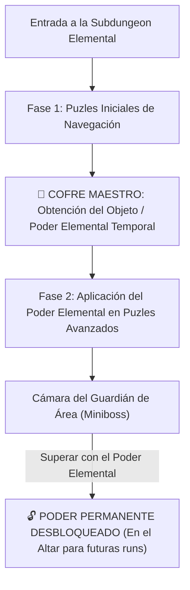

# Compendio Maestro de 27 Puzles, Salas y Encuentros (Isaac & 3D Zelda)

> **Ubicación**: `7 - DM/OneShots/ARepeat/03-Catalogo_de_Salas_y_Puzles.md`  
> **Filosofía**: Catálogo exhaustivo de puzles espaciales, mecánicos y eventos no combativos inspirados en *The Binding of Isaac* y *3D Zelda Games* (OoT, MM, WW, TP, SS, BotW, TotK) listos para usar en la rejilla 7x7.

---

## 1. Estructura Zelda para Subdungeons Elementales

Cada Subdungeon Elemental opera como una **Mini-Dungeon de Zelda**:

---

## 2. Catálogo de Salas Especiales Estilo The Binding of Isaac

### 01. 🗝️ La Sala Secreta Pura de Minos (Isaac Secret Room)
* **Generación Isaac**: Ubicada en una celda adyacente a **2, 3 o 4 salas activas**.
* **Sin Pistas Exteriores**: NINGUNA grieta o marca en paredes exteriores. Deducción 100% por geometría en el cuaderno físico del grupo.
* **Apertura**: Bomba o impacto contundente de sintonía **EARTH Shatter**.
* **Botín**: Pedestal de piedra arcana con **Cofre de Reliquias Raras de Minos** (o 2d6 elixires elementales).

### 02. 🗝️🗝️ La Sala Super Secreta del Altar de Cristal (Isaac Super Secret Room)
* **Generación Isaac**: Ubicada en una celda que conecta con **SOLO 1 SALA ACTIVA** (al final de una rama muerta).
* **Apertura**: Muro de piedra muy denso que requiere 2 Cargas o una Bomba rúnica pesada.
* **Botín**: Altar de sintonía pura que concede sintonía gratuita instantánea durante la run actual a 1 jugador.

### 03. 🩸 La Cámara del Altar de Sacrificio (Sacrifice Room)
* **Mecánica**: Un estanque de sangre rúnica con un pedestal erizado de picos de basalto.
* **Ofrenda**: Un jugador derrama voluntariamente sangre (pierde 1d10 HP o **1 Carga Arcana**).
* **Favores de Minos (1d6)**:
  1. *1-2*: Elixir de resistencia elemental para el grupo.
  2. *3-4*: Revelación instantánea de 3 salas en la Web App.
  3. *5-6*: **Fragmento de la Rueda de Criptografía de Minos** o Reliquia Estelar.

### 04. ⚖️ La Sala de Desafío Rúnico (Challenge Room)
* **Mecánica**: Pulsar el pedestal central sella las puertas e invoca 3 rondas de trampas Beamos o constructos de basalto.
* **Recompensa**: Al sobrevivir 3 rondas, se abren las puertas y descienden **2 Cofres Dorados de Downtime**.

### 05. 📜 El Mercado Espectral de Minos (Arcane Shop / Merchant)
* **Mecánica**: Estatua parlante de Minos rodeada de pedestales flotantes. Permite comerciar consumibles de dungeon, pergaminos de atajo o bombas por gemas o elixires colectados.

### 06. 🎲 La Sala del Dado de Basalto de 6 Caras (Arcade / Dice Room)
* **Mecánica**: Un pedestal de dado gigante. Gastar 1 Carga Arcana o 1 gema permite tirar el dado:
  * **1**: Trampa de descarga eléctrica.
  * **2-3**: Regenera 1d4 HP a todos los exploradores.
  * **4-5**: Cambia el estado de todas las puertas cerradas de la sala a Abiertas.
  * **6**: Recombina la disposición de cofres de la run, mejorándolos a dorados.

### 07. 🩸 La Sala de la Maldición de la Sombra (Curse Room)
* **Mecánica**: El pasadizo de entrada está erizado de espinas oscuras. Atravesarlo inflige **1d6 daño psíquico** al entrar y **1d6** al salir.
* **Recompensa**: Contiene un cofre de reliquias arcanas prohibidas o un pergamino de atajo directo a la Subdungeon.

---

## 3. Catálogo Extenso de Puzles Espaciales (3D Zelda)

### A. Ocarina of Time / Majora's Mask

#### 08. El Enigma de las Tres Cisternas en Cascada (OoT Water Temple)
* **Mecánica**: Tres válvulas en espiral regulan el agua de 3 salas vecinas en la rejilla 7x7. Ajustar la Válvula A drena la Sala B, pero inunda la Sala C, exigiendo coordinar el flujo para alcanzar el pedestal sumergido.

#### 09. El Pozo de las Sombras y Plataformas Fantasma (OoT Lens of Truth)
* **Mecánica**: Foso sin suelo visible. El *Escudo Prismático (LIGHT)* o proyectar luz encendida sobre los muros muestra las sombras proyectadas de baldosas flotantes invisibles.

#### 10. La Galería de las Cuatro Antorchas de Viento (MM Snowhead Temple)
* **Mecánica**: Cuatro antorchas deben encenderse en < 6 segundos mientras soplos helados apagan las antorchas desprotegidas. Exige cubrir las corrientes con muros de basalto (`EARTH`) antes de encenderlas con **FIRE**.

#### 11. El Laberinto de los Bloques de Tiempo Sincronizados (OoT Song of Time)
* **Mecánica**: Bloques grabados con ideogramas que se materializan o desvanecen en intervalos de 1 ronda. Los aventureros deben cronometrar sus saltos para no caer al foso.

#### 12. La Pista de Baldosas Caedizas de Cuarzo (OoT Crumbling Tiles)
* **Mecánica**: Baldosas agrietadas sobre lava que se desmoronan 1 segundo después de pisarlas. Planificar la carrerilla continua sin detenerse.

---

### B. Wind Waker / Twilight Princess

#### 13. La Galería de los Espejos en Cadena (Spirit / Earth Temple)
* **Mecánica**: Cuatro estatuas equipadas con espejos orientables. Girar cada espejo para conducir un haz solar en cadena desde la entrada hasta la compuerta del sello del sol.

#### 14. El Pozo del Viento Ascendente (WW Wind Temple)
* **Mecánica**: Torre vertical de 50 pies con rejillas ruidosas. Activar `[🟄 AIR] + [▲ KAEL-UP]` genera una ráfaga ascendente que permite volar con la *Capa del Vértice* hasta la cima.

#### 15. Las Estatuas Gemelas Espejadas (TP Dominion Rod Sync)
* **Mecánica**: Sala dividida por un muro transparente. Mover la Estatua A desplaza la Estatua B de forma espejada en el otro lado para que ambas pisen pedestales a la vez.

#### 16. El Cañón de las Bolas de Basalto (TP Bomb Bowling)
* **Mecánica**: Rodar esferas de piedra pesadas por canaletas curvas inclinadas para impactar y destruir barreras distantes de la sala.

#### 17. El Obelisco de la Vela Solar Giratoria (WW Wind Sail)
* **Mecánica**: Reorientar una vela giratoria con ráfagas de la *Capa del Vértice (AIR)* para desplazar una pasarela móvil de bronce sobre un abismo.

---

### C. Skyward Sword / Breath of the Wild / Tears of the Kingdom

#### 18. El Engranaje de Tiempo Invertido (TotK Recall)
* **Mecánica**: Una rueda de molino gigante girando en sentido horario arrojando rocas. Usar `[🔄 ROT-CYCLE]` invierte su giro, permitiendo subir montado en sus palas.

#### 19. La Balanza de Peso y Catapulta de Piedra (BotW Seesaw Launch)
* **Mecánica**: Dejar caer un bloque de basalto pesado (**EARTH**) en un extremo de una viga balanceada catapultando al aventurero del otro extremo al balcón superior.

#### 20. La Red de Conductividad Salina (BotW Electric Circuit)
* **Mecánica**: Estanque de agua salada entre un generador y la puerta. Alinear barriles metálicos o armas de hierro para formar la red que transmita la corriente continua.

#### 21. El Carril de los Maderos Flotantes a Presión (BotW Buoyancy)
* **Mecánica**: Cortar las cuerdas de retenidas de balsas sumergidas para catapultarlas verticalmente a la superficie y presionar botones del techo.

#### 22. La Torre de Gravedad Invertida (Majora's Mask / TotK)
* **Mecánica**: Invertir la gravedad de la sala con la consola rúnica, caminando boca abajo sobre el techo para cruzar fosos de picos.

---

## 4. Catálogo de Encuentros No Combativos (Narrativos y Espaciales)

### 23. El Oráculo de Basalto Mudo
* **Concepto**: Gólem ancestral sentado en loto. Se comunica encendiendo triadas de ideogramas en su pecho (`[🌱 LIFE] + [▶ PHAS-FWD]`).
* **Resolución**: Replicar la secuencia armónica en la consola del pedestal abre un atajo de retorno rápido al Atrio.

### 24. El Dilema del Gran Puente de Cristal
* **Concepto**: Puente de cuarzo sobre un cañón subterráneo que reacciona según la Palabra de Poder del día:
  * **FIRE**: Arde e inflige daño sin protección de agua.
  * **AIR**: Ráfagas laterales amenazan con despeñar a los cruzantes.
  * **WATER**: Se inunda de corriente rápida.
* **Resolución**: Coordinar sintonías de protección del grupo para cruzar a salvo.

### 25. El Archivo de las Memorias de Minos
* **Concepto**: Biblioteca de losas flotantes. Leer las losas desvela historia de Shivath y otorga pistas directas para armar la **Rueda de Criptografía de Minos**.

### 26. El Invernadero de Esporas Durmientes (LIFE Encounter)
* **Concepto**: Sala repleta de flora carnívora que despierta con vibraciones o ruidos.
* **Resolución**: Tiradas de Sigilo o uso de **LIFE/AIR** para disipar las esporas y cruzar sin desatar la trampa botánica.

### 27. El Pasaje de los Ecos Resonantes (Cuarzo Sonoro)
* **Concepto**: Estalactitas de cuarzo que emiten tonos armónicos al recibir impactos.
* **Resolución**: Repetir la melodía rúnica (golpeando estalactitas en el orden correcto) despierta el mecanismo de la compuerta.

---

## 5. Catálogo de Puzles Mecánicos y Cerrojos de Incursión (No Elementales)

Puzles diseñados para resolverse mediante físicas simples, llaves genéricas o ítems del laberinto. **Son deterministas y rápidos de repetir en expediciones futuras**:

### 28. 🗝️ El Portón del Cerrojo de Latón (Small Key Lock)
* **Mecánica**: Portón con cerradura de tambor reforzada. Requiere 1 **Llave de Latón** genérica hallada en cofres de salas comunes o nichos de escombros.
* **Repetibilidad**: Una vez localizada la sala con la llave en el mapa 7x7, las incursiones posteriores la recogen en su ruta sin perder tiempo.

### 29. ⚖️ La Cámara de la Báscula de Contrapesos
* **Mecánica**: Dos platos de bronce suspendidos de cadenas. La puerta permanece sellada a menos que ambos platos alcancen la masa exacta.
* **Repetibilidad**: Anotar el peso exacto la primera vez (ej. 2 aventureros en un plato / 1 bloque de piedra en el otro) permite resolverlo en 5 segundos en expediciones futuras.

### 30. ⚙️ El Enigma de los Engranajes Muestreados (Pin Combination)
* **Mecánica**: Tres discos de bronce con muescas numeradas. La combinación de 3 dígitos (ej. 4-2-6) está grabada de forma oculta en la base de la sala.
* **Repetibilidad**: Tras descifrar la cifra en la primera run, el grupo anota la clave en su cuaderno físico y la introduce instantáneamente en runs subsecuentes.

### 31. ⏱️ Los Pasadores de Pulso Sincronizado
* **Mecánica**: Dos palancas distantes que retraen cerrojos hidráulicos durante 3 segundos. Exige que 2 jugadores (o 1 jugador corriendo tras trabar una palanca con una estaca) las activen a la vez.
* **Repetibilidad**: Trabajo en equipo puro sin gasto de recursos ni sintonía mágica.

### 32. 🕯️ La Puerta de la Fundición Fría (Key Mold Puzzle)
* **Mecánica**: Cerradura de muesca profunda e irregular. En la sala opuesta se encuentra un molde de cera y una barra de metal maleable.
* **Repetibilidad**: Presionar el molde y vaciarlo en la forja fría crea la llave. En runs posteriores el grupo conoce el camino directo entre la forja y el sello.

### 33. 🏋️ El Rastrillo de Alta Tensión Mecánica
* **Mecánica**: Rastrillo de hierro de 300 lbs conectado a un torno sin fin con trinquete.
* **Repetibilidad**: Requiere una prueba de Fuerza (DC 13) o trabar el engranaje con un mazo/estaca de basalto. Proceso puramente físico y predecible.

---

## 6. Catálogo de Cerrojos con Pruebas de Habilidad Inusuales

Cerrojos interactivos que requieren usos creativos de habilidades poco habituales. **Al resolverlos la primera vez, la clave queda anotada en el cuaderno físico del grupo, evitando repetir tiradas de dado**:

### 34. 🏥 La Compuerta Biomecánica Sangrante (Medicine Check)
* **Mecánica**: Compuerta de músculo petrificado y savia arcana en tensión.
* **Check Inusual**: *Medicina (DC 13)* para encontrar el "nodo arterial" correcto e infligir una punción quirúrgica que relaje la masa muscular.
* **Repetibilidad**: La ubicación del nodo queda registrada en el cuaderno; en futuras incursiones se sangra en 1 segundo.

### 35. 📜 El Friso de la Dinastía Olvidada (Strength [History] Check)
* **Mecánica**: Cuatro losas gigantes rotatorias esculpidas con los reyes ancestrales de Shivath.
* **Check Inusual**: Tirada combinada de *Fuerza (Historia) (DC 13)*: recordar la cronología real mientras se aplica palanca física para hacer girar las losas.
* **Repetibilidad**: La secuencia de reyes anotada elimina la necesidad de tirada; sólo exige empujar las losas.

### 36. 📜 El Portón del Cántico Sagrado de Alrest (Religion Check)
* **Mecánica**: Estatuas de teólogos arcanos que solo abren el paso al escuchar la liturgia adecuada.
* **Check Inusual**: *Religión (DC 13)* para cantar la salmodia arcana en la métrica adecuada.
* **Repetibilidad**: La estrofa traducida queda en el cuaderno; cualquier personaje puede recitarla directamente.

### 37. 🎵 La Cristalera de Resonancia Armónica (Performance Check)
* **Mecánica**: Cierre de cuarzo traslúcido atascado por cristalización armónica.
* **Check Inusual**: *Interpretación / Instrumento (DC 13)* para emitir la nota/tono vibracional exacto que resquebraja el bloqueo.
* **Repetibilidad**: La nota (ej. Sol#) se anota en el cuaderno; hacer sonar un diapasón la abre al instante.

### 38. 🪲 La Cerradura del Nido de Larvas de Basalto (Animal Handling Check)
* **Mecánica**: Cerradura obstruida por pequeños constructos-insectos durmientes.
* **Check Inusual**: *Trato con Animales (DC 13)* para engatusar o alimentar a las larvas con virutas de mineral para que royan el pestillo.
* **Repetibilidad**: Sabiendo qué mineral comen las larvas, arrojar un trozo en el receptáculo la abre al instante.

### 39. 💨 La Sima de las Fisuras Térmicas Micro-Gaseosas (Survival Check)
* **Mecánica**: Muro con 6 orificios; 5 expulsan gas tóxico y 1 retrae el rastrillo.
* **Check Inusual**: *Supervivencia (DC 13)* para detectar por diferencias de flujo de aire térmico cuál es la fisura segura.
* **Repetibilidad**: Anotado el número del orificio seguro en el cuaderno, se introduce la vara en 1 segundo.
