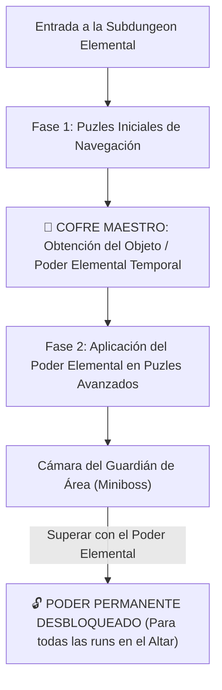

# Catálogo Maestro de Salas, Puzles y Conexiones (Diseño Zelda Style)

> **Ubicación**: `7 - DM/OneShots/ARepeat/03-Catalogo_de_Salas_y_Puzles.md`  
> **Filosofía**: **Diseño de Salas estilo Legend of Zelda / Metroidvania**. Puzles espaciales, interacción de entorno, atajos con mecánicas únicas y objetos elementales de dungeon.

---

## 1. Estructura Zelda para Subdungeons Elementales

Cada Subdungeon Elemental opera como una **Mini-Dungeon de Zelda**:

### El Objeto Elemental de Dungeon (Dungeon Item)
* **FIRE**: *El Guantelete de Llama de Minos* -> Lanza proyectiles de plasma que encienden antorchas distantes o derriten hielo al instante.
* **WATER**: *La Flauta del Mar de Minos* -> Eleva o drena el nivel del agua en cualquier sala con rejillas.
* **AIR**: *La Capa del Vértice de Minos* -> Otorga impulso aéreo de 30 ft para cruzar abismos y remontar corrientes de viento.
* **EARTH**: *El Martillo de Basalto de Minos* -> Rompe bloques de roca y golpea estacas telúricas para levantar pilares.
* **LIFE**: *La Semilla Botánica de Minos* -> Germina plantas gigantes instantáneas que actúan como puentes o cuerdas.
* **LIGHT**: *El Escudo Prismático de Minos* -> Refleja haces de luz solar hacia gemas receptoras distantes.

---

## 2. Catálogo de Salas con Diseño Zelda

### CATEGORÍA A: SALAS DE ATAJO Y SECRETA

#### Sala 01: La Sala de la Rejilla y el Abismo (Atajo de Forma Gaseosa / Fase)
* **Diseño Zelda**: Dos plataformas de piedra separadas por un abismo sin fondo. Una **Rejilla de Hierro de Forja** bloquea el paso físico y aéreo (volar no funciona por los barrotes estrechos).
* **Mecánica de Atajo**:
  * Un jugador que use `Gaseous Form`, cambio de fase o paso etéreo puede atravesar los barrotes de la rejilla.
  * **Acción del Otro Lado**: Al cruzar, el jugador acciona una palanca de palio que **deja caer un puente de cadenas permanente** y abre una trampilla.
* **Beneficio en la Run**: Salta 2 o 3 salas de puzles/monstruos no hechos, ahorrando **2 Cargas Arcanas**. En días específicos, el lado lejano alberga un **Cofre de Reliquias Raras**.

#### Sala 02: El Pasadizo de la Roca Agrietada (Muro de Bomba / Earth Shatter)
* **Diseño Zelda**: Una pared de piedra con una marcada grieta resplandeciente.
* **Mecánica**: Golpearla con el *Martillo de Basalto (EARTH)*, una carga explosiva o un hechizo contundente derriba la pared permanentemente, revelando un pasaje directo entre la entrada y el centro del mapa.

#### Sala 03: La Cornisa del Gancho de Raíz (Atajo Botánico)
* **Diseño Zelda**: Una cornisa elevada inaccesible.
* **Mecánica**: Disparar una flecha o usar **LIFE** en la cepa marchita del techo hace crecer un liana permanente que cuelga hasta el suelo.

---

### CATEGORÍA B: SALAS DE INTERRUPTORES Y MECANISMOS DE CRISTAL

#### Sala 04: El Salón del Cristal Azul/Rojo (Crystal Switch Room)
* **Diseño Zelda**: Bloques de cristal en el suelo que suben y bajan. En el centro hay un **Cristal Rúnico de Golpe**.
* **Mecánica**: Golpear el cristal cambia su color de Azul a Rojo. Cuando está Azul, los bloques azules bajan y los rojos suben. Permite resolver el avance golpeando el cristal a distancia con proyectiles o sintonía **LIGHT/AIR**.

#### Sala 05: La Sala de las Cuatro Antorchas de Tiempo (Torch Lighting)
* **Diseño Zelda**: Cuatro pedestales de antorcha apagados alrededor de una compuerta sellada.
* **Mecánica**: Las 4 antorchas deben encenderse en menos de **6 segundos** (1 ronda). Requiere sintonía **FIRE** (lanzar una bola de fuego que cubra el área) o usar el *Guantelete de Llama* para encenderlas en secuencia rápida.

#### Sala 06: El Abismo de los Bloques Desplazables (Block Pushing)
* **Diseño Zelda**: Un abismo inundado con bloques de basalto sobre rieles.
* **Mecánica**: Los jugadores deben empujar los bloques pesados (*Test de Fuerza o sintonía EARTH*) para formar un camino continuo hacia la salida.

---

### CATEGORÍA C: SALAS DE NIVEL DE AGUA Y FLUIDOS

#### Sala 07: La Cisterna de las Tres Marcas (Water Level Puzzle)
* **Diseño Zelda**: Una sala de 3 niveles de altura con marcas de agua en las paredes y una rueda de control.
* **Mecánica**:
  * **Nivel Alto**: El agua llena la sala; permite nadar hasta repisas altas, pero cubre los cofres del suelo.
  * **Nivel Medio**: Revela plataformas intermedias flotantes.
  * **Nivel Bajo**: Drena la sala por completo, permitiendo acceder a los páneles de la base.

#### Sala 08: El Tobogán de la Corriente Unidireccional (One-Way Slide)
* **Diseño Zelda**: Un canal de agua/hielo rápido que desliza a los aventureros desde la Sala A a la Sala B.
* **Mecánica**: Es un viaje de un solo sentido. Para regresar a la Sala A, los jugadores deben encontrar el interruptor de inversión de corriente en una sala lejana.

---

### CATEGORÍA D: SALAS DE LUZ Y REFLEJOS

#### Sala 09: La Cámara del Ojo Receptor (Eye Target Room)
* **Diseño Zelda**: Sobre la puerta norte hay un **Ojo de Cristal Dorado** cerrado.
* **Mecánica**: El ojo solo se abre cuando recibe un haz de luz reflejado o un disparo directo preciso (sintonía **LIGHT**). Al iluminarse, la puerta emite un acorde armónico y se abre.

#### Sala 10: La Galería del Espejo Giratorio (Mirror Alignment)
* **Diseño Zelda**: Tres estatuas con espejos giratorios sobre peanas.
* **Mecánica**: Girar los espejos para dirigir un rayo solar proveniente del techo desde la Estatua 1 -> Estatua 2 -> Estatua 3 -> Gema de la Puerta.

---

### CATEGORÍA E: SALAS DE VIENTO Y GRAVEDAD

#### Sala 11: El Pozo de las Corrientes Ascendentes (Updraft Shaft)
* **Diseño Zelda**: Un pozo vertical profundo con rejillas de aire en el suelo.
* **Mecánica**: Al accionar la válvula `[🟄 AIR] + [▲ KAEL-UP]`, una fuerte corriente de aire asciende por el pozo. Los aventureros con capas o sintonía **AIR** flotan fácilmente hasta la cima.

#### Sala 12: La Cámara del Mosaico Invertido (Gravity Flip)
* **Diseño Zelda**: El suelo tiene marcas de pisadas grabadas en el techo.
* **Mecánica**: Tocar el altar rúnico invierte la gravedad en la sala. Los jugadores caminan por el techo para cruzar sobre un foso de picos en el suelo real.

---

## 3. Catálogo de Ideas de Conexiones Flexibles entre Salas

Usa estas ideas de conexión sin restricciones rígidas para enriquecer el mapa de la run:

1. **Conexión por Trampilla de Caída**: Caer por un hueco en el suelo de la Sala B2 te deposita en la Sala C2.
2. **Conexión de Espejismo (LIGHT)**: Una pared que parece piedra sólida se revela como una ilusión intangible al proyectarle luz brillante.
3. **Conexión de Raíces (LIFE)**: Abrir paso cortando o haciendo crecer raíces que unen dos salas separadas verticalmente.
4. **Conexión de Compuerta de Glifos**: Pasadizo sellado por una consola de 3 gemas que requiere ingresar la Triada Rúnica adecuada.
5. **Conexión de Atajo por Palanca de Cadenas**: Un puente o reja que solo se puede abrir desde el lado posterior (estilo Souls / Zelda), creando un atajo permanente una vez explorado.
