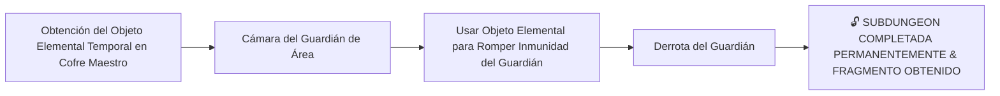

# Encuentros y Guardianes de Minos (Boss Design Framework)

> **Ubicación**: `7 - DM/OneShots/ARepeat/04-Encuentros_y_Guardianes.md`  
> **Diseñado bajo el Marco Metodológico**: `boss-ability-design`  
> **Sistema de Combate**: **Zelda-Style Mini-Dungeon Bosses** + **Elemental Orbs & Full Burst** (Inspirado en *Xenoblade 2*).  
> **Palabras de Poder de Shivath**: **Fire**, **Water**, **Air**, **Earth**, **Life**, **Light**.

---

## 1. Guardianes de Área y Objetos Elementales de Subdungeon

En cada Subdungeon Elemental, los jugadores obtienen el **Objeto Elemental Temporal** en el Cofre Maestro. Este objeto es indispensable para vulnerar la inmunidad del Guardián de Área:



---

### Catálogo de Guardianes y Objetos Elementales

### A. El Señor del Crisol (Guardián de FIRE - La Caldera Volcánica)
* **Objeto Elemental Requerido**: *Guantelete de Llama* (Obtenido en el Cofre Maestro de la Caldera).
* **Mecánica Zelda**: El boss se protege tras un escudo de escoria de magma congelado. Disparar el *Guantelete de Llama* a los 3 braseros superiores funde el escudo y lo aturde 1 ronda.
* **Peligro Kinético de Arena**: Geiseres de lava activa en el suelo al final de cada ronda (Reflejos DC 14 o 2d6 Fuego).
* **Recompensa**: 🔓 Desbloqueo permanente del paso por la Caldera y Fragmento de Tablilla #1.

---

### B. La Quimera Hidráulica (Guardián de WATER - La Cisterna Sumergida)
* **Objeto Elemental Requerido**: *Flauta del Mar*.
* **Mecánica Zelda**: La Quimera flota fuera del alcance sobre un chorro de agua. Tocar la *Flauta del Mar* drena la columna de agua, haciendo caer al boss al suelo.
* **Peligro Kinético de Arena**: Corriente de succión en los desagües arrastra 15 ft hacia las cuchillas de turbina.
* **Recompensa**: 🔓 Desbloqueo permanente del paso por la Cisterna y Fragmento de Tablilla #2.

---

### C. El Coloso del Vértice (Guardián de AIR - La Torre de los Vientos)
* **Objeto Elemental Requerido**: *Capa del Vértice*.
* **Mecánica Zelda**: El Coloso genera tornados que empujan a los exploradores al vacío. Usar la *Capa del Vértice* permite remontar el tornado y aterrizar sobre el núcleo débil del boss.
* **Peligro Kinético de Arena**: Corrientes ascendentes y pozos sin fondo; caer requiere tirada de Atletismo DC 13 para agarrarse al borde.
* **Recompensa**: 🔓 Desbloqueo permanente del paso por la Torre y Fragmento de Tablilla #3.

---

### D. El Titán de Basalto (Guardián de EARTH - El Dominio Telúrico)
* **Objeto Elemental Requerido**: *Martillo de Basalto*.
* **Mecánica Zelda**: El Titán posee armadura de piedra impenetrable. Asestar un golpe de impacto con el *Martillo de Basalto* agrieta su coraza para permitir daño convencional.
* **Peligro Kinético de Arena**: Derrumbes de estalactitas telúricas tras cada impacto sismológico (Fuerza DC 14 o quedar apresado).
* **Recompensa**: 🔓 Desbloqueo permanente del paso por el Dominio y Fragmento de Tablilla #4.

---

### E. El Botánico de Sombras (Guardián de LIFE - El Invernadero Ancestral)
* **Objeto Elemental Requerido**: *Semilla Botánica*.
* **Mecánica Zelda**: El Botánico se esconde en bulbos carnívoros. Plantar la *Semilla Botánica* germina vides que aprisionan los bulbos y exponen la flor central.
* **Peligro Kinético de Arena**: Nubes de esporas venenosas (Constitución DC 13 o Envenenado) que se inflaman al contacto con fuego.
* **Recompensa**: 🔓 Desbloqueo permanente del paso por el Invernadero y Fragmento de Tablilla #5.

---

### F. El Espejismo de Cristal (Guardián de LIGHT - El Santuario Prismático)
* **Objeto Elemental Requerido**: *Escudo Prismático*.
* **Mecánica Zelda**: El boss genera 3 copias de luz ilusorias. Usar el *Escudo Prismático* para reflejar la luz del tragaluz revela inmediatamente al verdadero boss.
* **Peligro Kinético de Arena**: Rayos cegadores refractados en las paredes (Sabiduría DC 13 o Ceguera por 1 ronda).
* **Recompensa**: 🔓 Desbloqueo permanente del paso por el Santuario y Fragmento de Tablilla #6.

---

## 2. BOSS FINAL: El Juicio de Minos (Equilibrio de Nivel Fijo)

```
======================================================================
          👑 EQUILIBRIO Y DIFICULTAD DEL BOSS FINAL 👑
======================================================================
- NIVEL FIJO RECOMENDADO: Nivel 7 - 8.
- BALANCE DE GRUPO: Diseñado exactamente para un grupo de CINCO (5)
  personajes equipados con al menos 5 de las 6 Palabras de Poder / Elementos.
- DESAFÍO: Exige coordinación de elementos para apilar y romper los Orbes
  Elementales y desatar el FULL BURST.
======================================================================
```

---

## 3. Mecánica Detallada de los Orbes Elementales (Xenoblade 2 System)

### A. Generación de Orbes (Orb Stacking)
Cada vez que el Boss ejecuta un ataque finalizador de fase o un jugador asesta un golpe con una de las **6 Palabras de Poder**, se manifiesta un **Orbe Elemental** flotando en órbita alrededor de *El Juicio de Minos*:

* **Tipos de Orbes**: `Fire Orb`, `Water Orb`, `Air Orb`, `Earth Orb`, `Life Orb`, `Light Orb`.
* **Beneficios Pasivos del Boss por Orbe Activo**:
  1. **Armadura Prismática**: +1 AC por cada Orbe activo.
  2. **Inmunidad al Elemento**: Inmune al tipo de daño del Orbe activo.
  3. **Aura de Reversión**: Daño melé genera **1d6 daño elemental** de contraataque.

---

### B. Rompimiento de Orbes (Elemental Countering)

| Orbe Activo en el Boss | Elemento Opuesto (Destructor Crítico) | Daño al Orbe por Impacto | Efecto de Destrucción de Orbe |
| :--- | :--- | :---: | :--- |
| **FIRE Orb (Fuego)** | **WATER (Agua)** | **2 Puntos** (Crítico) | Explotar en vapor; remueve inmunidad a Fuego. |
| **WATER Orb (Agua)** | **FIRE (Fuego)** | **2 Puntos** (Crítico) | Evaporación instantánea; stunea al boss 1 turno. |
| **AIR Orb (Aire)** | **EARTH (Tierra)** | **2 Puntos** (Crítico) | Aplastamiento de presión; derriba al boss **Prone**. |
| **EARTH Orb (Tierra)** | **AIR (Aire)** | **2 Puntos** (Crítico) | Pulverización de viento; rompe la armadura de roca. |
| **LIFE Orb (Vida)** | **LIGHT (Luz)** | **2 Puntos** (Crítico) | Purificación luminosa; sana 2d8 HP al grupo aliado. |
| **LIGHT Orb (Luz)** | **LIFE (Vida)** | **2 Puntos** (Crítico) | Absorción vegetal; ciega temporalmente al boss. |

---

### C. Sobretensión de Cadena: FULL BURST (Ruptura Total)

```
======================================================================
               ⚡ FULL BURST: SOBRETENSIÓN DE MINOS ⚡
======================================================================
1. ¡ROMPIMIENTO TOTAL!: Todos los Orbes restantes explotan a la vez.
2. STUN COMPLETO: El Juicio de Minos queda ATURDIDO durante 1 RONDA.
3. INMUNIDADES CANCELADAS: Se eliminan todas las AC extra y resistencias.
4. DAÑO CRÍTICO MULTIPLICADO: Todos los ataques de los jugadores durante 
   esta ronda asestan DAÑO CRÍTICO AUTOMÁTICO MULTIPLICADO (x2).
======================================================================
```

---

## 4. Distribución Diaria de Encuentros de Combate (Regla de Adición 20-50%)

> **Regla Core de Encuentros**: En cada incursión diaria del laberinto, los encuentros de combate **SE AÑADEN** a las salas activas existentes (puzles, trampas o salas de ítems), **NUNCA reemplazan** la sala ni su contenido original.

### A. Proporción Diaria de Combates
* **Porcentaje Diario**: Entre el **20% y el 50%** de las salas activas de la incursión recibirán un encuentro de combate añadido.
* **Mecánica Aditiva**: El puzle o gimmick original de la sala permanece 100% activo. El combate puede librarse en paralelo o antes de resolver la sala.

### B. Distribución Normal de Dificultad (CR 3 - 12, Media 7)
La dificultad de los encuentros sigue una **curva de distribución normal (Gaussiana)** centrada en **Media CR = 7** ($\sigma \approx 1.8$), acotada estrictamente entre **CR 3 y CR 12**:

| Rango de Desafío | Probabilidad Estimada | Tipo de Criaturas del Laberinto |
| :---: | :---: | :--- |
| **CR 3 - 4** | ~15% (Extremo Bajo) | Enjambre de Escarabajos Magmáticos, Espectros de Bronce, Minotauro Joven |
| **CR 5 - 6** | ~30% (Medio-Bajo) | Minotauro del Laberinto, Golem de Piedra Rúnico, Quimera Vulcánica |
| **CR 7 - 8** | **~35% (Pico de la Curva)** | **Guardián Mecánico de Minos, Titán de Granito Telúrico, Minotauro Berserker** |
| **CR 9 - 10** | ~15% (Medio-Alto) | Titán de Basalto Enfadado, Quimera del Abismo, Avatar de Minos |
| **CR 11 - 12** | ~5% (Extremo Alto) | Gryphon de Cristal Místico, Archidemonio de Escoria, Titán Primigenio de Basalto |

---

