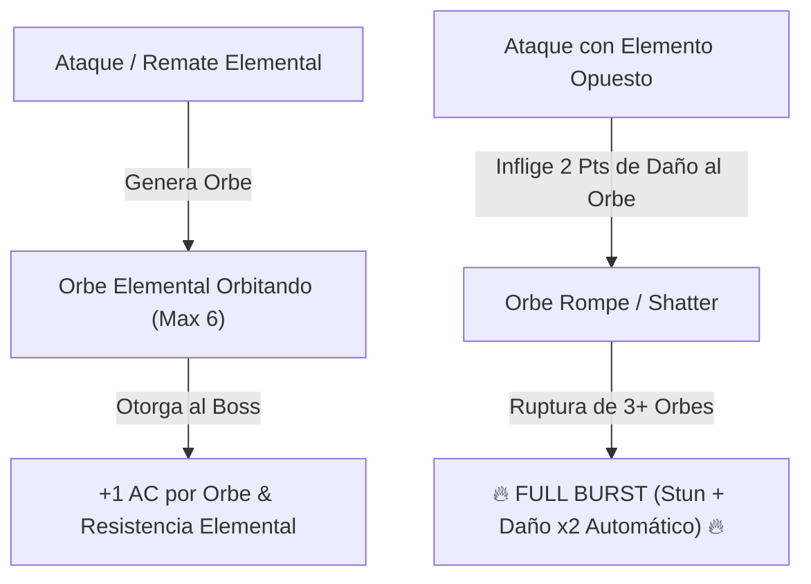

# Encuentros y Guardianes de Minos (Boss Design Framework)

> **Ubicación**: `7 - DM/OneShots/ARepeat/04-Encuentros_y_Guardianes.md`  
> **Diseñado bajo el Marco Metodológico**: `boss-ability-design`  
> **Sistema Especial de Combate**: **Elemental Orbs & Full Burst** (Inspirado en *Xenoblade Chronicles 2*).  
> **Palabras de Poder de Shivath**: **Fire**, **Water**, **Air**, **Earth**, **Life**, **Light**.

---

## 1. Minibosses de Sala (Guardianes Persistentes)

Los Minibosses custodian nodos clave. **Al ser derrotados, no reaparecen en futuras incursiones** y su eliminación altera permanentemente la dungeon.

### A. El Botánico de Sombras (Miniboss de la Sala 03 - LIFE)
* **Función en la Dungeon**: Controla la plaga de esporas venenosas en la Red Botánica.
* **Efecto de Derrota**: La plaga de toxinas se extingue, haciendo seguro el tránsito por las salas verdes.
* **Habilidad Destacada**:
  * `Esporas de Asfixia (Acción Activa, Recarga 5-6).` Inflige **3d8 daño de veneno** a un objetivo. Si impacta al PJ con sintonía **Life**, este absorbe las esporas y sana **1d8 HP** a un aliado adyacente.

### B. El Quimérico Volcánico (Miniboss de la Sala 05 - FIRE/EARTH)
* **Función en la Dungeon**: Mantiene la Forja en calor incontrolable.
* **Efecto de Derrota**: La Forja pasa a un estado de calor regulado.
* **Habilidad Destacada**:
  * `Piel de Magma Denso (Pasiva).` Otorga **+4 AC** mientras esté en contacto con lava. El PJ **Water** puede congelar las baldosas para remover esta pasiva durante 2 rondas.

---

## 2. BOSS FINAL: El Juicio de Minos (El Héroe del Sello)

* **Concepto**: Un coloso arcano compuesto de basalto y un núcleo de cristal hexagonal. Es la encarnación del test de Minos.
* **Mecánica Core**: **Mecánica de Orbes Elementales (Xenoblade Chronicles 2 Adaptation)**.



---

## 3. Mecánica Detallada de los Orbes Elementales (Xenoblade 2 System)

### A. Generación de Orbes (Orb Stacking)
Cada vez que el Boss ejecuta un ataque finalizador de fase o un jugador asesta un golpe con una de las **6 Palabras de Poder**, se manifiesta un **Orbe Elemental** flotando en órbita alrededor de *El Juicio de Minos*:

* **Tipos de Orbes**: `Fire Orb`, `Water Orb`, `Air Orb`, `Earth Orb`, `Life Orb`, `Light Orb`.
* **Beneficios Pasivos del Boss por Orbe Activo**:
  1. **Armadura Prismática**: +1 AC por cada Orbe activo (Ej: 4 orbes = +4 AC).
  2. **Inmunidad al Elemento**: El boss se vuelve completamente inmune al tipo de daño del Orbe que tenga activo.
  3. **Aura de Reversión**: Quien ataque al boss a distancia melé recibe **1d6 daño elemental** del tipo de cada orbe activo.

---

### B. Rompimiento de Orbes (Elemental Countering)

Cada Orbe tiene **3 Puntos de Durabilidad de Orbe**. Los jugadores pueden redirigir sus ataques elementales o facultades de incursión directamente hacia un Orbe flotante específico:

#### Tabla de Elementos Opuestos (Vulnerabilidad Crítica)

| Orbe Activo en el Boss | Elemento Opuesto (Destructor Crítico) | Daño al Orbe por Impacto | Efecto de Destrucción de Orbe |
| :--- | :--- | :---: | :--- |
| **FIRE Orb (Fuego)** | **WATER (Agua)** | **2 Puntos** (Crítico) | Explotar en vapor; remueve inmunidad a Fuego. |
| **WATER Orb (Agua)** | **FIRE (Fuego)** | **2 Puntos** (Crítico) | Evaporación instantánea; stunea al boss 1 turno. |
| **AIR Orb (Aire)** | **EARTH (Tierra)** | **2 Puntos** (Crítico) | Aplastamiento de presión; derriba al boss **Prone**. |
| **EARTH Orb (Tierra)** | **AIR (Aire)** | **2 Puntos** (Crítico) | Pulverización de viento; rompe la armadura de roca. |
| **LIFE Orb (Vida)** | **LIGHT (Luz)** | **2 Puntos** (Crítico) | Purificación luminosa; sana 2d8 HP al grupo aliado. |
| **LIGHT Orb (Luz)** | **LIFE (Vida)** | **2 Puntos** (Crítico) | Absorción vegetal; ciega temporalmente al boss. |

*Nota: Atacar a un Orbe con cualquier elemento no opuesto solo inflige 1 Punto de Daño al Orbe.*

---

### C. Sobretensión de Cadena: FULL BURST (Ruptura Total)

Cuando los exploradores logran **destruir 3 o más Orbes Elementales** durante la batalla:

```
======================================================================
               ⚡ FULL BURST: SOBRETENSIÓN DE MINOS ⚡
======================================================================
1. ¡ROMPIMIENTO TOTAL!: Todos los Orbes restantes explotan a la vez.
2. STUN COMPLETO: El Juicio de Minos queda ATURDIDO durante 1 RONDA.
3. INMUNIDADES CANCELADAS: Se eliminan todas las AC extra y resistencias.
4. DAÑO CRÍTICO MULTIPLICADO: Todos los ataques de los jugadores durante 
   esta ronda asestan DAÑO CRÍTICO AUTOMÁTICO MULTIPLICADO (x2).
======================================================================
```

---

## 4. Estructura de Fases del Boss

### FASE 1: La Carga Elemental (100% - 60% HP)
* **Acción de Inicio**: El boss genera automáticamente 2 Orbes aleatorios al iniciar el combate (`Fire Orb` + `Earth Orb`).
* **Habilidad**: `Sobretensión de Orbes (Acción Activa).` El boss canaliza la energía de sus orbes activos infligiendo **2d8 daño elemental** por cada orbe flotante a un objetivo.

### FASE 2: La Barrera Hexagonal de Orbes (60% - 20% HP)
* **Acción de Inicio**: El boss entra en defensiva y manifiesta **los 6 Orbes Elementales a la vez** (`Fire`, `Water`, `Air`, `Earth`, `Life`, `Light`).
* **Objetivo de los Jugadores**: Identificar las parejas opuestas (Water vs Fire, Light vs Life, Air vs Earth) para ejecutar la ruptura de 3 orbes y activar el **FULL BURST**.

### FASE 3: Colapso del Núcleo (20% - 0% HP)
* **Desencadenado tras el FULL BURST**: El núcleo de cristal queda completamente expuesto. La **AC cae a 11**.
* **Acción de Remate**: `Juicio Final de Minos (Acción de Hito Temporal).` Rayo prismático continuo que exige que todos los jugadores ejecuten sus facultades de sintonía en combo para asestar el golpe final.

---

## 5. Recompensas de Victoria del Boss

Al derrotar a **El Juicio de Minos**:
1. **Acceso al Sanctum Interior**: Revelación del lore secreto de Minos en Shivath.
2. **Artefacto Consumible**: **Piedra de Anclaje de Minos** (permite teletransportarse al campamento desde cualquier punto en aventuras futuras).
3. **Modo Calibración**: El grupo puede elegir el alineamiento de salas en cualquier incursión posterior.
