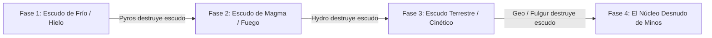

# Encuentros y Guardianes de Minos (Boss Design Framework)

> **Ubicación**: `7 - DM/OneShots/ARepeat/04-Encuentros_y_Guardianes.md`  
> **Diseñado bajo el Marco Metodológico**: `boss-ability-design`  
> **Sinergia Especial**: Combate interactivo donde la **Sintonía Elemental de los Jugadores** es indispensable para romper escudos y fases.

---

## 1. Minibosses de Sala (Guardianes Persistentes)

Los Minibossescustodian nodos clave. **Al ser derrotados, no reaparecen en futuras incursiones** y su eliminación altera permanentemente la dungeon.

### A. El Autómata Conductor (Miniboss de la Sala 03 - Fulgur)
* **Función en la Dungeon**: Genera las sobretensiones peligrosas en la Red Eléctrica.
* **Efecto de Derrota**: Las trampas de chispas en todos los pasillos quedan inhabilitadas permanentemente.
* **Habilidad Destacada**:
  * `Sobretensión en Cadena (Acción Activa, Recarga 5-6).` Inflige **3d8 daño de rayo** en una línea de 30 ft. Si impacta al PJ con **Sintonía Fulgur**, este absorbe el impacto y redirige **1d8 daño de rayo** a la fuente del autómata.

### B. El Quimérico Volcánico (Miniboss de la Sala 05 - Pyros/Geo)
* **Función en la Dungeon**: Mantiene la Forja en calor incontrolable.
* **Efecto de Derrota**: La Forja pasa a un estado de calor regulado, eliminando la necesidad de tiradas de constitución por calor extremo en el salón.
* **Habilidad Destacada**:
  * `Piel de Magma Denso (Pasiva).` Otorga **+4 AC** mientras esté en contacto con baldosas incandescentes. El PJ **Hydro** puede congelar las baldosas con su facultad para remover esta pasiva durante 2 rondas.

---

## 2. BOSS FINAL: El Juicio de Minos (El Héroe del Sello)

* **Concepto**: Un coloso arcano compuesto de piedra de basalto y un núcleo de cristal hexagonal. Es la encarnación del test de Minos.
* **Mecánica Core**: Posee una barrera de **Escudo Prismático Elemental**. Cada fase del escudo **solo puede ser destruida por el jugador que posea el Bufo Elemental correspondiente**.

---

### Taxonomía y Habilidades de "El Juicio de Minos"

#### Categorías de Rasgos Aplicadas:
* **Mitigación y Defensa**: *Barrera Elemental Cambiante* (Inmunidad total a daño excepto del elemento vulnerado en fase).
* **Adaptabilidad y Progresión**: Gana +1 a la precisión de ataque por cada escudo roto.
* **Control y Denegación**: *Onda de Distorsión Gravitacional* (Empuja a los exploradores a los bordes de la arena).

---

### FASES DEL COMBATE

### FASE 1: La Armadura de Escarcha Astral (100% - 75% HP)

* **Modificador Pasivo**: El boss está envuelto en un aura congelante. Inflige **1d6 daño de frío** a cualquiera a menos de 10 ft.
* **Inmunidad**: Inmune a todo daño excepto ataques infundidos con **Pyros (Calor)**.
* **Condición de Transición**: El jugador con **Sintonía Pyros** debe canalizar su facultad *Ignite* en el Núcleo del Boss o asestar 3 ataques de fuego para fundir la Armadura de Escarcha.

#### Acciones de Fase 1:
* `Mazo de Glaciar (Acción Activa).` Attack +7 to hit, alcance 10 ft. Hit: **2d10+4 daño físico** + **1d8 daño de frío**. El objetivo debe superar un *Save CON DC 14* o quedar **Agotado**.
* `Ráfaga Subcero (Acción de Hito Temporal, Inicio de Ronda 2).` Todas las baldosas se cubren de hielo resbaladizo. Movimiento reducido a la mitad excepto para el PJ **Pyros** y **Hydro**.

---

### FASE 2: La Coraza de Plasma Volcánico (75% - 50% HP)

* **Modificador Pasivo**: El boss exuda magma. Sus ataques infunden el estado **Quemadura** (**1d6 daño de fuego continuo** al inicio de cada turno).
* **Inmunidad**: Inmune a todo daño excepto ataques e interacciones infundidas con **Hydro (Fluidez)**.
* **Condición de Transición**: El jugador con **Sintonía Hydro** debe canalizar su facultad *Conduct/Drain* usando la reserva de agua del escenario para impactar el núcleo incandescente, causando una reacción de choque térmico (*Stun de 1 ronda*).

#### Acciones de Fase 2:
* `Erupción Central (Acción Reactiva, gatillo: recibir 20+ daño en 1 turno).` El boss expulsa 3 proyectiles de lava a zonas aleatorias. Cada proyectil crea una zona de magma de 10 ft que dura 2 rondas.
* `Barrida Incandescente (Acción Activa).` Ataque en cono de 20 ft. Hit: **3d8 daño de fuego**. *Save AGI DC 15* para mitad de daño.

---

### FASE 3: El Bastión Telúrico Magnético (50% - 25% HP)

* **Modificador Pasivo**: Placas de roca pesada gravitan alrededor del boss, otorgándole **AC 20**.
* **Inmunidad**: Inmune a ataques a distancia y proyectiles.
* **Condición de Transición**: Se requiere un combo coordinado:
  1. El jugador con **Sintonía Fulgur** debe sobrecargar los rieles magnéticos del suelo (*Acción de Circuito*).
  2. El jugador con **Sintonía Geo** debe ejecutar *Shatter* en la placa central para resquebrajar el bastión.

#### Acciones de Fase 3:
* `Inversión Gravitacional (Acción de Control).` Todos los personajes son elevados 15 ft en el aire. El jugador con **Sintonía Zephyr** puede usar su caída pluma para atrapar a los aliados antes de que caigan.
* `Golpe Telúrico (Acción Activa).` Impacta el suelo generando una onda expansiva de 30 ft. Hit: **3d10 daño contundente** y derriba a los objetivos **Prone**.

---

### FASE 4: El Núcleo de la Verdad de Minos (25% - 0% HP)

* **Modificador Pasivo**: El escudo se disipa por completo. El núcleo de cristal queda expuesto. La **AC cae a 13**, pero el boss entra en modo de **Sobretensión de Cauterio**.
* **Frenesí de Remate**: Todas las resistencias se eliminan. **Todos los elementos de los jugadores hacen doble daño**.

#### Acciones de Fase 4 (Consolidadas y Letales):
* `Juicio Final de Minos (Acción de Hito Temporal, al inicio del turno del Boss).` El núcleo canaliza un rayo prismático que inflige **4d8 daño radiante/arcano** repartido entre todos los jugadores en la sala.
* `Resonancia del Vacío (Acción Reactiva, gatillo: quedar a 10 HP o menos).` El PJ con **Sintonía Umbra** puede usar su facultad *Phase* para cegar temporalmente al núcleo, otorgando **Ventaja Automática** a todos los ataques aliados durante la ronda final de remate.

---

## 3. Recompensas de Victoria del Boss

Al derrotar a **El Juicio de Minos**:
1. **Acceso al Sanctum Interior**: Se revela la cámara central de Minos (Lore secreto de la campaña).
2. **Artefacto Consumible de la Misión**: El grupo obtiene la **Piedra de Anclaje de Minos** (permite teletransportarse al campamento desde cualquier lugar del mapa en aventuras futuras).
3. **Desbloqueo Permanente**: El laberinto entra en modo *Calibración Cumplida*, permitiendo al grupo elegir el alineamiento de salas en cualquier incursión posterior.
