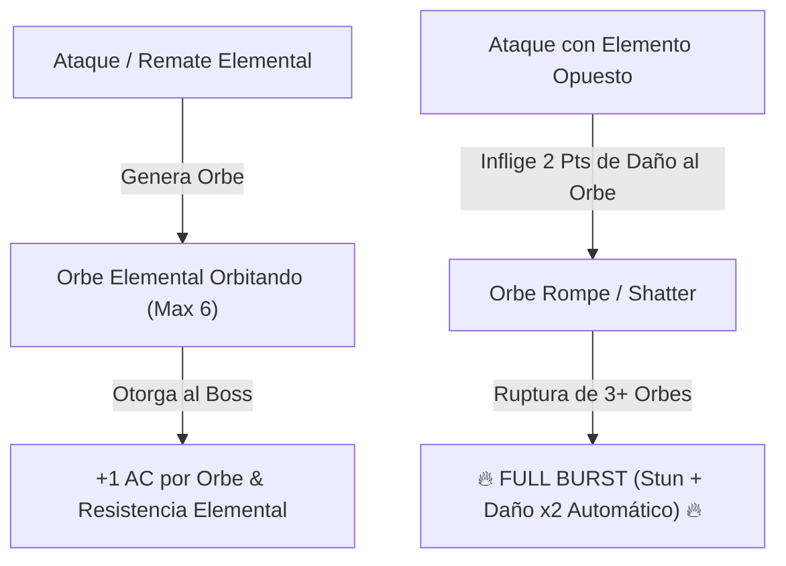

# Encuentros y Guardianes de Minos (Boss Design Framework)

> **Ubicación**: `7 - DM/OneShots/ARepeat/04-Encuentros_y_Guardianes.md`  
> **Diseñado bajo el Marco Metodológico**: `boss-ability-design`  
> **Sistema de Combate**: **6 Guardianes de Área (Persistencia Total & Bonus de Excelencia 7/10)** + **Elemental Orbs & Full Burst** (Inspirado en *Xenoblade 2*).  
> **Palabras de Poder de Shivath**: **Fire**, **Water**, **Air**, **Earth**, **Life**, **Light**.

---

## 1. Guardianes de Área y Regla de Persistencia

```
======================================================================
         👑 PERSISTENCIA TOTAL Y BONUS DE EXCELENCIA 7/10 👑
======================================================================
1. PERSISTENCIA DE SUBDUNGEON: Todo el avance dentro de la Subdungeon
   (palancas activadas, agua desviada, puertas abiertas o daño al Guardián)
   SE GUARDA PERMANENTEMENTE entre incursiones. Los jugadores pueden volver
   en otro momento y retomar la Subdungeon donde la dejaron.

2. BONUS DE EXCELENCIA (REGLA 7/10):
   - Si el grupo derrota al Guardián y completa la Subdungeon conservando
     SIETE O MÁS (>= 7/10) PUNTOS DE CARGA ARCANA intactos al final:
     ¡Ganan el BONUS DE EXCELENCIA! (Desbloqueo instantáneo del bufo
     de sintonía permanente en el Altar + Reliquia Estelar de Minos).
   - Si gastan más cargas (< 7 Cargas al final), IGUAL AVANZAN y guardan 
     su progreso, pudiendo desbloquear la sintonía estándar sin el bonus.
======================================================================
```

---

### Catálogo de los 6 Guardianes de Área

### A. El Señor del Crisol (Guardián de FIRE - La Caldera Volcánica)
* **Tirada 1d8**: Opción 1.
* **Bonus de Excelencia (>= 7 Cargas)**: 🔓 Desbloqueo instantáneo + Reliquia Volcánica.
* **Habilidad Destacada**:
  * `Incineración Cauterizante (Acción Activa, Recarga 5-6).` Inflige **3d8 daño de fuego** en cono de 20 ft. Evitar la lava previene la pérdida de Carga Arcana.

---

### B. La Quimera Hidráulica (Guardián de WATER - La Cisterna Sumergida)
* **Tirada 1d8**: Opción 2.
* **Bonus de Excelencia (>= 7 Cargas)**: 🔓 Desbloqueo instantáneo + Perla Astral.
* **Habilidad Destacada**:
  * `Chorro de Alta Presión (Acción Activa).` Inflige **3d6 daño contundente** y empuja 20 ft.

---

### C. El Coloso del Vértice (Guardián de AIR - La Torre de los Vientos)
* **Tirada 1d8**: Opción 3.
* **Bonus de Excelencia (>= 7 Cargas)**: 🔓 Desbloqueo instantáneo + Pluma Astral.
* **Habilidad Destacada**:
  * `Torbellino Repulsivo (Acción Activa).` Eleva a los jugadores 30 ft en el aire. Exige reacción de caída pluma.

---

### D. El Titán de Basalto (Guardián de EARTH - El Dominio Telúrico)
* **Tirada 1d8**: Opción 4.
* **Bonus de Excelencia (>= 7 Cargas)**: 🔓 Desbloqueo instantáneo + Escudo de Piedra Viva.
* **Habilidad Destacada**:
  * `Muro Telúrico (Pasiva).` +4 AC hasta usar el ideograma `[🟅 EARTH] + [⊗ PURGE]`.

---

### E. El Botánico de Sombras (Guardián de LIFE - El Invernadero Ancestral)
* **Tirada 1d8**: Opción 5.
* **Bonus de Excelencia (>= 7 Cargas)**: 🔓 Desbloqueo instantáneo + Semilla de Vitalidad.
* **Habilidad Destacada**:
  * `Esporas de Asfixia (Acción Activa, Recarga 5-6).` Inflige **3d8 daño de veneno**.

---

### F. El Espejismo de Cristal (Guardián de LIGHT - El Santuario Prismático)
* **Tirada 1d8**: Opción 6.
* **Bonus de Excelencia (>= 7 Cargas)**: 🔓 Desbloqueo instantáneo + Prisma del Sol.
* **Habilidad Destacada**:
  * `Reflejos Ilusorios (Pasiva).` Crea 3 copias de luz.

---

## 2. BOSS FINAL: El Juicio de Minos (El Héroe del Sello)

* **Tirada 1d8**: Opción 7 (o Puerta Hexagonal abierta tras reunir los 6 Fragmentos).
* **Mecánica Core**: **Mecánica de Orbes Elementales (Xenoblade Chronicles 2 Adaptation)**.



---

## 3. Mecánica Detallada de los Orbes Elementales (Xenoblade 2 System)

### A. Generación de Orbes (Orb Stacking)
Cada vez que el Boss ejecuta un ataque finalizador de fase o un jugador asesta un golpe con una de las **6 Palabras de Poder**, se manifiesta un **Orbe Elemental** flotando en órbita alrededor de *El Juicio de Minos*:

* **Tipos de Orbes**: `Fire Orb`, `Water Orb`, `Air Orb`, `Earth Orb`, `Life Orb`, `Light Orb`.
* **Beneficios Pasivos del Boss por Orbe Activo**:
  1. **Armadura Prismática**: +1 AC por cada Orbe activo.
  2. **Inmunidad al Elemento**: Inmune al tipo de daño del Orbe activo.
  3. **Aura de Reversión**: Daño melé genera **1d6 daño elemental** de contraataque.

---

### B. Rompimiento de Orbes (Elemental Countering)

#### Tabla de Elementos Opuestos (Vulnerabilidad Crítica)

| Orbe Activo en el Boss | Elemento Opuesto (Destructor Crítico) | Daño al Orbe por Impacto | Efecto de Destrucción de Orbe |
| :--- | :--- | :---: | :--- |
| **FIRE Orb (Fuego)** | **WATER (Agua)** | **2 Puntos** (Crítico) | Explotar en vapor; remueve inmunidad a Fuego. |
| **WATER Orb (Agua)** | **FIRE (Fuego)** | **2 Puntos** (Crítico) | Evaporación instantánea; stunea al boss 1 turno. |
| **AIR Orb (Aire)** | **EARTH (Tierra)** | **2 Puntos** (Crítico) | Aplastamiento de presión; derriba al boss **Prone**. |
| **EARTH Orb (Tierra)** | **AIR (Aire)** | **2 Puntos** (Crítico) | Pulverización de viento; rompe la armadura de roca. |
| **LIFE Orb (Vida)** | **LIGHT (Luz)** | **2 Puntos** (Crítico) | Purificación luminosa; sana 2d8 HP al grupo aliado. |
| **LIGHT Orb (Luz)** | **LIFE (Vida)** | **2 Puntos** (Crítico) | Absorción vegetal; ciega temporalmente al boss. |

---

### C. Sobretensión de Cadena: FULL BURST (Ruptura Total)

```
======================================================================
               ⚡ FULL BURST: SOBRETENSIÓN DE MINOS ⚡
======================================================================
1. ¡ROMPIMIENTO TOTAL!: Todos los Orbes restantes explotan a la vez.
2. STUN COMPLETO: El Juicio de Minos queda ATURDIDO durante 1 RONDA.
3. INMUNIDADES CANCELADAS: Se eliminan todas las AC extra y resistencias.
4. DAÑO CRÍTICO MULTIPLICADO: Todos los ataques de los jugadores durante 
   esta ronda asestan DAÑO CRÍTICO AUTOMÁTICO MULTIPLICADO (x2).
======================================================================
```
