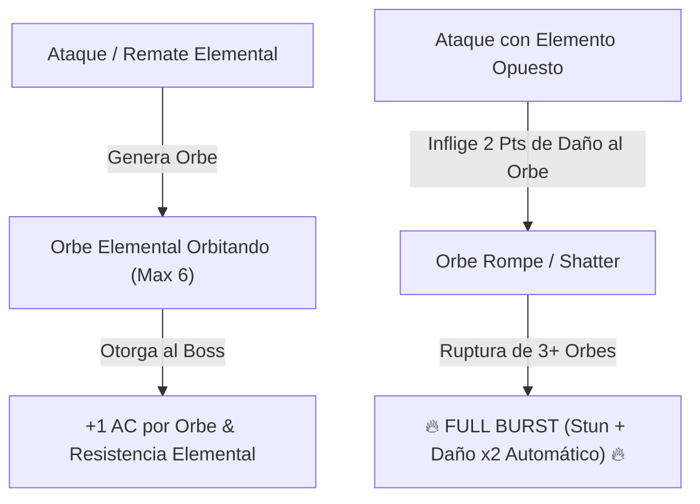

# Encuentros y Guardianes de Minos (Boss Design Framework)

> **Ubicación**: `7 - DM/OneShots/ARepeat/04-Encuentros_y_Guardianes.md`  
> **Diseñado bajo el Marco Metodológico**: `boss-ability-design`  
> **Sistema de Combate**: **6 Guardianes de Área (Desbloqueo 7/10 Cargas)** + **Elemental Orbs & Full Burst** (Inspirado en *Xenoblade 2*).  
> **Palabras de Poder de Shivath**: **Fire**, **Water**, **Air**, **Earth**, **Life**, **Light**.

---

## 1. Guardianes de Área (Prueba del 7/10 de Carga)

Cada Subdungeon Elemental está custodiada por un **Guardián de Área**. 

```
======================================================================
         👑 REGLA DE EJECUCIÓN PERFECTA (PRUEBA DEL GUARDIÁN) 👑
======================================================================
Para desbloquear la Palabra de Poder del Guardián en el Altar de Sintonía:
1. Derrotar al Guardián de Área en su Día Astral específico.
2. Mantener OCHO O MÁS (>= 7/10) PUNTOS DE CARGA ARCANA al finalizar.
   (Máximo 3 Puntos de Carga gastados en toda la incursión).
======================================================================
```

---

### Catálogo de los 6 Guardianes de Área

### A. El Señor del Crisol (Guardián de FIRE - La Caldera Volcánica)
* **Día Astral**: Día de la Llama.
* **Efecto de Derrota con >= 7 Cargas**: 🔓 Desbloquea la Palabra de Poder **FIRE** en el Altar de Sintonía.
* **Habilidad Destacada**:
  * `Incineración Cauterizante (Acción Activa, Recarga 5-6).` Inflige **3d8 daño de fuego** en cono de 20 ft. Si los jugadores la evitan con movimiento perfecto (*Save AGI DC 14*), no se consume Carga Arcana extra.

---

### B. La Quimera Hidráulica (Guardián de WATER - La Cisterna Sumergida)
* **Día Astral**: Día de la Marea.
* **Efecto de Derrota con >= 7 Cargas**: 🔓 Desbloquea la Palabra de Poder **WATER** en el Altar de Sintonía.
* **Habilidad Destacada**:
  * `Chorro de Alta Presión (Acción Activa).` Inflige **3d6 daño contundente** y empuja 20 ft. Permite sumergirse en la cisterna sin ahogarse si se bloquea con el escudo.

---

### C. El Coloso del Vértice (Guardián de AIR - La Torre de los Vientos)
* **Día Astral**: Día del Viento.
* **Efecto de Derrota con >= 7 Cargas**: 🔓 Desbloquea la Palabra de Poder **AIR** en el Altar de Sintonía.
* **Habilidad Destacada**:
  * `Torbellino Repulsivo (Acción Activa).` Eleva a los jugadores 30 ft en el aire. Exige reacción de caída pluma o *Save AGI DC 15*.

---

### D. El Titán de Basalto (Guardián de EARTH - El Dominio Telúrico)
* **Día Astral**: Día del Pico.
* **Efecto de Derrota con >= 7 Cargas**: 🔓 Desbloquea la Palabra de Poder **EARTH** en el Altar de Sintonía.
* **Habilidad Destacada**:
  * `Muro Telúrico (Pasiva).` +4 AC hasta que los jugadores usen el ideograma `[🟅 EARTH] + [⊗ PURGE]` para agrietar su armadura.

---

### E. El Botánico de Sombras (Guardián de LIFE - El Invernadero Ancestral)
* **Día Astral**: Día del Brote.
* **Efecto de Derrota con >= 7 Cargas**: 🔓 Desbloquea la Palabra de Poder **LIFE** en el Altar de Sintonía.
* **Habilidad Destacada**:
  * `Esporas de Asfixia (Acción Activa, Recarga 5-6).` Inflige **3d8 daño de veneno**. Al ser derrotado con >= 7 Cargas, purifica la toxina del invernadero para siempre.

---

### F. El Espejismo de Cristal (Guardián de LIGHT - El Santuario Prismático)
* **Día Astral**: Día del Sol.
* **Efecto de Derrota con >= 7 Cargas**: 🔓 Desbloquea la Palabra de Poder **LIGHT** en el Altar de Sintonía.
* **Habilidad Destacada**:
  * `Reflejos Ilusorios (Pasiva).` Crea 3 copias de luz. Usar espejos rúnicos disipa las copias sin gastar turnos ni Carga.

---

## 2. BOSS FINAL: El Juicio de Minos (El Héroe del Sello)

* **Concepto**: Un coloso arcano compuesto de basalto y un núcleo de cristal hexagonal. Es la encarnación del test de Minos.
* **Mecánica Core**: **Mecánica de Orbes Elementales (Xenoblade Chronicles 2 Adaptation)**.



---

## 3. Mecánica Detallada de los Orbes Elementales (Xenoblade 2 System)

### A. Generación de Orbes (Orb Stacking)
Cada vez que el Boss ejecuta un ataque finalizador de fase o un jugador asesta un golpe con una de las **6 Palabras de Poder**, se manifiesta un **Orbe Elemental** flotando en órbita alrededor de *El Juicio de Minos*:

* **Tipos de Orbes**: `Fire Orb`, `Water Orb`, `Air Orb`, `Earth Orb`, `Life Orb`, `Light Orb`.
* **Beneficios Pasivos del Boss por Orbe Activo**:
  1. **Armadura Prismática**: +1 AC por cada Orbe activo (Ej: 4 orbes = +4 AC).
  2. **Inmunidad al Elemento**: El boss se vuelve completamente inmune al tipo de daño del Orbe que tenga activo.
  3. **Aura de Reversión**: Quien ataque al boss a distancia melé recibe **1d6 daño elemental** del tipo de cada orbe activo.

---

### B. Rompimiento de Orbes (Elemental Countering)

Cada Orbe tiene **3 Puntos de Durabilidad de Orbe**. Los jugadores pueden redirigir sus ataques elementales o facultades de incursión directamente hacia un Orbe flotante específico:

#### Tabla de Elementos Opuestos (Vulnerabilidad Crítica)

| Orbe Activo en el Boss | Elemento Opuesto (Destructor Crítico) | Daño al Orbe por Impacto | Efecto de Destrucción de Orbe |
| :--- | :--- | :---: | :--- |
| **FIRE Orb (Fuego)** | **WATER (Agua)** | **2 Puntos** (Crítico) | Explotar en vapor; remueve inmunidad a Fuego. |
| **WATER Orb (Agua)** | **FIRE (Fuego)** | **2 Puntos** (Crítico) | Evaporación instantánea; stunea al boss 1 turno. |
| **AIR Orb (Aire)** | **EARTH (Tierra)** | **2 Puntos** (Crítico) | Aplastamiento de presión; derriba al boss **Prone**. |
| **EARTH Orb (Tierra)** | **AIR (Aire)** | **2 Puntos** (Crítico) | Pulverización de viento; rompe la armadura de roca. |
| **LIFE Orb (Vida)** | **LIGHT (Luz)** | **2 Puntos** (Crítico) | Purificación luminosa; sana 2d8 HP al grupo aliado. |
| **LIGHT Orb (Luz)** | **LIFE (Vida)** | **2 Puntos** (Crítico) | Absorción vegetal; ciega temporalmente al boss. |

---

### C. Sobretensión de Cadena: FULL BURST (Ruptura Total)

Cuando los exploradores logran **destruir 3 o más Orbes Elementales** durante la batalla:

```
======================================================================
               ⚡ FULL BURST: SOBRETENSIÓN DE MINOS ⚡
======================================================================
1. ¡ROMPIMIENTO TOTAL!: Todos los Orbes restantes explotan a la vez.
2. STUN COMPLETO: El Juicio de Minos queda ATURDIDO durante 1 RONDA.
3. INMUNIDADES CANCELADAS: Se eliminan todas las AC extra y resistencias.
4. DAÑO CRÍTICO MULTIPLICADO: Todos los ataques de los jugadores durante 
   esta ronda asestan DAÑO CRÍTICO AUTOMÁTICO MULTIPLICADO (x2).
======================================================================
```

---

## 4. Recompensas de Victoria del Boss

Al derrotar a **El Juicio de Minos**:
1. **Acceso al Sanctum Interior**: Revelación del lore secreto de Minos en Shivath.
2. **Artefacto Consumible**: **Piedra de Anclaje de Minos** (permite teletransportarse al campamento desde cualquier punto en aventuras futuras).
3. **Modo Calibración**: El grupo puede elegir el alineamiento de salas en cualquier incursión posterior.
