# Encuentros y Guardianes de Minos (Boss Design Framework)

> **Ubicación**: `7 - DM/OneShots/ARepeat/04-Encuentros_y_Guardianes.md`  
> **Diseñado bajo el Marco Metodológico**: `boss-ability-design`  
> **Sinergia Especial**: Combate interactivo donde las **6 Palabras de Poder de Shivath** (**Fire**, **Water**, **Air**, **Earth**, **Life**, **Light**) son indispensables para romper escudos y fases.

---

## 1. Minibosses de Sala (Guardianes Persistentes)

Los Minibosses custodian nodos clave. **Al ser derrotados, no reaparecen en futuras incursiones** y su eliminación altera permanentemente la dungeon.

### A. El Botánico de Sombras (Miniboss de la Sala 03 - LIFE)
* **Función en la Dungeon**: Controla la plaga de esporas venenosas en la Red Botánica.
* **Efecto de Derrota**: La plaga de toxinas se extingue, haciendo seguro el tránsito por las salas verdes.
* **Habilidad Destacada**:
  * `Esporas de Asfixia (Acción Activa, Recarga 5-6).` Inflige **3d8 daño de veneno** a un objetivo. Si impacta al PJ con sintonía **Life**, este absorbe las esporas y sana **1d8 HP** a un aliado adyacente.

### B. El Quimérico Volcánico (Miniboss de la Sala 05 - FIRE/EARTH)
* **Función en la Dungeon**: Mantiene la Forja en calor incontrolable.
* **Efecto de Derrota**: La Forja pasa a un estado de calor regulado.
* **Habilidad Destacada**:
  * `Piel de Magma Denso (Pasiva).` Otorga **+4 AC** mientras esté en contacto con lava. El PJ **Water** puede congelar las baldosas para remover esta pasiva durante 2 rondas.

---

## 2. BOSS FINAL: El Juicio de Minos (El Héroe del Sello)

* **Concepto**: Un coloso arcano compuesto de basalto y un núcleo de cristal hexagonal. Es la encarnación del test de Minos.
* **Mecánica Core**: Posee una barrera de **Escudo Prismático Elemental** adaptado a las 6 Palabras de Poder de Shivath. Cada fase del escudo **solo puede ser destruida por el jugador que posea la sintonía correspondiente**.

```mermaid
graph LR
    F1["Fase 1: Escudo de Hielo"] -->|"FIRE destruye escudo"| F2["Fase 2: Escudo Volcánico"]
    F2 -->|"WATER destruye escudo"| F3["Fase 3: Escudo Telúrico"]
    F3 -->|"EARTH / AIR destruyen escudo"| F4["Fase 4: Escudo de Toxinas"]
    F4 -->|"LIFE destruye escudo"| F5["Fase 5: Escudo de Espejismo"]
    F5 -->|"LIGHT destruye escudo"| F6["Fase Final: El Núcleo Desnudo"]
```

---

### Taxonomía y Habilidades de "El Juicio de Minos"

#### Categorías de Rasgos Aplicadas:
* **Mitigación y Defensa**: *Barrera Elemental Cambiante* (Inmunidad total a daño excepto del elemento vulnerado en la fase actual).
* **Adaptabilidad y Progresión**: Gana +1 a la precisión de ataque por cada escudo roto.
* **Control y Denegación**: *Onda de Distorsión Gravitacional* (Empuja a los exploradores a los bordes de la arena).

---

### FASES DEL COMBATE

### FASE 1: Armadura de Escarcha (Vulnerable a FIRE)
* **Modificador Pasivo**: Aura de frío de 10 ft (**1d6 daño de frío** por turno).
* **Inmunidad**: Inmune a todo excepto **FIRE**.
* **Transición**: El PJ **Fire** debe canalizar *Ignite* o infligir 20+ daño de fuego para derretir la coraza.

---

### FASE 2: Coraza Volcánica (Vulnerable a WATER)
* **Modificador Pasivo**: Magma fluido en sus ataques (**1d6 daño de fuego continuo**).
* **Inmunidad**: Inmune a todo excepto **WATER**.
* **Transición**: El PJ **Water** debe usar *Drain/Conduct* con el estanque para provocar un choque térmico (*Stun de 1 ronda*).

---

### FASE 3: Bastión Telúrico (Vulnerable a EARTH & AIR)
* **Modificador Pasivo**: Placas de roca gravitantes (**AC 20**).
* **Inmunidad**: Inmune a proyectiles y ataques a distancia.
* **Transición**: **Air** contrarresta la inversión gravitacional del boss y **Earth** ejecuta *Shatter* en la placa central.

---

### FASE 4: Velo de Esporas (Vulnerable a LIFE)
* **Modificador Pasivo**: Nube de toxinas que reduce la curación recibida a la mitad.
* **Inmunidad**: Inmune a ataques físicos directos.
* **Transición**: El PJ **Life** debe canalizar *Overgrowth* para absorber la plaga bioluminiscente del escudo.

---

### FASE 5: Espejismo Astral (Vulnerable a LIGHT)
* **Modificador Pasivo**: El boss crea 3 duplicados de luz (*Ceguera e Ilusión*).
* **Inmunidad**: Ataques normales impactan duplicados falsos.
* **Transición**: El PJ **Light** debe usar *Refract/Reveal* para disipar los reflejos falsos y exponer al verdadero boss.

---

### FASE FINAL: El Núcleo Desnudo de Minos (25% - 0% HP)
* **Modificador Pasivo**: Escudos disipados. **AC cae a 13**, pero entra en frenesí de sobretensión.
* **Frenesí de Remate**: **Todas las 6 Palabras de Poder de los jugadores infligen el doble de daño**.

#### Acciones de Fase Final:
* `Juicio Final de Minos (Acción de Hito Temporal).` Rayo prismático que inflige **4d8 daño radiante/arcano** repartido en el grupo.
* `Remate Armónico (Acción Reactiva).` Cuando todos los jugadores atacan en la misma ronda usando sus Palabras de Poder, el boss queda **Aturdido** hasta el final del combate.

---

## 3. Recompensas de Victoria del Boss

Al derrotar a **El Juicio de Minos**:
1. **Acceso al Sanctum Interior**: Revelación del lore secreto de Minos en Shivath.
2. **Artefacto Consumible**: **Piedra de Anclaje de Minos** (permite teletransportarse al campamento desde cualquier punto en aventuras futuras).
3. **Modo Calibración**: El grupo puede elegir el alineamiento de salas en cualquier incursión posterior.
