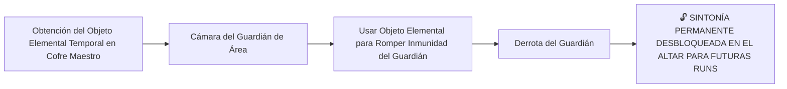
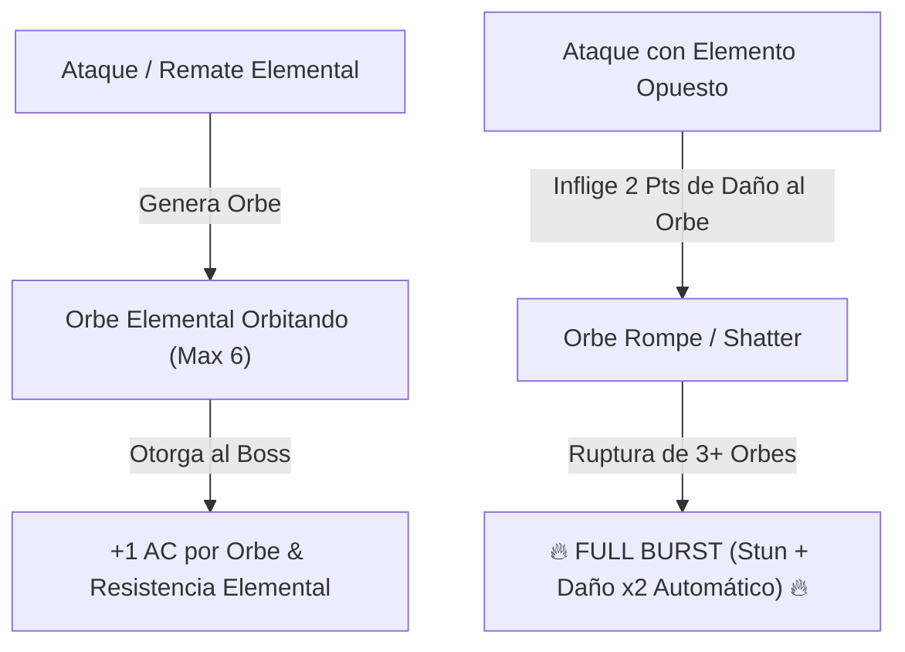

# Encuentros y Guardianes de Minos (Boss Design Framework)

> **Ubicación**: `7 - DM/OneShots/ARepeat/04-Encuentros_y_Guardianes.md`  
> **Diseñado bajo el Marco Metodológico**: `boss-ability-design`  
> **Sistema de Combate**: **Zelda-Style Mini-Dungeon Bosses (Dungeon Item Counter)** + **Elemental Orbs & Full Burst** (Inspirado en *Xenoblade 2*).  
> **Palabras de Poder de Shivath**: **Fire**, **Water**, **Air**, **Earth**, **Life**, **Light**.

---

## 1. Guardianes de Área y Objetos Elementales de Subdungeon

En cada Subdungeon Elemental, los jugadores obtienen el **Objeto Elemental Temporal** en el Cofre Maestro. Este objeto es indispensable para vulnerar la inmunidad del Guardián de Área:



---

### Catálogo de Guardianes y Objetos Elementales

### A. El Señor del Crisol (Guardián de FIRE - La Caldera Volcánica)
* **Objeto Elemental Requerido**: *Guantelete de Llama de Minos* (Obtenido en el Cofre Maestro de la Caldera).
* **Mecánica Zelda**: El boss se protege tras un escudo de escoria de magma congelado. Disparar el *Guantelete de Llama* a los 3 braseros superiores funde el escudo y lo aturde 1 ronda.
* **Recompensa**: 🔓 Desbloqueo permanente de la Palabra de Poder **FIRE** en el Altar de Sintonía.

---

### B. La Quimera Hidráulica (Guardián de WATER - La Cisterna Sumergida)
* **Objeto Elemental Requerido**: *Flauta del Mar de Minos*.
* **Mecánica Zelda**: La Quimera flota fuera del alcance sobre un chorro de agua. Tocar la *Flauta del Mar* drena la columna de agua, haciendo caer al boss al suelo.
* **Recompensa**: 🔓 Desbloqueo permanente de la Palabra de Poder **WATER** en el Altar de Sintonía.

---

### C. El Coloso del Vértice (Guardián de AIR - La Torre de los Vientos)
* **Objeto Elemental Requerido**: *Capa del Vértice de Minos*.
* **Mecánica Zelda**: El Coloso genera tornados que empujan a los exploradores al vacío. Usar la *Capa del Vértice* permite remontar el tornado y aterrizar sobre el núcleo débil del boss.
* **Recompensa**: 🔓 Desbloqueo permanente de la Palabra de Poder **AIR** en el Altar de Sintonía.

---

### D. El Titán de Basalto (Guardián de EARTH - El Dominio Telúrico)
* **Objeto Elemental Requerido**: *Martillo de Basalto de Minos*.
* **Mecánica Zelda**: El Titán posee armadura de piedra impenetrable. Asestar un golpe de impacto con el *Martillo de Basalto* agrieta su coraza para permitir daño convencional.
* **Recompensa**: 🔓 Desbloqueo permanente de la Palabra de Poder **EARTH** en el Altar de Sintonía.

---

### E. El Botánico de Sombras (Guardián de LIFE - El Invernadero Ancestral)
* **Objeto Elemental Requerido**: *Semilla Botánica de Minos*.
* **Mecánica Zelda**: El Botánico se esconde en bulbos carnívoros. Plantar la *Semilla Botánica* germina vides que aprisionan los bulbos y exponen la flor central.
* **Recompensa**: 🔓 Desbloqueo permanente de la Palabra de Poder **LIFE** en el Altar de Sintonía.

---

### F. El Espejismo de Cristal (Guardián de LIGHT - El Santuario Prismático)
* **Objeto Elemental Requerido**: *Escudo Prismático de Minos*.
* **Mecánica Zelda**: El boss genera 3 copias de luz ilusorias. Usar el *Escudo Prismático* para reflejar la luz del tragaluz revela inmediatamente al verdadero boss.
* **Recompensa**: 🔓 Desbloqueo permanente de la Palabra de Poder **LIGHT** en el Altar de Sintonía.

---

## 2. BOSS FINAL: El Juicio de Minos (El Héroe del Sello)

* **Concepto**: Un coloso arcano compuesto de basalto y un núcleo de cristal hexagonal. Es la encarnación del test de Minos.
* **Mecánica Core**: **Mecánica de Orbes Elementales (Xenoblade Chronicles 2 Adaptation)**.



---

## 3. Mecánica Detallada de los Orbes Elementales (Xenoblade 2 System)

### A. Generación de Orbes (Orb Stacking)
Cada vez que el Boss ejecuta un ataque finalizador de fase o un jugador asesta un golpe con una de las **6 Palabras de Poder**, se manifiesta un **Orbe Elemental** flotando en órbita alrededor de *El Juicio de Minos*:

* **Tipos de Orbes**: `Fire Orb`, `Water Orb`, `Air Orb`, `Earth Orb`, `Life Orb`, `Light Orb`.
* **Beneficios Pasivos del Boss por Orbe Activo**:
  1. **Armadura Prismática**: +1 AC por cada Orbe activo.
  2. **Inmunidad al Elemento**: Inmune al tipo de daño del Orbe activo.
  3. **Aura de Reversión**: Daño melé genera **1d6 daño elemental** de contraataque.

---

### B. Rompimiento de Orbes (Elemental Countering)

#### Tabla de Elementos Opuestos (Vulnerabilidad Crítica)

| Orbe Activo en el Boss | Elemento Opuesto (Destructor Crítico) | Daño al Orbe por Impacto | Efecto de Destrucción de Orbe |
| :--- | :--- | :---: | :--- |
| **FIRE Orb (Fuego)** | **WATER (Agua)** | **2 Puntos** (Crítico) | Explotar en vapor; remueve inmunidad a Fuego. |
| **WATER Orb (Agua)** | **FIRE (Fuego)** | **2 Puntos** (Crítico) | Evaporación instantánea; stunea al boss 1 turno. |
| **AIR Orb (Aire)** | **EARTH (Tierra)** | **2 Puntos** (Crítico) | Aplastamiento de presión; derriba al boss **Prone**. |
| **EARTH Orb (Tierra)** | **AIR (Aire)** | **2 Puntos** (Crítico) | Pulverización de viento; rompe la armadura de roca. |
| **LIFE Orb (Vida)** | **LIGHT (Luz)** | **2 Puntos** (Crítico) | Purificación luminosa; sana 2d8 HP al grupo aliado. |
| **LIGHT Orb (Luz)** | **LIFE (Vida)** | **2 Puntos** (Crítico) | Absorción vegetal; ciega temporalmente al boss. |

---

### C. Sobretensión de Cadena: FULL BURST (Ruptura Total)

```
======================================================================
               ⚡ FULL BURST: SOBRETENSIÓN DE MINOS ⚡
======================================================================
1. ¡ROMPIMIENTO TOTAL!: Todos los Orbes restantes explotan a la vez.
2. STUN COMPLETO: El Juicio de Minos queda ATURDIDO durante 1 RONDA.
3. INMUNIDADES CANCELADAS: Se eliminan todas las AC extra y resistencias.
4. DAÑO CRÍTICO MULTIPLICADO: Todos los ataques de los jugadores durante 
   esta ronda asestan DAÑO CRÍTICO AUTOMÁTICO MULTIPLICADO (x2).
======================================================================
```
