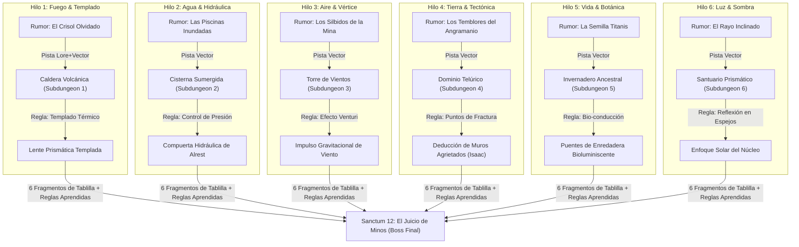

# Ficha de Control del DM, Cuaderno Físico y Tablero de Rumores

> **Ubicación**: `7 - DM/OneShots/ARepeat/05-Ficha_Control_DM_y_Tablero_Rumores.md`  
> **Formato de Seguimiento**: Cuaderno Físico en Mesa (Jugadores) + Grafo de Rumores (*Curiosity Board*).  
> **Palabras de Poder de Shivath**: **Fire**, **Water**, **Air**, **Earth**, **Life**, **Light**.

---

## 1. El Cuaderno Físico en Mesa (Transferencia entre Jugadores)

```
======================================================================
               📖 EL CUADERNO FÍSICO DE LA MINA 📖
======================================================================
1. MAPA Y ANOTACIONES HECHAS POR JUGADORES:
   - Los jugadores mantienen un CUADERNO FÍSICO en la mesa de juego donde
     dibujan el mapa del laberinto, anotan significados de ideogramas
     alrestianos y registran atajos permanentes.

2. TRANSFERENCIA IN-GAME:
   - Cualquier grupo de personajes que entre en el laberinto lleva consigo
     el Cuaderno Físico en su equipo. De este modo, los descubrimientos de
     jugadores anteriores benefician a los nuevos sin necesidad de reseteos.
======================================================================
```

---

## 2. Regla de Rendimiento Decreciente por Incursión (Anti-Farm)

Para evitar que los aventureros "farmeen" dinero repetido haciendo incursiones cortas de 2 cargas:

* **Salas Previamente Exploradas**: Los cofres menores de salas ya abiertas en runs anteriores **no otorgan dinero ni gemas repetidos**.
* **Obtención de Botín de Downtime**: El botín solo se concede al explorar **salas nuevas en la rejilla 7x7**, resolver un puzle de triada por primera vez o completar la **Subdungeon Elemental**.

---

## 3. La Tríada de Información de Minos (Knowledge-Gating / Outer Wilds)

Todo escrito, ideograma o pista encontrado en el laberinto o en los rumores de Treftiel cumple simultáneamente **3 Capas concéntricas de información**:

```
 ┌────────────────────────────────────────────────────────┐
 │ 1. Capa Narrativa / Lore (Emoción, Conflicto, Historia)│
 ├────────────────────────────────────────────────────────┤
 │ 2. Capa Espacial / Vector (¿A qué sala/dirección ir?) │
 ├────────────────────────────────────────────────────────┤
 │ 3. Capa Mecánica / Regla (¿Cómo resolver un puzle?)   │
 └────────────────────────────────────────────────────────┘
```

### Ejemplo de Pista Multicapa (El Cuaderno del Arcanista)
1. **Lore**: *"El maestro artesano pereció abrasado al intentar moldear la Lente Solar sin enfriar primero los conductos del Núcleo."*
2. **Vector Espacial**: Apunta a la *Sala del Crisol (Fuego)* y al *Santuario Prismático (Luz)*.
3. **Regla Mecánica**: Revela que la Lente de Luz de la Subdungeon #6 requiere templado en la Subdungeon de Fuego (#1) antes de alinearse en el Núcleo.

---

## 4. El Grafo de Rumores de Treftiel (Curiosity Board / Knowledge DAG)

Usa esta red de pistas estilo *Outer Wilds* (*Rumor Mode*) para estructurar el avance cognitivo trans-ciclo:



