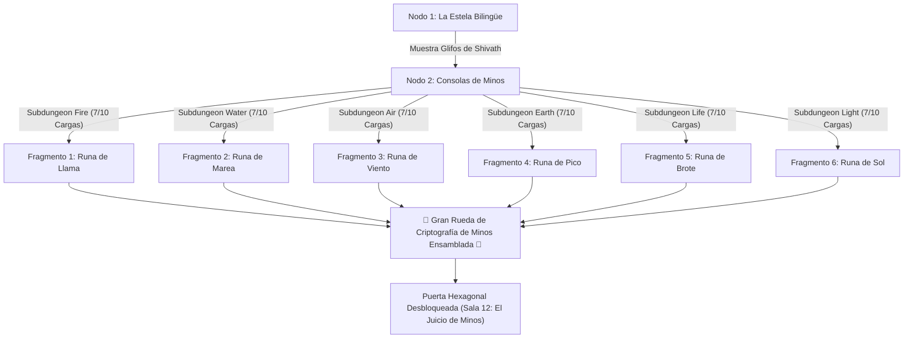

# Ficha de Control del DM y Tablero de Rumores (Outer Wilds Curiosity Board)

> **Ubicación**: `7 - DM/OneShots/ARepeat/05-Ficha_Control_DM_y_Tablero_Rumores.md`  
> **Propósito**: Herramienta interactiva para que el DM gestione la persistencia del laberinto en Treftiel entre múltiples sesiones y grupos de jugadores.  
> **Palabras de Poder de Shivath**: **Fire**, **Water**, **Air**, **Earth**, **Life**, **Light**.

---

## 1. El Tablero de Rumores (Grafo de Conocimiento y Meta-Puzle)

Este es el mapa visual de misterios que los jugadores completan en el **Diario del Gremio**. Para abrir la Gran Puerta Hexagonal (Sala 12), deben ensamblar los **6 Fragmentos de la Gran Rueda de Criptografía**:



---

## 2. Ficha de Registro de Estado Persistente (DM Checklist)

Imprime o copia este bloque para llevar el estado actual de tu campaña:

```markdown
### ESTADO DEL LABERINTO DE MINOS EN TREFTIEL (Campaña Activa)

#### A. Estado de Nodos y Redes Inter-Salas
- [ ] Válvula de Agua (Sala 02 - WATER): [ CERRADA / ABIERTA ] -> La Forja está [ INUNDADA / SECA ]
- [ ] Invernadero Solar (Sala 03 - LIFE/LIGHT): [ SIN LUZ / ILUMINADO ]
- [ ] Engranaje Maestro (Sala 04 - EARTH/AIR): [ ORIENTACIÓN 0° / 90° DEXTRO / 180° ]
- [ ] Horno de la Forja (Sala 05 - FIRE): [ APAGADO / ENCENDIDO ] -> Cripta Helada está [ CONGELADA / DERRETIDA ]
- [ ] Espejos Rúnicos (Sala 09 - LIGHT): [ DESALINEADOS / ALINEADOS ]

#### B. Fragmentos de la Gran Rueda de Criptografía (Meta-Puzle)
- [ ] Fragmento 1 (FIRE - Señor del Crisol >= 7 Cargas): [ PENDIENTE / RECUPERADO ]
- [ ] Fragmento 2 (WATER - Quimera Hidráulica >= 7 Cargas): [ PENDIENTE / RECUPERADO ]
- [ ] Fragmento 3 (AIR - Coloso del Vértice >= 7 Cargas): [ PENDIENTE / RECUPERADO ]
- [ ] Fragmento 4 (EARTH - Titán de Basalto >= 7 Cargas): [ PENDIENTE / RECUPERADO ]
- [ ] Fragmento 5 (LIFE - Botánico de Sombras >= 7 Cargas): [ PENDIENTE / RECUPERADO ]
- [ ] Fragmento 6 (LIGHT - Espejismo de Cristal >= 7 Cargas): [ PENDIENTE / RECUPERADO ]
- [ ] **Secuencia Rúnica Ensamblada (Puerta Hexagonal Abierta)**: [ NO / SÍ ]

#### C. Guardianes y Bosses Persistentes
- [ ] El Juicio de Minos (Boss Final): [ INACTIVO / DERROTADO ]

#### D. Recompensas Extraídas por los Jugadores
- Oro acumulado para el grupo: ________ GP
- Consumibles en inventario: ________________________
- Objetos mágicos menores hallados: ________________________
```
