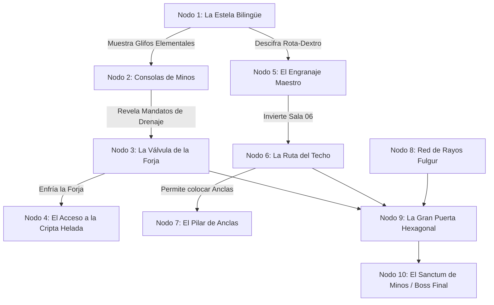

# Ficha de Control del DM y Tablero de Rumores (Outer Wilds Curiosity Board)

> **Ubicación**: `7 - DM/OneShots/ARepeat/05-Ficha_Control_DM_y_Tablero_Rumores.md`  
> **Propósito**: Herramienta interactiva para que el DM gestione la persistencia del laberinto entre múltiples sesiones y grupos de jugadores.

---

## 1. El Tablero de Rumores (Grafo de Conocimiento)

Este es el mapa visual de misterios que los jugadores completan en el **Diario del Gremio**. Cada nodo representa un secreto o mecánica que abre el paso a nuevas áreas:



---

## 2. Ficha de Registro de Estado Persistente (DM Checklist)

Imprime o copia este bloque para llevar el estado actual de tu campaña:

```markdown
### ESTADO DEL LABERINTO DE MINOS (Campaña Activa)

#### A. Estado de Nodos y Redes Inter-Salas
- [ ] Válvula de Agua (Sala 02): [ CERRADA / ABIERTA ] -> La Forja está [ INUNDADA / SECA ]
- [ ] Circuito de Rayo (Sala 03): [ DESCONECTADO / PUENTE TEMPORAL / PUENTE PERMANENTE ]
- [ ] Engranaje Maestro (Sala 04): [ ORIENTACIÓN 0° / 90° DEXTRO / 180° ]
- [ ] Horno de la Forja (Sala 05): [ APAGADO / ENCENDIDO ] -> Cripta Helada está [ CONGELADA / DERRETIDA ]
- [ ] Ascensor Magnético (Sala 09): [ INACTIVO / ACTIVO ]
- [ ] Puerta Hexagonal del Núcleo (Sala 12): [ SELLADA / 1 de 4 / 2 de 4 / 3 de 4 / ABIERTA ]

#### B. Guardianes Persistentes
- [ ] Autómata Conductor (Sala 03): [ VIVO / DERROTADO ] (Trampas de rayos deshabilitadas: [ SI / NO ])
- [ ] Quimérico Volcánico (Sala 05): [ VIVO / DERROTADO ] (Calor de la Forja regulado: [ SI / NO ])
- [ ] El Juicio de Minos (Boss Final): [ INACTIVO / DERROTADO ]

#### C. Glifos Traducidos en el Diario
- [x] Glifos Elementales Básicos (Pyros, Hydro, Fulgur, Zephyr, Geo, Umbra)
- [ ] Directivo Kael-Up / Kael-Down
- [ ] Directivo Rota-Dextro / Rota-Sinistro
- [ ] Directivo Vinc-Anchor
- [ ] Secuencia de la Galería del Juicio ([IGNIS] -> [TERRA] -> [FULMEN] -> [NOX])

#### D. Anclas Arcanas Colocadas por Jugadores
- Sala Anclada 1: _____________________
- Sala Anclada 2: _____________________
```

---

## 3. Guía de Inicio Rápido de Sesión (DM Zero-Prep)

Para dirigir una incursión improvisada de 2 horas:

1. **Paso 1 (Entrada y Sintonía)**:
   * Los jugadores entran a la Sala 01. Entrega **10 Puntos de Carga Arcana** al grupo.
   * Cada jugador escoge su **Sintonía Elemental** (Pyros, Hydro, Fulgur, Zephyr, Geo, Umbra).
2. **Paso 2 (Tirada de Alineamiento)**:
   * Tira **1d6** en la *Tabla de Alineamientos* (`02-Relaciones_Inter_Salas_y_Matriz.md`).
   * Determina las 3 o 4 salas que estarán conectadas en esta expedición.
3. **Paso 3 (Bucle de Carga)**:
   * Resta 1 de Carga Arcana por cada sala explorada o puzle fallado.
   * Al llegar a 0, narra el colapso espacial y la expulsión segura al campamento.
4. **Paso 4 (Cierre y Notas)**:
   * Pide a los jugadores que escriban 2 líneas en el **Diario de la Mina** con sus descubrimientos para la siguiente sesión.
