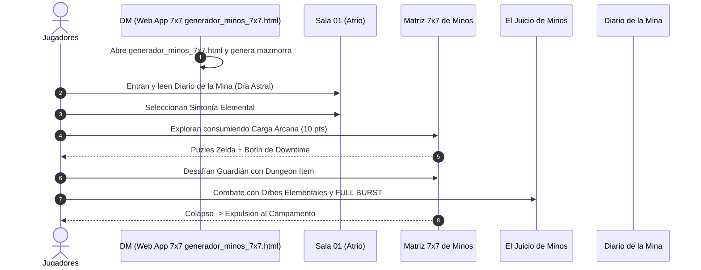

# El Laberinto de Minos (Mapeo Maestro del Módulo)

> **Ubicación**: `7 - DM/OneShots/ARepeat/El Laberinto de Minos.md`  
> **Ubicación en Shivath**: **Treftiel**, cerca del **Angramanio** (Bóveda de Estabilización).  
> **Formato**: Compendio Ejecutivo para Actividad de Downtime / Repetible / Drop-in.  
> **Herramienta Web App 7x7**: [`generador_minos_7x7.html`](file:///Users/matiasbay/Documents/Obsidian/Shivath/7%20-%20DM/OneShots/ARepeat/generador_minos_7x7.html) (Fichero de un clic).  
> **Inspiraciones Core**: *Zelda 2D/3D* + *Outer Wilds* + *Blue Prince* + *Xenoblade* + *Binding of Isaac*.  
> **Palabras de Poder de Shivath**: **Fire**, **Water**, **Air**, **Earth**, **Life**, **Light**.

---

## Índice del Módulo ARepeat

Este paquete modular contiene todo lo necesario para dirigir el Laberinto de Minos como una aventura recurrente en tu campaña:

1. [`generador_minos_7x7.html`](file:///Users/matiasbay/Documents/Obsidian/Shivath/7%20-%20DM/OneShots/ARepeat/generador_minos_7x7.html) **(WEB APP INTERACTIVA DE 1 CLIC)**
   * Matriz visual 7x7 dispersa con celdas de tamaño rígido, Atrio móvil, Subdungeon <= 3 pasos, Sala Secreta Isaac obligatoria, inspector de celdas y modificador manual de pasadizos.
2. [`00-Indice_y_Sistemas_Core.md`](file:///Users/matiasbay/Documents/Obsidian/Shivath/7%20-%20DM/OneShots/ARepeat/00-Indice_y_Sistemas_Core.md)
   * Lore de Treftiel y el Angramanio.
   * Carga Arcana, Diario del Gremio y Sintonías Elementales.
   * Subdungeons 1d8, persistencia total y bonus de excelencia 7/10.
3. [`01-Sistema_de_Escritura_Alrestiano.md`](file:///Users/matiasbay/Documents/Obsidian/Shivath/7%20-%20DM/OneShots/ARepeat/01-Sistema_de_Escritura_Alrestiano.md)
   * Jeroglíficos simbólicos de Shivath (Triadas de 3 gemas).
4. [`02-Relaciones_Inter_Salas_y_Matriz.md`](file:///Users/matiasbay/Documents/Obsidian/Shivath/7%20-%20DM/OneShots/ARepeat/02-Relaciones_Inter_Salas_y_Matriz.md)
   * Redes causales inter-salas (Hidráulica, Térmica, Luz, Gravitacional).
5. [`03-Catalogo_de_Salas_y_Puzles.md`](file:///Users/matiasbay/Documents/Obsidian/Shivath/7%20-%20DM/OneShots/ARepeat/03-Catalogo_de_Salas_y_Puzles.md)
   * Catálogo masivo de 23+ salas inspiradas directamente en Zelda (2D, 3D, BotW/TotK).
6. [`04-Encuentros_y_Guardianes.md`](file:///Users/matiasbay/Documents/Obsidian/Shivath/7%20-%20DM/OneShots/ARepeat/04-Encuentros_y_Guardianes.md)
   * 6 Guardianes de Área y Boss Final con **Elemental Orbs & Full Burst** (Xenoblade 2).
7. [`05-Ficha_Control_DM_y_Tablero_Rumores.md`](file:///Users/matiasbay/Documents/Obsidian/Shivath/7%20-%20DM/OneShots/ARepeat/05-Ficha_Control_DM_y_Tablero_Rumores.md)
   * Grafo de Rumores (*Curiosity Board*) y la Rueda de Criptografía de Minos.
8. [`06-Generador_de_Conexiones_y_Mapas.md`](file:///Users/matiasbay/Documents/Obsidian/Shivath/7%20-%20DM/OneShots/ARepeat/06-Generador_de_Conexiones_y_Mapas.md)
   * Manual de uso de la herramienta Web App 7x7.

---

## Síntesis de la Dinámica en Mesa

