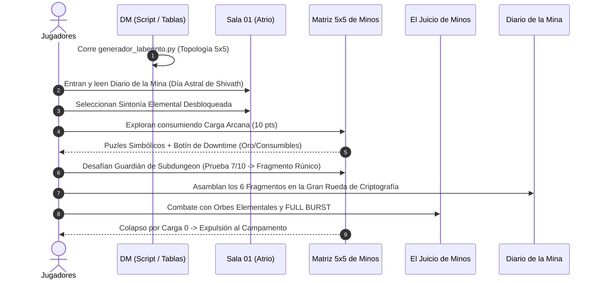

# El Laberinto de Minos (Mapeo Maestro del Módulo)

> **Ubicación**: `7 - DM/OneShots/ARepeat/El Laberinto de Minos.md`  
> **Ubicación en Shivath**: **Treftiel**, cerca del **Angramanio** (Bóveda de Estabilización).  
> **Formato**: Compendio Ejecutivo para Actividad de Downtime / Repetible / Drop-in.  
> **Inspiraciones Core**: *Outer Wilds* (Progreso por Conocimiento) + *Blue Prince* (Lógica Inter-Salas) + *Xenoblade* (Escritura Alrestiana).  
> **Palabras de Poder de Shivath**: **Fire**, **Water**, **Air**, **Earth**, **Life**, **Light**.

---

## Índice del Módulo ARepeat

Este paquete modular contiene todo lo necesario para dirigir el Laberinto de Minos como una aventura recurrente en tu campaña:

1. [`00-Indice_y_Sistemas_Core.md`](file:///Users/matiasbay/Documents/Obsidian/Shivath/7%20-%20DM/OneShots/ARepeat/00-Indice_y_Sistemas_Core.md)
   * Lore de Treftiel y el Angramanio (Bóveda de Estabilización).
   * Reglas de la Carga Arcana (10 pts por *run*).
   * Recompensas de Downtime (Ligero dinero, consumibles elementales y objetos mágicos).
   * **Sistema de Sintonía Elemental** (Fire, Water, Air, Earth, Life, Light).
   * **El Gran Meta-Puzle de la Rueda de Criptografía de Minos** (6 Fragmentos de Tablilla).
2. [`01-Sistema_de_Escritura_Alrestiano.md`](file:///Users/matiasbay/Documents/Obsidian/Shivath/7%20-%20DM/OneShots/ARepeat/01-Sistema_de_Escritura_Alrestiano.md)
   * Jeroglíficos simbólicos de Shivath.
   * Reglas de Consolas Rúnicas e ingreso de código ejecutable de 3 gemas.
   * Diccionario visual de sustancias, vectores y objetos.
3. [`02-Relaciones_Inter_Salas_y_Matriz.md`](file:///Users/matiasbay/Documents/Obsidian/Shivath/7%20-%20DM/OneShots/ARepeat/02-Relaciones_Inter_Salas_y_Matriz.md)
   * Redes de Causalidad (Hidráulica, Térmica, de Luz/Refracción, Gravitacional).
   * Matriz 5x5 con Huecos Libres (Estilo *Zelda 2D / Binding of Isaac*).
   * Tabla del Calendario Astral (1d6) y Alineamiento Procedural de Minos (1d6).
4. [`03-Catalogo_de_Salas_y_Puzles.md`](file:///Users/matiasbay/Documents/Obsidian/Shivath/7%20-%20DM/OneShots/ARepeat/03-Catalogo_de_Salas_y_Puzles.md)
   * Catálogo de Salas Temáticas Artesanales con interacciones elementales de PJs y efectos permanentes en el terreno.
5. [`04-Encuentros_y_Guardianes.md`](file:///Users/matiasbay/Documents/Obsidian/Shivath/7%20-%20DM/OneShots/ARepeat/04-Encuentros_y_Guardianes.md)
   * 6 Guardianes de Área de Subdungeon (Prueba del 7/10 de Carga).
   * **Boss Final: El Juicio de Minos (El Héroe del Sello)** con **Elemental Orbs & Full Burst** (Inspirado en *Xenoblade 2*).
6. [`05-Ficha_Control_DM_y_Tablero_Rumores.md`](file:///Users/matiasbay/Documents/Obsidian/Shivath/7%20-%20DM/OneShots/ARepeat/05-Ficha_Control_DM_y_Tablero_Rumores.md)
   * Grafo de Rumores (*Curiosity Board* estilo Outer Wilds con los 6 Fragmentos Rúnicos).
   * Checklist interactiva para el DM para rastrear el avance entre sesiones.
7. [`06-Generador_de_Conexiones_y_Mapas.md`](file:///Users/matiasbay/Documents/Obsidian/Shivath/7%20-%20DM/OneShots/ARepeat/06-Generador_de_Conexiones_y_Mapas.md) y [`generador_laberinto.py`](file:///Users/matiasbay/Documents/Obsidian/Shivath/7%20-%20DM/OneShots/ARepeat/generador_laberinto.py)
   * Herramientas de generación automática (Script de Python 5x5) y Tablas Manuales para obtener la topología y puertas de la dungeon al instante.

---

## Síntesis de la Dinámica en Mesa

