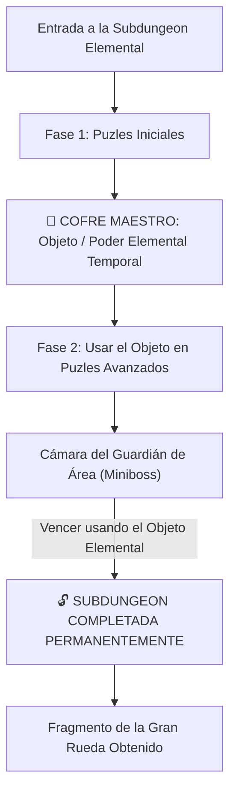

# El Laberinto de Minos: Sistemas Core y Subdungeons (Mecánico Agnóstico)

> **Ubicación**: `7 - DM/OneShots/ARepeat/00-Indice_y_Sistemas_Core.md`  
> **Formato**: Misión Secundaria Repetible / Downtime / West Marches  
> **Inspiración**: *Zelda 2D/3D Mini-Dungeons* + *Outer Wilds* + *Blue Prince* + *Binding of Isaac*  
> **Palabras de Poder de Shivath**: **Fire**, **Water**, **Air**, **Earth**, **Life**, **Light**.

Ver de simplificar y hacer una dungeon con ascensor o escaleras
Vale maybe la cosa empieza como dungeon meshi y después cambia a otra cosa
Maybe basarme en pokemon mundo misterioso

---

## 1. Bucle de Juego y Estructura de Subdungeons

Cada **Subdungeon Elemental** opera como una **Mini-Dungeon de Zelda**:



### Objetos Elementales Temporales de Subdungeon (Dungeon Items)
1. **FIRE**: *Guantelete de Llama* (Dispara plasma para encender antorchas distantes y derretir hielo).
2. **WATER**: *Flauta del Mar* (Modifica el nivel del agua en cualquier cisterna).
3. **AIR**: *Capa del Vértice* (Otorga saltos de viento de 30 ft y vuelo en corrientes).
4. **EARTH**: *Martillo de Basalto* (Rompe muros de piedra agrietados y golpea estacas telúricas).
5. **LIFE**: *Semilla Botánica* (Germina vides gigantes instantáneas como puentes o cuerdas).
6. **LIGHT**: *Escudo Prismático* (Refleja rayos de luz hacia ojos y receptores solares).

---

## 🏰 Guías Verbatim de Mazmorras Zelda (`Subdungeons/`)

Cada Sanctum / Subdungeon cuenta con una guía **verbatim completa sala por sala estilo Zelda** (con mapa de flujo Mermaid, Llaves Pequeñas 🗝️, Mini-Boss ⚔️, Dungeon Item 🎁, Llave del Boss 👑 y Boss Final 💀):

1. **[[01_Subdungeon_Fuego_Caldera|🌋 Subdungeon 1: La Caldera Volcánica (Goron Mines - Twilight Princess)]]** (`01_Subdungeon_Fuego_Caldera.md`)
2. **[[02_Subdungeon_Agua_Cisterna|🌊 Subdungeon 2: La Cisterna Sumergida (Ancient Cistern - Skyward Sword)]]** (`02_Subdungeon_Agua_Cisterna.md`)
3. **[[03_Subdungeon_Aire_Torre|🌬️ Subdungeon 3: La Torre de los Vientos (City in the Sky - TP & Stormwind Ark - TotK)]]** (`03_Subdungeon_Aire_Torre.md`)
4. **[[04_Subdungeon_Tierra_Dominio|🪨 Subdungeon 4: El Dominio Telúrico (Snowhead Temple - MM Edición Basalto sin Hielo)]]** (`04_Subdungeon_Tierra_Dominio.md`)
5. **[[05_Subdungeon_Vida_Invernadero|🌿 Subdungeon 5: El Invernadero Ancestral (Inside the Great Deku Tree - OoT & Forbidden Woods - WW)]]** (`05_Subdungeon_Vida_Invernadero.md`)
6. **[[06_Subdungeon_Luz_Santuario|☀️ Subdungeon 6: El Santuario Prismático (Spirit Temple - OoT Verbatim)]]** (`06_Subdungeon_Luz_Santuario.md`)
7. **[[07_Sanctum_12_Reactor_Central|👑 Sanctum 12: El Reactor Central (Ganon's Castle - OoT & TotK)]]** (`07_Sanctum_12_Reactor_Central.md`)

---

## 2. Persistencia Total de Subdungeons y Regla 7/10 de Excelencia

```
======================================================================
         👑 PERSISTENCIA TOTAL Y BONUS DE EXCELENCIA 7/10 👑
======================================================================
1. RESETEO FÍSICO Y PRIORIDAD DEL CONOCIMIENTO DEL JUGADOR:
   - El estado físico de las salas (palancas, bloques, puertas) SE RESETEA FÍSICAMENTE al iniciar cada nueva incursión.
   - Las soluciones, códigos y frecuencias NO SE RANDOMIZAN; permanecen fijas e inmutables.
   - **Prioridad Absoluta al Conocimiento del Jugador**: Si los jugadores deducen la clave o código mediante pistas del entorno (ej. descubren que la combinación es `3-1-5` o la frecuencia `Fa Sostenido / 432 Hz`), la prueban y funciona, la anotan en su cuaderno físico y queda desbloqueada para siempre.
   - **Resolución por Tirada de Dados (Check Bajo)**: Si los jugadores deciden no deducir la clave y prueban resolver la sala mediante una tirada de habilidad con un resultado bajo/medio, la sala se abre pero narrativamente ocurre un fallo de precisión: *"Tras probar combinaciones a ciegas durante unos minutos, dais con una secuencia que abre la puerta, pero no sabéis exactamente qué números eran los correctos"*. En este caso avanzan en la run actual, pero **no pueden anotarla con precisión en la libreta** para saltársela gratis en runs futuras.
   - **Travesía e Incursión en la Misma Run (Theatre of the Mind)**: Atravesar salas ya despejadas durante la MISMA incursión es **instantáneo** mediante teatro de la mente (el DM simplemente narra el tránsito directo sin tiradas ni encuentros).

2. BONUS DE EXCELENCIA 7/10 (CARGAS ARCANAS SOLO SE GASTAN EN FALLO):
   - Las Cargas Arcanas (10 pts) SOLO SE GASTAN EN CASO DE FALLO (pruebas falladas, trampas, etc.).
   - Si el grupo completa la Subdungeon conservando SIETE O MÁS (>= 7/10)
     Puntos de Carga Arcana al finalizar (máximo 3 fallos cometidos),
     obtiene el BONUS DE EXCELENCIA (Reliquia de Minos + Recompensa Extra).
   - Si cometen más de 3 fallos (< 7 Cargas al final), IGUAL AVANZAN y guardan 
     su progreso para la siguiente run.
======================================================================
```

---

## 3. Recompensas de Incursión y Botín Repetido

1. **Botín Principal (Salas Nuevas & Guardianes)**: Monedas, gemas y objetos mágicos permanentes al explorar celdas nuevas por primera vez o vencer Guardianes.
2. **Botín de Re-exploración (Consumibles Exclusivos de Mazmorra - No Extraíbles)**:
   - Las salas ya abiertas en runs anteriores **no conceden dinero ni gemas repetidos** (Regla Anti-Farm).
   - En su lugar, pueden contener **Consumibles de Incursión Exclusivos (NO EXTRAÍBLES)**: Elixires de resistencia temporal, bombas rúnicas de un uso o cargas de escudo arcano. Estos objetos **solo se pueden usar dentro de la mazmorra durante la run actual** y se disipan al salir o colapsar.

---

## 4. El Gran Meta-Puzle: Knowledge Gating vs Item Gate Final (Zelda + Outer Wilds)

Para abrir la **Gran Puerta Hexagonal del Sanctum (Sala 12)** y desafiar a *El Juicio de Minos*, los jugadores deben completar el **Macro-Puzle del Reactor Central**:

```
======================================================================
     🧠 KNOWLEDGE GATING GENERACIÓN VS. ITEM GATE FINAL (ZELDA) 🧠
======================================================================
1. BLOQUEOS COGNITIVOS EN EL LABERINTO (KNOWLEDGE LOCKS):
   - A lo largo de la rejilla 7x7 y las Subdungeons, todos los accesos 
     intermedios operan por COMPRENSIÓN (Knowledge Gating). Entender el 
     lore, la secuencia o el patrón permite cruzar sin llaves arbitrarias.

2. ITEM GATE EXCLUSIVO DEL SANCTUM 12 (ESTILO ZELDA):
   - Únicamente la entrada a la Boss Dungeon Final (**Sanctum 12**) funciona 
     como un **Item Gate clásico de Zelda**.
   - Se exige físicamente encajar los **6 Fragmentos de Tablilla** (1 por cada 
     Guardián de Subdungeon derrotado) en el pedestal central para desencadenar 
     el Alineamiento Maestro y abrir el reactor final.
======================================================================
```

---

## 5. Regla de Filtrado Elemental de la Incursión Daily

> [!IMPORTANT]
> **EXCLUSIVIDAD ELEMENTAL DEL DÍA**:
> - En cada incursión diaria, el laberinto se sintoniza con **UNA ÚNICA Subdungeon Elemental** (Fuego, Agua, Aire, Tierra, Vida o Luz).
> - El pool de salas elementales de esa run **SOLO contiene salas del Set Elemental correspondiente a la Subdungeon activa**.
> - Por ejemplo: Si la Subdungeon del día es **FIRE (Fuego)**, el laberinto generará salas del *Set 0 (Genéricas/Neutrales)* y **únicamente del Set 1 (Fuego)**. Las salas del Set de Agua, Aire, Tierra, Vida o Luz se excluyen automáticamente para preservar la identidad temática del día.

