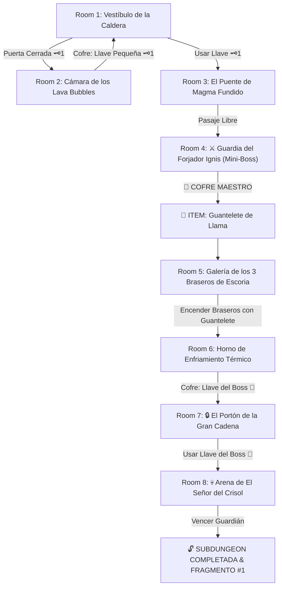

# 🌋 Subdungeon 1: La Caldera Volcánica (Fire Temple Verbatim)

> **Ubicación**: `7 - DM/OneShots/ARepeat/Subdungeons/01_Subdungeon_Fuego_Caldera.md`  
> **Estilo**: Zelda Classic Dungeon Layout  
> **Dungeon Item**: *Guantelete de Llama*  
> **Guardián de Área**: *El Señor del Crisol*  
> **Recompensa**: 🔓 Desbloqueo Permanente de la Caldera + Fragmento de Tablilla #1

---

## 🗺️ Mapa de Flujo de la Mazmorra (Zelda Diagram)

---

## 🏛️ Recorrido Verbatim Sala por Sala (DM Walkthrough)

### Room 1: Vestíbulo de la Caldera (Entrada)
> *"El calor os golpea como un muro al cruzar el umbral. El suelo de basalto tiembla sobre un foso de lava que rodea la entrada. Al norte, un espeso portón de hierro con un ojo de cerradura de latón 🗝️1 bloquea el avance. En el muro este se abre un pasaje sin puerta que emite chasquidos metálicos."*
* **Puertas**: Oeste (Entrada), Norte (Locked 🗝️1), Este (Abierta).
* **Enemigos**: 2x Constructos de Basalto Menores (AC 13, 15 HP).
* **Acción DM**: Los jugadores deben tomar el pasaje Este (Room 2) para encontrar la Llave Pequeña 🗝️1.

---

### Room 2: Cámara de los Lava Bubbles (Llave Pequeña #1)
> *"Una sala circular dominada por tres pilones de lava burbujeante de los que emergen esferas ígneas flotantes que chillan al detectar movimiento. En una plataforma al fondo descansa un cofre de bronce."*
* **Puertas**: Oeste (Vuelve a Room 1).
* **Puzle/Encuentro**: Derrotar a los 3 Lava Bubbles (AC 12, 10 HP; inmunes a fuego).
* **Botín**: Al derrotarlos, el cofre de bronce se desengancha conteniendo la **Llave Pequeña 🗝️1**.

---

### Room 3: El Puente de Magma Fundido
> *"Un abismo de 20 pies de lava hirviente separa la plataforma donde os halláis de la puerta del norte. A los lados hay dos palancas metálicas cubiertas de hollín."*
* **Puertas**: Sur (Locked 🗝️1 de vuelta), Norte (Puerta del Mini-Boss).
* **Resolución**: Accionar la palanca izquierda (*Fuerza DC 12*) extiende una pasarela de hierro articulada sobre la lava.

---

### Room 4: ⚔️ Cámara del Forjador Ignis (Mini-Boss & Dungeon Item)
> *"Una gruta abovedada donde un coloso de bronce de cuatro brazos con un mazo candente se yergue desde el centro de la sala. A sus espaldas, un cofre ornamental de pan de oro resplandece en un altar elevado."*
* **Mini-Boss**: **Forjador Ignis** (AC 15, 45 HP; Ataque: Mazo Ígneo +5, 2d6+3 Fuego).
* **Estrategia DM**: Ataca en patrones rectilíneos. Al ser derrotado, colapsa en una pila de escoria y abre el acceso al cofre.
* **🎁 COFRE MAESTRO**: Contiene el **Guantelete de Llama** (Permite disparar proyectiles de plasma térmico para encender braseros distantes y fundir capas de escoria congelada).

---

### Room 5: Galería de los 3 Braseros de Escoria
> *"Tres imponentes braseros de piedra penden sobre el foso de lava a 30 pies de distancia. Cada brasero está cubierto por una capa de escoria magmática congelada petrificada. El portón norte está sellado por dilatación térmica."*
* **Puertas**: Sur (Vuelve a Room 4), Norte (Locked por braseros).
* **Puzle**: Usar el recién obtenido *Guantelete de Llama* para disparar plasma térmico a los 3 braseros distantes (Ataque AC 11). El calor rompe la escoria congelada y los enciende.
* **Resultado**: Al encender los 3 braseros, el portón norte retrae sus placas y se abre.

---

### Room 6: Horno de Enfriamiento Térmico (Llave del Boss 👑)
> *"Un ancho río de magma incandescente de 25 pies corta el paso. Válvulas de agua están suspendidas en las paredes sobre la lava. Al otro lado se aprecia una repisa con un cofre dorado decorado con una corona rúnica."*
* **Puertas**: Sur (Vuelve a Room 5), Norte (Locked 👑).
* **Resolución**: Disparar con el *Guantelete de Llama* a la palanca de la válvula superior para liberar un chorro de agua fría sobre el magma. Esto genera una nube de vapor e incrusta un **Puente de Basalto Poroso Temporal (2 rondas)**.
* **Botín**: Cruzar corriendo el puente y abrir el cofre dorado para obtener la **Llave del Boss 👑 (Llave de la Gran Cadena)**.

---

### Room 7: 🔒 El Portón de la Gran Cadena
> *"Un monumental portón de hierro de 15 pies de altura cruzado por gruesas cadenas volcánicas y un enorme candado dorado con la forma de una efigie de Minos."*
* **Puertas**: Sur (Vuelve a Room 6), Norte (Arena del Boss Final).
* **Resolución**: Insertar la **Llave del Boss 👑** para fundir el candado y retraer las cadenas.

---

### Room 8: 💀 Arena de El Señor del Crisol (Guardián de Fuego)
> *"Una vasta estancia circular rodeada por fosos de magma donde se yergue El Señor del Crisol protegida por un escudo de escoria incandescente."*
* **Mecánica Boss**: Ver ficha detallada en [`02_Arena_del_Senor_del_Crisol.md`](file:///Users/matiasbay/Documents/Obsidian/Shivath/7%20-%20DM/OneShots/ARepeat/Salas/07_Salas_Especiales/02_Arena_del_Senor_del_Crisol.md). Disparar el *Guantelete de Llama* a los 3 braseros superiores funde el escudo y lo aturde 1 ronda.
* **Recompensa**: 🔓 Desbloqueo permanente del paso por la Caldera + **Fragmento de Tablilla #1**.
