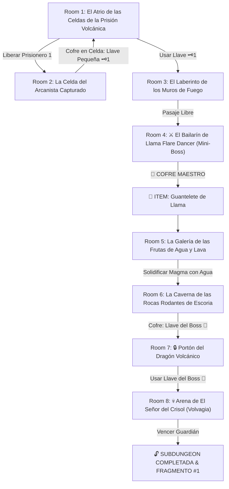

# 🌋 Subdungeon 1: La Caldera Volcánica (Inspirada en Fire Temple - Ocarina of Time & Fire Sanctuary - SS)

> **Ubicación**: `7 - DM/OneShots/ARepeat/Subdungeons/01_Subdungeon_Fuego_Caldera.md`  
> **Inspiración Directa**: **Fire Temple** (*The Legend of Zelda: Ocarina of Time*) + **Fire Sanctuary** (*Skyward Sword*)  
> **Mecánicas Clave**: **Rescate de Prisioneros de Celdas Volcánicas**, **Muros de Fuego Oscilantes** y **Frutas de Agua sobre Magma**  
> **Dungeon Item**: *Guantelete de Llama* (Disparo de Plasma Térmico & Escudo Antitérmico)  
> **Guardián de Área**: *El Señor del Crisol* (Inspirado en *Volvagia*, el Dragón Volcánico)  
> **Recompensa**: 🔓 Desbloqueo Permanente de la Caldera + Fragmento de Tablilla #1

---

## 🗺️ Mapa de Flujo de la Mazmorra (Fire Temple OoT Layout)

---

## 🏛️ Recorrido Verbatim Sala por Sala (Fire Temple OoT Walkthrough)

### Room 1: El Atrio de las Celdas de la Prisión Volcánica (Entrada)
> *"Una inmensa prisión subterránea excavada en la piedra de un volcán activo. A ambos lados se ven celdas con barrotes de hierro fundido donde arcanistas de Minos permanecen cautivos. Al norte, un espeso portón de piedra con un ojo de cerradura de latón 🗝️1 bloquea el paso."*
* **Estética (Fire Temple OoT)**: Paredes de ladrillo rojizo caliente, fosos de magma inferior, gritos celestes de prisioneros, canto cavernoso de fondo.
* **Puertas**: Sur (Entrada), Norte (Locked 🗝️1), Este (Celda del Prisionero #1).
* **Acción DM**: Dirigirse a la Celda del Este (Room 2) para liberar al primer arcanista y obtener la Llave Pequeña 🗝️1.

---

### Room 2: La Celda del Arcanista Capturado (Llave Pequeña #1)
> *"Una celda de piedra reforzada donde un arcanista encarcelado señala un interruptor en el muro exterior detrás de una trampa de llamas."*
* **Enemigos**: 2x Keese de Fuego / Babosas Ígneas (AC 12, 10 HP).
* **Resolución**: Derrotar a los enemigos y accionar el interruptor de cristal para elevar los barrotes de la celda. El arcanista liberado abre el cofre interior que contiene la **Llave Pequeña 🗝️1**.

---

### Room 3: El Laberinto de los Muros de Fuego
> *"Una sala rectangular barrida por muros transversales de llama viva que se desplazan rítmicamente sobre el suelo de basalto. Al usar la Llave 🗝️1, la puerta norte se abre hacia el anfiteatro."*
* **Puertas**: Sur (Locked 🗝️1 de vuelta), Norte (Puerta del Mini-Boss).
* **Resolución**: Cruzar esquivando el patrón de los muros de fuego (*Acrobacias DC 12*) e insertar la Llave 🗝️1.

---

### Room 4: ⚔️ El Bailarín de Llama (Flare Dancer Mini-Boss & Dungeon Item)
> *"Un espectro de fuego con túnica encendida que baila sobre un pedestal circular de magma lanzando llamaradas de espiral."*
* **Mini-Boss**: **Bailarín de Llama / Flare Dancer** (AC 14, 46 HP; su núcleo salta del cuerpo al recibir agua o frío).
* **🎁 COFRE MAESTRO**: Contiene el **Guantelete de Llama** (Dispara plasma térmico para encender braseros lejanos, fundir capas de escoria congelada y otorgar resistencia al calor abrasador).

---

### Room 5: La Galería de las Frutas de Agua y Lava (Fire Sanctuary SS)
> *"Un ancho canal de magma hirviente de 30 pies. En los muros cuelgan bulbos de frutas de agua cristalina que supuran líquido al rompimiento."*
* **Puzle**: Usar el recién obtenido *Guantelete de Llama* o armas a distancia para cortar el tallo de las frutas de agua sobre el magma.
* **Resultado**: La fruta cae al magma y genera una plataforma circular de basalto solidificado temporal (estilo Fire Sanctuary SS) permitiendo cruzar a pie hacia Room 6.

---

### Room 6: La Caverna de las Rocas Rodantes de Escoria (Llave del Boss 👑)
> *"Una cañuela con nichos laterales por donde esferas incandescentes de escoria caen rítmicamente desde el techo. En un altar al fondo descansa un cofre dorado."*
* **Puzle**: Avanzar entre los nichos laterales esquivando las rocas rodantes (*Reflejos DC 13*).
* **Botín**: Abrir el cofre dorado para obtener la **Llave del Boss 👑 (Llave de Volvagia)**.

---

### Room 7: 🔒 Portón del Dragón Volcánico
> *"Un portón monumental forjado en bronce con el relieve de un dragón de cuernos incandescente y un candado con forma de calavera volcánica."*
* **Resolución**: Insertar la **Llave del Boss 👑** para que las fauces de bronce se abran.

---

### Room 8: 💀 Arena de El Señor del Crisol (Volvagia Boss)
> *"Un foso circular de piedra repleto de 9 hoyos de magma en el suelo de los cuales emerge Volvagia (El Señor del Crisol), un dragón volcánico coronado por una máscara de escoria."*
* **Mecánica Volvagia**: Ver ficha en [`02_Arena_del_Senor_del_Crisol.md`](file:///Users/matiasbay/Documents/Obsidian/Shivath/7%20-%20DM/OneShots/ARepeat/Salas/07_Salas_Especiales/02_Arena_del_Senor_del_Crisol.md). Disparar el *Guantelete de Llama* a los hoyos por los que emerge para aturdir al dragón durante 1 ronda.
* **Recompensa**: 🔓 Desbloqueo permanente de la Caldera + **Fragmento de Tablilla #1**.
