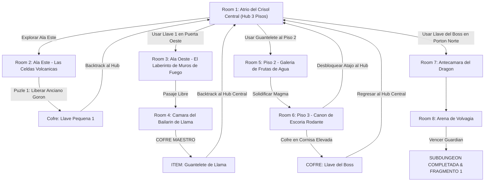

# 🌋 Subdungeon 1: La Caldera Volcánica (Layout Complejo y No-Lineal estilo Goron Mines & Fire Temple)

> **Ubicación**: `7 - DM/OneShots/ARepeat/Subdungeons/01_Subdungeon_Fuego_Caldera.md`  
> **Inspiración Verbatim**: **Goron Mines** (*Twilight Princess*) + **Fire Temple** (*Ocarina of Time*)  
> **Estructura de Layout**: **Hub Central (3 Pisos)** + **Ala Este (Celdas Goron)** + **Ala Oeste (Fundición de Rieles)** + **Backtracking con Dungeon Item**  
> **Dungeon Item**: *Guantelete de Llama* (Plasma Térmico & Atracción Magnética)  
> **Guardián de Área**: *El Señor del Crisol* (Inspirado en *Volvagia / Fyrus*)  
> **Recompensa**: 🔓 Desbloqueo Permanente de la Caldera + Fragmento de Tablilla #1

---

## 🗺️ Mapa de Flujo No-Lineal de la Mazmorra (Non-Linear Zelda Hub Layout)

---

## 🏛️ Recorrido Verbatim Sala por Sala (DM Walkthrough & Backtracking)

### Room 1: Atrio del Crisol Central (Hub Central - 3 Pisos)
> *"Un monumental atrio circular de tres niveles tallado en piedra volcánica. Un lago de magma hirviente ocupa el suelo inferior. Tres grandes accesos flanquean la sala: al Este las Celdas Volcánicas, al Oeste un pasaje cerrado con cerrojo de latón 🗝️1, y en el techo del Piso 2 discurren rieles de basalto magnético azuledo. Al norte, en el Piso 3, se yergue el Portón del Dragón 🔒."*
* **Estructura Hub**: Conecta directo con Room 2 (Este), Room 3 (Oeste - Locked 🗝️1), Room 5 (Techo - Requiere *Guantelete de Llama*) y Room 7 (Norte - Requiere *Llave del Boss 👑*).
* **Acción DM**: Los jugadores deben explorar el **Ala Este (Room 2)** para obtener la Llave Pequeña #1.

---

### Room 2: 🧩 Ala Este: Celdas Volcánicas & Rescate del Anciano Goron (OoT / TP)
> *"Una galería subterránea barrida por un muro de llamas vivas de 10 pies de altura. Detrás de los barrotes de la celda Este, un Anciano Goron grita señalando un cristal rúnico ocantado tras una estatua de basalto."*
* **Puzle Involucrado**:
  1. **Revelar el Cristal**: Mover la estatua de basalto (*Fuerza DC 13*) para exponer el cristal encendido.
  2. **Apagar las Llamas**: Golpear el cristal con un proyectil a distancia, apagando el muro de fuego durante 2 rondas.
  3. **Accionar Pisador**: Correr por el corredor (*Atletismo DC 11*) y presionar el pisador de la celda.
* **Botín**: Los barrotes de la celda se elevan. El Anciano Goron entrega la **Llave Pequeña 🗝️1**.
* **🔄 BACKTRACKING**: Regresar al **Hub Central (Room 1)** e insertar la Llave 🗝️1 en la Puerta Oeste.

---

### Room 3: 🧩 Ala Oeste: El Laberinto de Muros de Fuego (OoT)
> *"Un corredor sinuoso donde ráfagas de llama oscilan en patrones rítmicos cruzados. Al fondo, un portón pesado da paso al pabellón del Mini-Boss."*
* **Puzle Involucrado**: Observar la secuencia de fuego (*Percepción DC 12*) y sincronizar el cruce de casillas (*Acrobacias DC 13*).

---

### Room 4: ⚔️ Cámara del Mini-Boss: Bailarín de Llama / Flare Dancer (OoT)
> *"Una estancia circular sobre magma donde el Bailarín de Llama realiza su danza de fuego."*
* **Combate / Puzle**: Desalojar el núcleo negro con agua/plasma/impacto (*DC 13*) y atacarlo antes de que regenere su manto.
* **🎁 COFRE MAESTRO**: Otorga el **Guantelete de Llama** (Dispara plasma térmico y activa la **Atracción Magnética de Basalto** para caminar por el techo).
* **🔄 BACKTRACKING**: Con el recién obtenido *Guantelete de Llama*, el grupo regresa al **Hub Central (Room 1)** para ascender al Piso 2 caminando boca abajo por los rieles del techo.

---

### Room 5: 🧩 Piso 2: Galería de las Frutas de Agua (Fire Sanctuary SS)
> *"Un balcón suspendido en el Piso 2 del Hub sobre un ancho canal de magma. En los muros cuelgan frutas de agua cristalina."*
* **Puzle Involucrado**: Disparar el *Guantelete de Llama* a las frutas de agua para hacerlas caer sobre el magma, solidificando plataformas circulares flotantes temporales para cruzar al Piso 3 (Room 6).

---

### Room 6: Piso 3: Cañón de Escoria Rodante & Atajo del Hub (Llave del Boss 👑)
> *"Una cañuela alta en el Piso 3 por donde esferas de escoria caen rodando. En un nicho elevado flota un cofre dorado."*
* **Puzle & Atajo**:
  1. Esquivar las rocas rodantes (*Reflejos DC 13*) para alcanzar la repisa del cofre dorado.
  2. **Abrir Atajo al Hub**: Golpear la estaca de basalto con el *Guantelete de Llama* para hacer caer una escalera de contrapeso directa al Piso 1 del Hub Central.
* **Botín**: Abrir el cofre dorado para reclamar la **Llave del Boss 👑 (Llave de Volvagia)**.

---

### Room 7: 🔒 Antecámara del Dragón
> *"De regreso al Piso 3 del Hub Central (usando la nueva escalera atajo), el grupo se alza ante el Portón monumental del Dragón."*
* **Resolución**: Insertar la **Llave del Boss 👑** para desenganchar los cerrojos de bronce.

---

### Room 8: 💀 Arena del Boss Final: Volvagia / El Señor del Crisol (OoT / TP)
> *"Una pista circular con 9 hoyos sobre magma de los que emerge Volvagia."*
* **Mecánica Boss**: Whack-a-mole con el *Guantelete de Llama*, aturdimiento 1 ronda y esquive de rocas en vuelo.
* **Recompensa**: 🔓 Desbloqueo permanente de la Caldera + **Fragmento de Tablilla #1**.
