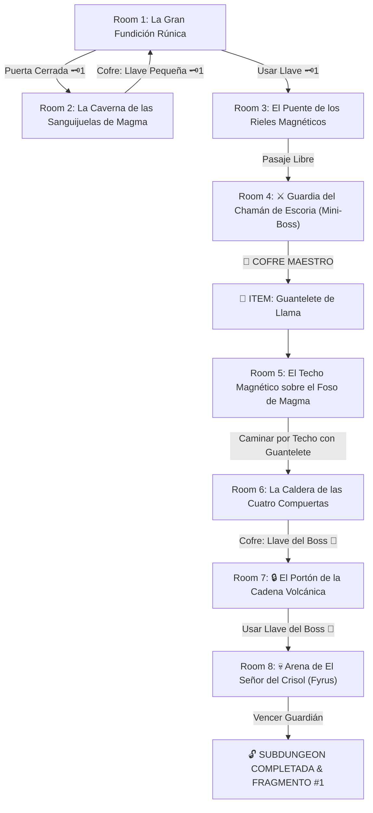

# 🌋 Subdungeon 1: La Caldera Volcánica (Inspirada en Goron Mines & Fire Sanctuary)

> **Ubicación**: `7 - DM/OneShots/ARepeat/Subdungeons/01_Subdungeon_Fuego_Caldera.md`  
> **Inspiración Directa**: **Goron Mines** (*Twilight Princess*) + **Fire Sanctuary** (*Skyward Sword*)  
> **Mecánicas Clave**: **Rieles Magnéticos de Basalto**, **Válvulas de Lava Liquida** y **Braseros de Plasma**  
> **Dungeon Item**: *Guantelete de Llama* (Plasma Térmico & Adherencia Magnética)  
> **Guardián de Área**: *El Señor del Crisol* (Inspirado en *Fyrus / Volvagia*)  
> **Recompensa**: 🔓 Desbloqueo Permanente de la Caldera + Fragmento de Tablilla #1

---

## 🗺️ Mapa de Flujo de la Mazmorra (Goron Mines Layout)

---

## 🏛️ Recorrido Verbatim Sala por Sala (Goron Mines Walkthrough)

### Room 1: La Gran Fundición Rúnica (Entrada)
> *"Un colosal complejo minero excavado en el corazón de un volcán. Ríos de magma incandescente fluyen por canales de piedra hacia gigantescos crisoles suspendidos de cadenas de hierro. En el muro norte se alza un portón forjado con un ojo de cerradura de latón 🗝️1."*
* **Estética**: Vapor abrasador, engranajes de hierro fundido, rieles luminosos de basalto magnetizado.
* **Puertas**: Sur (Entrada), Norte (Locked 🗝️1), Este (Abierta).
* **Acción DM**: Avanzar por el corredor Este (Room 2) para hallar la Llave Pequeña 🗝️1.

---

### Room 2: La Caverna de las Sanguijuelas de Magma (Llave Pequeña #1)
> *"Una gruta donde salamandras ígneas se deslizan entre los fidedignos estratos de roca caliente. Al fondo, sobre una plataforma de basalto rodeada de lava, descansa un cofre de hierro."*
* **Enemigos**: 3x Salamandras de Escoria (AC 13, 14 HP; escupen bolas de fuego).
* **Resolución**: Vencer a las salamandras y cruzar las losas calientes (*Atletismo DC 11*) para tomar la **Llave Pequeña 🗝️1**.

---

### Room 3: El Puente de los Rieles Magnéticos
> *"Un abismo de lava fluida separa la entrada del portón del Mini-Boss. En el techo se aprecia una banda continua de piedra magnética azuleda."*
* **Puertas**: Sur (Locked 🗝️1 de vuelta), Norte (Puerta del Mini-Boss).
* **Resolución**: Usar la Llave 🗝️1 y accionar la grúa manual (*Fuerza DC 12*) para desplegar el puente de contrapeso.

---

### Room 4: ⚔️ Guardia del Chamán de Escoria (Mini-Boss & Dungeon Item)
> *"Una estancia circular donde un enorme místico goron poseído por el fuego de la escoria blande un martillo encendido."*
* **Mini-Boss**: **Chamán de Escoria** (Inspirado en Dangoro; AC 15, 50 HP).
* **🎁 COFRE MAESTRO**: Contiene el **Guantelete de Llama** (Dispara plasma térmico para fundir hielo/escoria y activa la succión magnética para caminar por los rieles del techo).

---

### Room 5: El Techo Magnético sobre el Foso de Magma
> *"Un lago de magma infranqueable a pie. En el techo discurre una franja de piedra magnética azuleda que se extiende hacia el balcón norte."*
* **Puzle**: Activar la atracción del recién obtenido *Guantelete de Llama* contra la franja del techo.
* **Resultado**: El explorador es atraído hacia el techo y camina boca abajo sobre el riel magnético suspendido sobre la lava hasta Room 6.

---

### Room 6: La Caldera de las Cuatro Compuertas (Llave del Boss 👑)
> *"Una sala con cuatro compuertas térmicas que liberan chorros de vapor abrasador. En una plataforma aislada descansa un cofre de hierro con adornos de magma congelado."*
* **Puzle**: Usar el *Guantelete de Llama* para fundir los bloques de escoria que atascan los engranajes de las compuertas y caminar por los rieles magnéticos del muro.
* **Botín**: Abrir el cofre de la plataforma para reclamar la **Llave del Boss 👑 (Llave de la Caldera)**.

---

### Room 7: 🔒 El Portón de la Cadena Volcánica
> *"Un monumental portón de hierro de 15 pies retrazado por gruesas cadenas al rojo vivo con un candado en forma de yunque sangriento."*
* **Resolución**: Insertar la **Llave del Boss 👑** para enfriar las cadenas y abrir la entrada a la arena.

---

### Room 8: 💀 Arena de El Señor del Crisol (Fyrus Boss)
> *"Una vasta estancia circular donde El Señor del Crisol (un titán envuelto en cadenas de fuego) ruge en el centro de la arena."*
* **Mecánica Fyrus**: Ver ficha en [`02_Arena_del_Senor_del_Crisol.md`](file:///Users/matiasbay/Documents/Obsidian/Shivath/7%20-%20DM/OneShots/ARepeat/Salas/07_Salas_Especiales/02_Arena_del_Senor_del_Crisol.md). Disparar el *Guantelete de Llama* a los 3 braseros superiores para fundir la armadura de escoria y aturdirlo 1 ronda.
* **Recompensa**: 🔓 Desbloqueo permanente de la Caldera + **Fragmento de Tablilla #1**.
