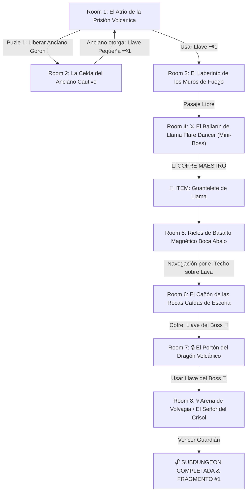

# 🌋 Subdungeon 1: La Caldera Volcánica (Verbatim Goron Mines TP & Fire Temple OoT)

> **Ubicación**: `7 - DM/OneShots/ARepeat/Subdungeons/01_Subdungeon_Fuego_Caldera.md`  
> **Inspiración Verbatim**: **Goron Mines** (*Twilight Princess*) + **Fire Temple** (*Ocarina of Time*)  
> **Puzles Copiados Directos**: **Rescate del Anciano de la Celda**, **Navegación del Techo Magnético Boca Abajo**, **El Laberinto del Bailarín de Llama** y **Los Hoyos del Dragón Volvagia**  
> **Dungeon Item**: *Guantelete de Llama* (Plasma Térmico & Atracción Magnética)  
> **Guardián de Área**: *El Señor del Crisol* (Inspirado en *Volvagia / Fyrus*)  
> **Recompensa**: 🔓 Desbloqueo Permanente de la Caldera + Fragmento de Tablilla #1

---

## 🗺️ Mapa de Flujo de la Mazmorra (Verbatim Zelda Flow)

---

## 🏛️ Recorrido Verbatim Sala por Sala con Puzles Involucrados

### Room 1: El Atrio de la Prisión Volcánica (Entrada)
> *"Una gigantesca prisión subterránea excavada en ladrillo rojizo sobre un foso de magma. Celdas con barrotes de hierro fundido flanquean los muros. En la celda Este se atisba la figura de un Anciano Goron cautivo. Al norte, un portón con ojo de cerradura de latón 🗝️1 bloquea el paso."*
* **Puertas**: Sur (Entrada), Norte (Locked 🗝️1), Este (Celda del Anciano).
* **Acción DM**: Los jugadores deben resolver el Puzle de la Celda (Room 2) para obtener la Llave 🗝️1.

---

### Room 2: 🧩 Puzle 1 Verbatim: Rescate del Anciano Goron (OoT / TP)
> *"Un muro de llamas continuas de 10 pies de altura impide llegar al interruptor de la celda. El Anciano grita desde los barrotes: '¡Detrás de la estatua de basalto hay un cristal que apaga el fuego!'"*
* **Puzle Involucrado**:
  1. **Localizar el Cristal Oculto**: *Check de Investigación (DC 12)* o mover la estatua de basalto (*Fuerza DC 13*) para revelar un cristal rúnico.
  2. **Desactivar la Llama**: Golpear el cristal con un proyectil o arma a distancia. Esto apaga el muro de llamas durante 10 segundos (2 rondas).
  3. **Presionar el Interruptor de la Celda**: Cruzar corriendo el pasaje desactivado y accionar el pisador (*Atletismo DC 11*).
* **Botín**: Los barrotes de la celda se elevan. El Anciano Goron liberado agradece al grupo y les entrega la **Llave Pequeña 🗝️1**.

---

### Room 3: 🧩 Puzle 2 Verbatim: El Laberinto de los Muros de Fuego (OoT)
> *"Una sala rectangular donde barreras de llama viva oscilan en patrones cruzados de 6 segundos. Al fondo, un portón de hierro aguarda la Llave 🗝️1."*
* **Puzle Involucrado**:
  1. **Identificar el Patrón**: *Check de Percepción (DC 12)* para notar que las llamas del lado izquierdo se apagan cuando las del derecho se activan.
  2. **Cruce Sincronizado**: El grupo debe tirar Iniciativa o realizar un *Check de Acrobacias (DC 13)* coordinado para cruzar las casillas en el momento exacto.
* **Apertura**: Insertar la **Llave Pequeña 🗝️1** en el portón norte para acceder a la arena del Mini-Boss.

---

### Room 4: ⚔️ Mini-Boss Verbatim: El Bailarín de Llama / Flare Dancer (OoT)
> *"Un espectro envuelto en un manto de llama viva que baila sobre un pedestal circular de magma lanzando llamaradas en espiral."*
* **Combate / Puzle Involucrado**:
  - **Fase 1 (Manto de Fuego)**: El boss es inmune al daño físico directo mientras su manto arda.
  - **Fase 2 (Separar el Núcleo)**: Un jugador debe arrojar agua, usar frío o asestar un impacto fuerte (*Ataque a Distancia o Fuerza DC 13*) para desalojar el pequeño núcleo negro del centro del fuego.
  - **Fase 3 (Persecución del Núcleo)**: El núcleo negro corre asustado por la estancia (AC 12, 35 HP). Hay que golpearlo antes de que regrese a la lava para regenerar su manto.
* **🎁 COFRE MAESTRO**: Al derrotarlo, aparece el cofre con el **Guantelete de Llama** (Dispara plasma térmico y activa la **Atracción Magnética de Basalto** para caminar por el techo).

---

### Room 5: 🧩 Puzle 3 Verbatim: Rieles de Basalto Magnético Boca Abajo (Goron Mines TP)
> *"Un lago de magma infranqueable a pie de 40 pies de luz. En el techo discurre una franja continua de basalto magnético azuledo. Chiflones de vapor caliente expelen rítmicamente desde el techo."*
* **Puzle Involucrado**:
  1. **Enganche Magnético**: Activar el *Guantelete de Llama* contra el basalto del techo. La atracción magnética arrastra a los jugadores hacia arriba, permitiéndoles caminar boca abajo sobre el riel.
  2. **Esquivar Chiflones de Vapor**: Mientras caminan boca abajo, deben realizar un *Check de Atletismo o Destreza (DC 13)* para avanzar o pausarse en las marcas seguras cuando los chiflones expulsen vapor abrasador (1d6 daño de fuego si son golpeados).
* **Resultado**: Aterrizar al otro lado del lago de magma en el balcón de Room 6.

---

### Room 6: El Cañón de las Rocas Caídas de Escoria (Llave del Boss 👑)
> *"Un pasillo inclinado donde rocas incandescentes de escoria caen periódicamente rodando hacia el abismo. En una repisa aislada descansa un cofre dorado."*
* **Puzle**: Avanzar entre los nichos laterales esquivando las rocas rodantes (*Reflejos DC 13*).
* **Botín**: Abrir el cofre dorado para reclamar la **Llave del Boss 👑 (Llave del Dragón Volvagia)**.

---

### Room 7: 🔒 El Portón del Dragón Volcánico
> *"Un monumental portón de hierro forjado con el relieve de un dragón de cuernos y un candado con forma de calavera de lava."*
* **Resolución**: Insertar la **Llave del Boss 👑** para desenganchar los cerrojos de bronce.

---

### Room 8: 💀 Boss Final Verbatim: Volvagia / El Señor del Crisol (OoT / TP)
> *"Una gran pista circular sobre la lava plagada de 9 hoyos de piedra. De pronto, un colosal dragón de magma con máscara de escoria (Volvagia) emerge rugiendo de uno de los hoyos."*
* **Mecánica Volvagia Involucrada**:
  - **Fase de Emergencia (Whack-a-Mole)**: Volvagia asoma la cabeza por uno de los 9 hoyos al azar. Los jugadores tienen 1 turno para aproximarse y disparar el *Guantelete de Llama* o golpear su máscara de escoria (*Ataque a Distancia AC 12*).
  - **Fase de Aturdimiento**: Al recibir el impacto en la cabeza, el dragón colapsa aturdido sobre la plataforma durante 1 ronda, permitiendo ataques melé con daño multiplicado.
  - **Fase de Vuelo & Rocas Caídas**: Volvagia vuela al techo y hace caer una lluvia de rocas incandescentes (Salvación de Destreza DC 14 o 2d6 daño de fuego).
* **Recompensa**: 🔓 Desbloqueo permanente de la Caldera + **Fragmento de Tablilla #1**.
