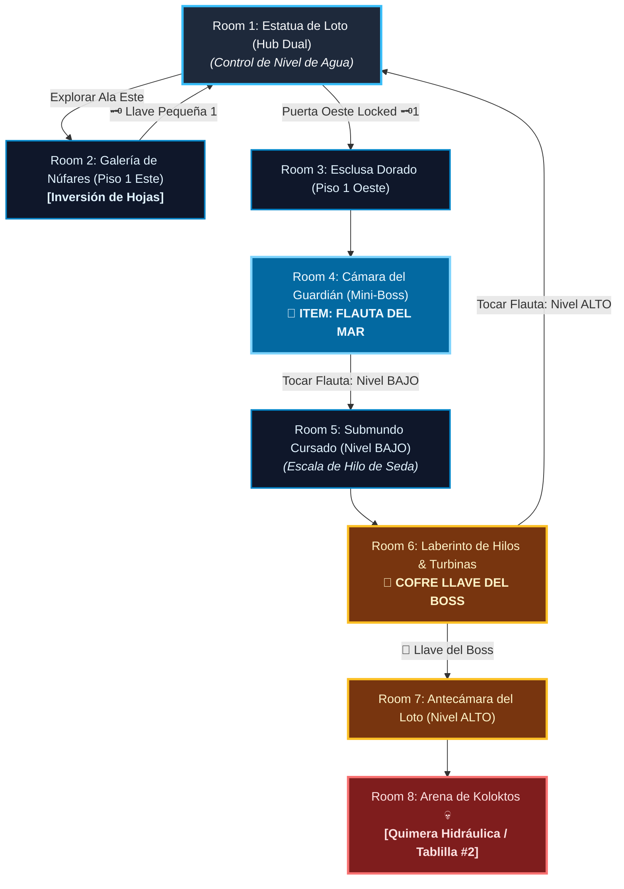

# 🌊 Subdungeon 2: La Cisterna Sumergida (Layout Complejo y No-Lineal estilo Ancient Cistern)

> **Ubicación**: `7 - DM/OneShots/ARepeat/Subdungeons/02_Subdungeon_Agua_Cisterna.md`  
> **Inspiración Verbatim**: **Ancient Cistern** (*Skyward Sword*)  
> **Regla de Diseño DM**: **CERO BLOQUEOS POR TIRADA OBLIGATORIA (No Skill-Check Gates)**. La progresión es 100% interactiva, mecánica y espacial. Las tiradas de dados son opcionales (evitar daño, ir más rápido o hallar secretos), pero el avance obligatorio NUNCA requiere fallar/pasar un dado.  
> **Estructura de Layout**: **Gran Palacio del Loto (Hub Central Dual)** + **Ala Este (Conductos Subacuáticos)** + **El Submundo Inferior (Nivel Cursado)** + **Control de Nivel de Agua (ALTO / MEDIO / BAJO)**  
> **Dungeon Item**: *Flauta del Mar* (Controlador del Nivel de Agua & Invocador de Corrientes)  
> **Guardián de Área**: *La Quimera Hidráulica* (Inspirado en *Koloktos*)  
> **Recompensa**: 🔓 Desbloqueo Permanente de la Cisterna + Fragmento de Tablilla #2

---

## 🗺️ Mapa de Flujo No-Lineal de la Mazmorra (Ancient Cistern Non-Linear Layout)

---

### 📊 Tabla Resumen de Progreso (Paso a Paso)

| Paso | Ubicación | Tipo | Objetivo y Acción Clave | Resultado |
| :---: | :--- | :---: | :--- | :--- |
| **1** | **Room 2 (Núfares)** | 🟢 Exploración | Bucear y voltear hojas de loto | Obtenida **Llave Pequeña 🗝️1** |
| **2** | **Room 3 & 4 (Ala Oeste)** | ⚔️ Mini-Boss | Despejar compuerta y vencer al *Guardián de Latón* | 🎁 Obtención de la **Flauta del Mar** |
| **3** | **Room 5 (Submundo B1)** | 🧩 Puzle | Tocar Flauta a Nivel BAJO y escalar Hilo de Seda | Caída al Submundo e inicio de ascenso |
| **4** | **Room 6 (Laberinto 3F)** | 👑 Clave & Atajo | Invertir corrientes de turbina con la Flauta del Mar | 👑 Obtenida **Llave del Boss** |
| **5** | **Room 8 (Arena Final)** | 💀 Boss | Tocar Flauta a Nivel ALTO e ingresar a boca de la estatua | 🔓 Subdungeon 2 + Fragmento #2 |

---

## 🏛️ Recorrido Verbatim Sala por Sala (DM Walkthrough & Water Level Manipulations)

### Room 1: La Gran Estatua de Loto (Hub Central Dual)
> *"Un palacio subacuático dominado por una estatua dorada de loto de 40 pies. La estatua conecta verticalmente el Palacio Superior con el Submundo Inferior. Al inicio, el nivel de agua está en ALTO. La boca de la estatua sostiene un portón con candado de loto 🔒."*

---

### Room 2: 🧩 Ala Este: Galería de las Núfares Flotantes (SS)
> *"Una cámara sumergida con grandes hojas de loto flotando en la superficie."*
* **Puzle Mecánico Sin Gating**: Bucear bajo la hoja principal y presionar hacia arriba para voltearla en la superficie, revelando el paso al conducto sumergido. *(Tirada opcional de Atletismo DC 11 permite hacerlo en la mitad de tiempo, pero el volteo es 100% exitoso)*.
* **Botín**: Abrir el cofre sumergido para obtener la **Llave Pequeña 🗝️1**.
* **🔄 BACKTRACKING**: Regresar nadando al **Hub Central (Room 1)** e insertar la Llave 🗝️1 en la Esclusa Oeste.

---

### Room 3: Ala Oeste: Esclusa del Canal Dorado
> *"Un pasillo con válvulas mecánicas de loto. Al usar la Llave 🗝️1, la compuerta se despeja."*

---

### Room 4: ⚔️ Cámara del Mini-Boss: Guardián de Latón de Cuatro Brazos (SS)
> *"Un autómata de latón de cuatro brazos armado con cimitarras ceremoniales."*
* **Combate**: Parar sus cimitarras y romper sus articulaciones desmembrándolo.
* **🎁 COFRE MAESTRO**: Entrega la **Flauta del Mar** (Cambia el nivel de agua del templo entre ALTO, MEDIO y BAJO).
* **🔄 BACKTRACKING & CAMBIO DE ESTADO**: El grupo regresa al **Hub Central (Room 1)** y toca la *Flauta del Mar* a **Nivel BAJO**. El agua del palacio se drena, abriendo el foso hacia el Submundo (Room 5).

---

### Room 5: 🧩 Foso Inferior: Caída al Submundo Cursado & Hilo de Seda (SS)
> *"Al vaciarse el agua, los jugadores caen al fango del Submundo entre hordas de Cursed Bokoblins. Un único Hilo de Seda Mística cuelga desde el techo elevado."*
* **Puzle Mecánico Sin Gating**: Derrotar a 4x Engendros Afligidos (resucitan salvo daño de fuego/luz) y escalar el Hilo de Seda observando el ritmo de las guadañas giratorias. *(Tirada opcional de Atletismo DC 13 evita 1d6 daño de raspón de guadaña si alguien sube con prisa, pero el ascenso normal es 100% seguro)*.

---

### Room 6: El Laberinto de Hilos y Turbinas (Llave del Boss 👑)
> *"Una pasarela superior en el Submundo. Tocar la Flauta del Mar revierte la corriente de la turbina permitiendo cruzar nadando sin esfuerzo."*
* **Botín**: Reclamar la **Llave del Boss 👑 (Llave de la Flor de Loto)**.
* **🔄 BACKTRACKING**: Regresar al **Hub Central (Room 1)** y tocar la *Flauta del Mar* a **Nivel ALTO** para llenar la estancia y hacer descender la cabeza de la estatua.

---

### Room 7: 🔒 Antecámara del Corazón del Loto
> *"Nadar hacia la boca de la estatua e insertar la Llave del Boss 👑."*

---

### Room 8: 💀 Boss Final: Koloktos / La Quimera Hidráulica (SS)
> *"Una cámara circular dominada por Koloktos: autómata gigante de seis brazos."*
* **Mecánica Boss**: Desmembrar sus brazos, recoger sus cimitarras de 12 ft y romper la reja de su pecho.
* **Recompensa**: 🔓 Desbloqueo permanente de la Cisterna + **Fragmento de Tablilla #2**.
