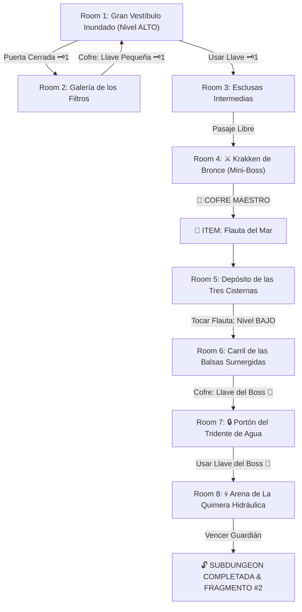

# 🌊 Subdungeon 2: La Cisterna Sumergida (Water Temple Verbatim)

> **Ubicación**: `7 - DM/OneShots/ARepeat/Subdungeons/02_Subdungeon_Agua_Cisterna.md`  
> **Estilo**: Zelda Classic Dungeon Layout  
> **Dungeon Item**: *Flauta del Mar*  
> **Guardián de Área**: *La Quimera Hidráulica*  
> **Recompensa**: 🔓 Desbloqueo Permanente de la Cisterna + Fragmento de Tablilla #2

---

## 🗺️ Mapa de Flujo de la Mazmorra (Zelda Diagram)

---

## 🏛️ Recorrido Verbatim Sala por Sala (DM Walkthrough)

### Room 1: Gran Vestíbulo Inundado (Entrada - Nivel ALTO)
> *"El sonido de cascadas retumba en una cámara abovedada anegada por 10 pies de agua cristalina. Al norte, flotando sobre la superficie, se ve un portón reforzado con un cerrojo de bronce 🗝️1. El paso del Este está abierto a ras de agua."*
* **Estado de Agua**: ALTO (10 ft).
* **Puertas**: Sur (Entrada), Norte (Locked 🗝️1), Este (Abierta).
* **Acción DM**: Nadar hacia el pasaje Este (Room 2) para obtener la Llave Pequeña 🗝️1.

---

### Room 2: Galería de los Filtros (Llave Pequeña #1)
> *"Rejas metálicas cruzan la estancia reteniendo sedimento y algas. En el fondo sumergido de una fosa de 8 pies se atisba un cofre de piedra pulida."*
* **Enemigos**: 3x Mantas Arcanas de Agua (AC 13, 12 HP).
* **Resolución**: Derrotar a las mantas y bucear (*Atletismo DC 11*) para abrir el cofre y tomar la **Llave Pequeña 🗝️1**.

---

### Room 3: Esclusas Intermedias
> *"Una sala estrecha con dos compuertas hidráulicas. Una palanca vertical de bronce permite nivelar el flujo del agua para despejar la compuerta norte."*
* **Puertas**: Sur (Locked 🗝️1 de vuelta), Norte (Puerta del Mini-Boss).
* **Resolución**: Insertar la Llave 🗝️1 y accionar la palanca (*Fuerza DC 11*) para abrir el acceso al Mini-Boss.

---

### Room 4: ⚔️ Krakken de Bronce (Mini-Boss & Dungeon Item)
> *"Un constructo biomecánico en forma de pulpo de bronce de 6 tentáculos emerge de una gran piscina central agitando el agua violentamente."*
* **Mini-Boss**: **Krakken de Bronce** (AC 14, 50 HP; Ataque: Tentáculo +5, 2d6+3 Contundente y Presa).
* **Estrategia DM**: Ataca sumergiéndose. Al derrotarlo, abre el acceso al altar del templo.
* **🎁 COFRE MAESTRO**: Contiene la **Flauta del Mar** (Permite cambiar el nivel del agua en cualquier cisterna del templo: Nivel ALTO, MEDIO o BAJO).

---

### Room 5: Depósito de las Tres Cisternas (Puzle de Nivelación)
> *"Tres enormes depósitos de agua interconectados por tubos de bronce. El agua cubre los pasajes inferiores impidiendo continuar a pie hacia el cuadrante profundo."*
* **Puzle**: Tocar la melodía de Drenaje en la *Flauta del Mar*. El nivel de agua desciende de ALTO a BAJO en 1 ronda.
* **Resultado**: Al bajar el agua a nivel BAJO, se revela una compuerta sumergida en el fondo de la cisterna central que conduce a Room 6.

---

### Room 6: El Carril de las Balsas Sumergidas (Llave del Boss 👑)
> *"Una estancia con 12 pies de agua donde dos grandes balsas de madera petrificada están atadas con gruesas cuerdas al lecho sumergido. En el techo, directamente sobre las balsas, destacan dos botones de presión."*
* **Puzle**: Tocar la *Flauta del Mar* a nivel BAJO o bucear para cortar las cuerdas de amarre. Al ceder las cuerdas, la flotabilidad de las balsas las catapulta hacia arriba impactando los botones del techo.
* **Botín**: El impacto de las balsas hace caer de la repisa superior el cofre dorado con la **Llave del Boss 👑 (Llave del Tridente)**.

---

### Room 7: 🔒 Portón del Tridente de Agua
> *"Un monumental portón de bronce flanqueado por dos efigies de cascadas con un gran candado en forma de tridente místico."*
* **Resolución**: Insertar la **Llave del Boss 👑** para desenganchar los pistones hidráulicos y abrir la arena del Boss.

---

### Room 8: 💀 Arena de La Quimera Hidráulica (Guardián de Agua)
> *"Una sala anegada donde La Quimera Hidráulica flota sobre un chorro de agua a presión a 25 pies de altura fuera del alcance melé."*
* **Mecánica Boss**: Ver ficha en [`03_Arena_de_la_Quimera_Hidraulica.md`](file:///Users/matiasbay/Documents/Obsidian/Shivath/7%20-%20DM/OneShots/ARepeat/Salas/07_Salas_Especiales/03_Arena_de_la_Quimera_Hidraulica.md). Tocar la *Flauta del Mar* drena la columna de agua haciendo caer al boss y aturdiéndolo 1 ronda.
* **Recompensa**: 🔓 Desbloqueo permanente de la Cisterna + **Fragmento de Tablilla #2**.
