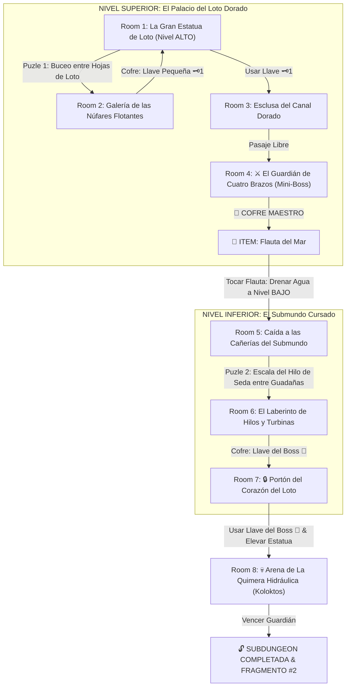

# 🌊 Subdungeon 2: La Cisterna Sumergida (Verbatim Ancient Cistern - Skyward Sword)

> **Ubicación**: `7 - DM/OneShots/ARepeat/Subdungeons/02_Subdungeon_Agua_Cisterna.md`  
> **Inspiración Verbatim**: **Ancient Cistern** (*The Legend of Zelda: Skyward Sword*)  
> **Puzles Copiados Directos**: **El Desplazamiento del Nivel de Agua y Buda de Loto**, **La Escala del Hilo de Seda en el Submundo Cursado** y **El Desmonte Armado de Koloktos**  
> **Dungeon Item**: *Flauta del Mar* (Controlador del Nivel de Agua & Invocador de Corrientes)  
> **Guardián de Área**: *La Quimera Hidráulica* (Inspirada en *Koloktos*)  
> **Recompensa**: 🔓 Desbloqueo Permanente de la Cisterna + Fragmento de Tablilla #2

---

## 🗺️ Mapa de Flujo de la Mazmorra (Ancient Cistern Layout)

---

## 🏛️ Recorrido Verbatim Sala por Sala con Puzles Involucrados

### Room 1: La Gran Estatua de Loto (Entrada)
> *"Un palacio subacuático dominado por una estatua dorada de loto de 40 pies de altura. El agua turquesa cubre el nivel hasta 12 pies. En la boca de la estatua hay un portón con un candado de latón 🗝️1."*
* **Puertas**: Sur (Entrada), Norte (Locked 🗝️1), Este (Abierta).
* **Acción DM**: Bucear hacia la sala Este (Room 2) para resolver el Puzle de la Llave.

---

### Room 2: 🧩 Puzle 1 Verbatim: Hojas de Loto e Inversión Subacuática (SS)
> *"Una sala circular con grandes hojas de loto flotando en la superficie. Bajo una de las hojas se atisba la entrada a un túnel sumergido."*
* **Puzle Involucrado**:
  1. **Invertir la Hoja de Loto**: Bucear por debajo de la hoja de loto principal y realizar un empuje hacia arriba (*Atletismo DC 11*) para voltear la hoja en la superficie.
  2. **Acceso al Túnel Subacuático**: Al voltear la hoja, se libera el paso al conducto sumergido que conduce al cofre del fondo.
* **Botín**: Abrir el cofre sumergido para obtener la **Llave Pequeña 🗝️1**.

---

### Room 3: Esclusa del Canal Dorado
> *"Un pasillo con válvulas mecánicas de loto. Al usar la Llave 🗝️1, la compuerta se abre hacia la estancia del Mini-Boss."*
* **Resolución**: Insertar la Llave 🗝️1 y girar la manivela rúnica (*Fuerza DC 11*).

---

### Room 4: ⚔️ Mini-Boss Verbatim: Guardián de Latón de Cuatro Brazos (SS)
> *"Un autómata de latón de cuatro brazos armado con cimitarras ceremoniales que despierta al pisar la sala."*
* **Combate / Puzle Involucrado**:
  - Parar sus cimitarras y romper los pasadores de sus articulaciones (*Ataque a Distancia o Fuerza DC 13*).
* **🎁 COFRE MAESTRO**: Al vencerlo, el cofre entrega la **Flauta del Mar** (Altera el nivel de agua entre ALTO, MEDIO y BAJO y mueve verticalmente la estatua de loto).

---

### Room 5: 🧩 Puzle 2 Verbatim: Caída y Escala del Hilo de Seda en el Submundo (Ancient Cistern Underworld SS)
> *"Al tocar la Flauta del Mar a Nivel BAJO, el agua se drena por los sumideros. El grupo cae al Submundo: una cueva sombría, húmeda y fangosa repleta de esqueletos vivientes. Un único Hilo de Seda Mística cuelga desde el techo iluminado del palacio superior."*
* **Puzle Involucrado**:
  1. **Combate con Cursed Bokoblins**: 4x Engendros Afligidos (AC 11, 15 HP). Si no se les asesta daño de fuego o radiante al caer a 0 HP, resucitan en 1 ronda.
  2. **Escala del Hilo de Seda**: Los jugadores deben trepar por el hilo de seda (*Check de Atletismo DC 13*). Mientras escalan, guadañas giratorias cortan el paso; deben pausar la subida en las muescas seguras para no caer al fango.
* **Resultado**: Alcanzar la cornisa del nivel superior en Room 6.

---

### Room 6: El Laberinto de Hilos y Turbinas (Llave del Boss 👑)
> *"Una pasarela superior que bordea las turbinas del castillo. En un nicho dorado tras una turbina descansa el cofre final."*
* **Puzle**: Tocar la *Flauta del Mar* para revertir la corriente de la turbina y cruzar nadando (*Atletismo DC 12*).
* **Botín**: Reclamar la **Llave del Boss 👑 (Llave de la Flor de Loto)**.

---

### Room 7: 🔒 Portón del Corazón del Loto
> *"De regreso a la Gran Estatua de Loto, el grupo debe insertar la Llave del Boss 👑 y tocar la Flauta del Mar a Nivel ALTO para hacer descender la cabeza de la estatua, revelando la boca del Boss."*

---

### Room 8: 💀 Boss Final Verbatim: La Quimera Hidráulica / Koloktos (SS)
> *"Una vasta cámara circular dominada por Koloktos (La Quimera Hidráulica): un autómata gigante de seis brazos armado con cimitarras colosales de 12 pies."*
* **Mecánica Koloktos Involucrada**:
  - **Fase 1 (Ataque de Brazos)**: Koloktos estampa sus brazos contra el suelo. Los jugadores deben esquivar (*Destreza DC 13*) y golpear sus articulaciones rojas para desmembrar 2 de sus brazos.
  - **Fase 2 (Usar las Cimitarras del Boss)**: Al caer los brazos, los jugadores pueden recoger las **Cimitarras Gigantes de Koloktos** del suelo (*Fuerza DC 14* para blandirlas).
  - **Fase 3 (Cercenar la Coraza del Núcleo)**: Asestar un impacto directo con la propia cimitarra del boss contra la reja del pecho de Koloktos pulveriza su armadura, exponiendo su corazón de rubí durante 1 ronda.
* **Recompensa**: 🔓 Desbloqueo permanente de la Cisterna + **Fragmento de Tablilla #2**.
