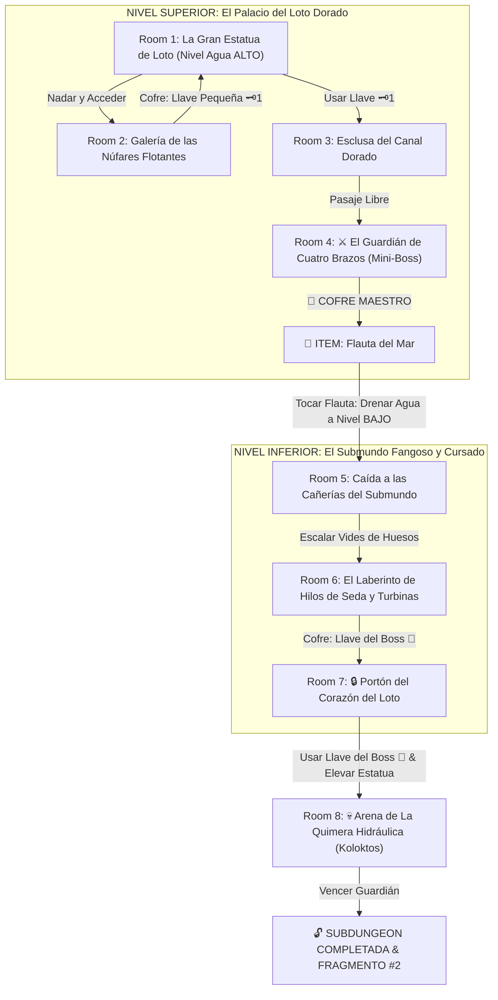

# 🌊 Subdungeon 2: La Cisterna Sumergida (Inspirada en Ancient Cistern - Skyward Sword)

> **Ubicación**: `7 - DM/OneShots/ARepeat/Subdungeons/02_Subdungeon_Agua_Cisterna.md`  
> **Inspiración Directa**: **Ancient Cistern** (*The Legend of Zelda: Skyward Sword*)  
> **Dualidad Temática**: **Nivel Superior (El Palacio del Loto Dorado)** vs **Nivel Inferior (El Submundo Fangoso y Olvidado)**  
> **Dungeon Item**: *Flauta del Mar* (Altera el nivel del agua y controla la elevación de la estatua de loto)  
> **Guardián de Área**: *La Quimera Hidráulica* (Inspirada en *Koloktos*)  
> **Recompensa**: 🔓 Desbloqueo Permanente de la Cisterna + Fragmento de Tablilla #2

---

## 🗺️ Mapa de Flujo de la Mazmorra (Ancient Cistern Layout)

---

## 🏛️ Recorrido Verbatim Sala por Sala (Ancient Cistern Walkthrough)

### Room 1: La Gran Estatua de Loto (Nivel Superior)
> *"Un palacio subacuático monumental dominado por una colosal estatua de granito dorado con la forma de un Buda de loto de cuatro brazos. El agua pura llena la sala hasta 12 pies de altura. En el muro norte, la boca de la estatua sostiene un portón de bronce con un candado de latón 🗝️1."*
* **Estética**: Estatuas de pan de oro, agua turquesa purísima, azulejos de loto.
* **Puertas**: Sur (Entrada), Norte (Locked 🗝️1), Este (Abierta).
* **Acción DM**: Nadar hacia la Galería de las Núfares (Room 2) para hallar la Llave Pequeña 🗝️1.

---

### Room 2: Galería de las Núfares Flotantes (Llave Pequeña #1)
> *"Una sala circular iluminada por la luz que atraviesa grandes hojas de loto flotantes. En el lecho sumergido descansa un cofre de piedra blanca."*
* **Enemigos**: 3x Medusas de Cristal Hidráulicas (AC 13, 12 HP).
* **Resolución**: Bucear entre las hojas de loto (*Atletismo DC 11*) y abrir el cofre con la **Llave Pequeña 🗝️1**.

---

### Room 3: Esclusa del Canal Dorado
> *"Un pasillo flanqueado por fuentes de agua que caen en hilos dorados. Al usar la Llave 🗝️1, la esclusa se abre hacia el pabellón del Mini-Boss."*
* **Resolución**: Insertar la Llave 🗝️1 y accionar la manivela de loto (*Fuerza DC 11*) para despejar el acceso a Room 4.

---

### Room 4: ⚔️ El Guardián de Cuatro Brazos (Mini-Boss & Dungeon Item)
> *"Una cámara octogonal donde un autómata ceremonial de latón de cuatro brazos armado con cimitarras arcanas cobra vida."*
* **Mini-Boss**: **Guardián de Latón** (Inspirado en Koloktos menor; AC 15, 48 HP).
* **🎁 COFRE MAESTRO**: Contiene la **Flauta del Mar** (Permite alterar el nivel del agua entre ALTO, MEDIO y BAJO, y controlar la elevación vertical de la Gran Estatua de Loto).

---

### Room 5: Caída a las Cañerías del Submundo (Nivel Inferior)
> *"Al tocar la Flauta del Mar, el agua del palacio se drena estruendosamente por los desagües. El grupo es succionado hacia el Submundo: una cueva sombría, fangosa y húmeda iluminada por esporas moradas."*
* **Estética (Ancient Cistern Underworld)**: Tuberías oxidadas, lodo viscoso, huesos de aventureros pasados y niebla pesada.
* **Acción DM**: Los exploradores deben trepar por vides de piedra y esquivar el lodo venenoso para encontrar el camino de regreso.

---

### Room 6: El Laberinto de Hilos de Seda y Turbinas (Llave del Boss 👑)
> *"Hilos de seda mística cuelgan del techo del submundo sobre un foso de lodo. Al fondo, sumergido en el fango, descansa un cofre dorado decorado con un loto."*
* **Enemigos (Cursed Bokoblins)**: 4x Engendros Fangosos Afligidos (AC 11, 15 HP; se alzan de nuevo si no son quemados o bendecidos).
* **Puzle**: Escalar los hilos de seda (*Atletismo DC 12*) para evitar el fango y alcanzar el cofre dorado con la **Llave del Boss 👑 (Llave de la Flor de Loto)**.

---

### Room 7: 🔒 Portón del Corazón del Loto
> *"De regreso al nivel superior escalando el interior de la gran estatua, os halláis ante la puerta del corazón del templo, bloqueada por un candado de loto dorado."*
* **Resolución**: Insertar la **Llave del Boss 👑** y tocar la *Flauta del Mar* a Nivel ALTO para hacer descender la cabeza de la estatua, revelando la entrada al Boss.

---

### Room 8: 💀 Arena de La Quimera Hidráulica (Koloktos Boss)
> *"Una vasta cámara redonda dominada por La Quimera Hidráulica: un coloso autómata de seis brazos armado con cimitarras gigantescas que se alza sobre un pedestal de agua."*
* **Mecánica Koloktos**: Ver ficha en [`03_Arena_de_la_Quimera_Hidraulica.md`](file:///Users/matiasbay/Documents/Obsidian/Shivath/7%20-%20DM/OneShots/ARepeat/Salas/07_Salas_Especiales/03_Arena_de_la_Quimera_Hidraulica.md). Tocar la *Flauta del Mar* drena la columna de agua haciendo caer al boss.
* **Recompensa**: 🔓 Desbloqueo permanente de la Cisterna + **Fragmento de Tablilla #2**.
